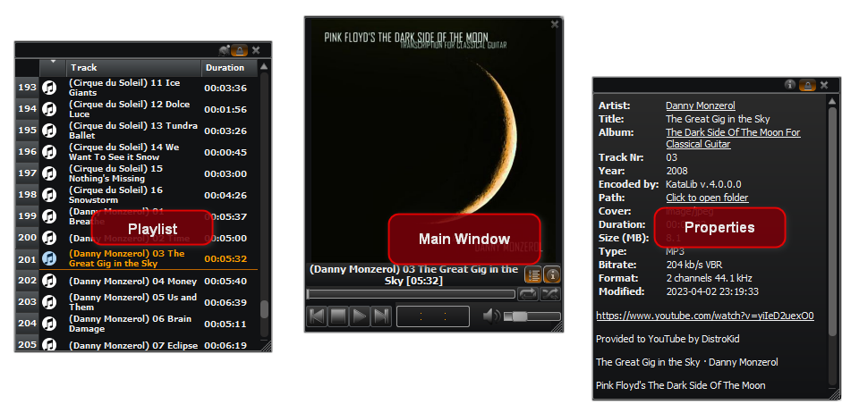

# Overview

**KataLib** is a program that can play and organize music (or media) files.  
  
This is a Layout with all the application's panels enabled.

Its user interface consists of the **Toolbar**, the **Transport**, and three panels, the **Playlist**, the **Library** and the **Properties**.  
- The **Playlist** panel is where we can drop or add local media files or YouTube links for playback, conversion or metadata editing.  
- The **Library** panel has two views:
  - The [Library Collections](#library-collections), where the contents are virtual Collections, consisting of tracks from local files and/or YouTube links.  
  - The [Library Tracks](#library-tracks), where the contents are the media files of any folder we add to the library.  

- The **Properties** panel is where the metadata of the selected track, either from the Playlist or from the Library, are displayed.  
  If the Library Collections are shown and a Collection is selected, the **Properties** panel shows the Collection's tracks instead.  

The panels can be toggled on/off, by the **Layout** menu on the bottom right of the main window.  

The size, position and configuration of the program's window can be saved as a "Layout", and can be easily re-applied from the **User Layouts** sub-menu of the **Layout** menu, or from the menu of the **Preferences** toolbar button.  

There is also an alternative view of the app, called the **Compact View**...

...that consists of a main player window and the **Playlist** and **Properties** floating windows, that can be turned on/off, to conserve screen space.

While using KOHighlights, keep in mind that most of the user interface controls have a Tooltip, that briefly explains what they do.  
This Tooltip is shown when you hover your mouse over the corresponding control. 
___

Generally, KataLib can be seen as three programs in one: A Player, a Converter and a Librarian.

### • A Player

As a Player, it can play any music or video file that we drop on it from the library or from the file explorer. It can load Winamp playlists and can also download YouTube links and/or playlists and play them.  
By selecting one or more tracks we can do many things like: edit metadata, copy, move, convert or even download the video file itself (if it's a YouTube link track).  

### • A Librarian

As a Librarian, it uses a database to store and present two distinct types of data.  
- The [Library Collections](#library-collections)  
These are virtual playlists of local media files and/or YouTube links.  
- The [Library Tracks](#library-tracks)  
The properties of local media files (tracks).  

### • A Converter

As a converter, it can [convert](#convert-dialog)
from these types of audio files...

[//]: # (
)

[//]: # (
from these types of audio files...
)

- ".mp3" - MPEG Audio Stream, Layer III (lossy)
- ".aac" - Advanced Audio Coding (lossy)
- ".m4a" - MPEG-4 Part 14 (audio only) can contain AAC (lossy) or ALAC (lossless) stream
- ".ape" - Monkey's Audio (lossless)
- ".ogg" - Ogg/Vorbis (lossy)
- ".oga" - Ogg/Opus Audio (lossy)
- ".opus" - Opus Interactive Audio Codec (lossy)
- ".flac" - Free Lossless Audio Codec (lossless)
- ".ac3" - Dolby AC-3 (lossy)
- ".wma" - Windows Media Audio (lossy)
- ".wav" - Waveform Audio (lossless)
- ".aif" - Audio Interchange File Format (lossless)
- ".mp4" - MPEG-4 Part 14 multimedia (extracts the aac audio stream)
- ".mkv" - Matroska Multimedia Container (extracts the audio stream)
- ".avi" - Audio Video Interleaved Container (extracts the audio stream)
- ".mov" - QuickTime File Format (extracts the aac audio stream)
- ".flv" - Flash video (extracts the aac audio stream)
- ".wv" - WavPack (lossless)
- ".mpc" - Musepack AKA MPEGplus (lossy)
- ".mp2" - MPEG-1 Audio Layer II (audio only) (lossy)
- ".mpga" - MPEG-1 Audio Layer III (audio only) (lossy)
- ".mpeg" - MPEG-1/2 (extracts the MPEG-1 Audio Layer II audio stream) (lossy)
- ".webm" - WebM - can contain Ogg or Opus (lossy)
- ".dts" - DTS - Digital Theater Systems
- ".m4b" - MPEG-4 Part 14 (audio only) (lossy) used for audiobooks
- ".dfs" - Direct Stream Digital file (lossless) (convert-only)

[//]: # (
  )

 
... to these types of audio files

[//]: # (
)

[//]: # (
... to these types of audio files
)

-   ".mp3" - MPEG Audio Stream, Layer III (lossy)
-   ".m4a" - MPEG-4 Part 14 (audio only) containing AAC (lossy) stream
-   ".aac" - Advanced Audio Coding AAC (lossy)
-   ".ogg" - Ogg/Vorbis (lossy)
-   ".opus" - Opus Interactive Audio Codec (lossy)
-   ".flac" - Free Lossless Audio Codec (lossless)
-   ".wav" - Waveform Audio (lossless)

[//]: # (
)

---------------------------------------------------------------

KataLib can also start in a **Portable** mode using a "-p" argument to the shortcut or by running the `KataLib Portable.exe`.  
In the Portable mode the app reads its settings, db, etc. from a `portable_settings` directory inside its folder and not from the Windows current user's settings.

---------------------------------------------------------------

## The ToolBar

The ToolBar is at the top of the main window. It contains buttons that can be used to perform various actions.  
These buttons can change or be disabled, depending on the current focus panel of the app.  

The permanently visible buttons are:

  

1. **Convert**  
Opens the [Convert dialog](#convert-dialog) that lets you select the way you want to convert the selected track(s).
2. **Files**  
Shows a menu with the following file management options: 
   - Copy
   - Move
   - Rename
   - Delete
3. **Metadata**  
Depending on the number of the selected tracks, this opens the [Edit Metadata](#edit-metadata) or the [Multi Edit Metadata](#multi-edit-metadata) dialog.
4. **Remove Tracks** / **Delete files** / **Delete Collections**  
If the Playlist is selected, it removes the selected tracks from the playlist.  
If the Collection panel is selected, the button removes the selected collections from the Library.   
If the Library files panel is selected, removes the selected files from the Library and <u>deletes them from the disk!</u> 
5. **Preferences**  
Opens the Preferences dialog. 
6. **About**  
Shows the About dialog, with info about the program and more...

If the Library panel is visible and focused, and the Library files are shown, the following buttons are also visible:

  

1. **Delete files** (**Remove Tracks** if the Playlist panel has focus)  
Removes the selected files from the Library and <u>deletes them from the disk!</u>
2. **Library Collections**  
Toggles showing the Library Collections instead of Library files.
3. **Filter**  
Opens the [Filter Library Tracks](#filter-library-tracks) dialog. 
4. **Library Folders**  
Shows the Folder Management window.

If the Library panel is visible and focused, and the Library Collections are shown, the following buttons are visible:

  

1. **Delete Collections** (**Remove Tracks** if the Playlist panel has focus)  
Removes the selected collections from the Library.
2. **Library Tracks**  
Toggles showing the Library files instead of Library Collections.
3. **Filter**  
Opens the [Filter Library Collections](#filter-library-collections) dialog.

# Detailed info

#### Playlist

#### Library Collections

When showing **Library Collections**, every row consists of the Collection's name, number of tracks, tags, total duration etc.  
We can create Collections from the Playlist's right-click menu, we can add tracks to existing Collections, we can remove tracks from them, we can delete existing Collections, or drop them to the Playlist for playback etc.  

#### Library Tracks

When showing **Library Tracks**, every row consists of some basic info (like file size or file type), some info that is contained inside some music files (like Artist or Title) and finally some info that we provide ourselves and aids us into organize our collection (like tags or rating).  
To get the music files into the library, we must provide the program with their location.  
This is done by pressing the **Library Folders** toolbar button.  
In the **Library Folders** dialog we can add/remove folders to/from the library.  
Only folders can be added to the library, not individual files.  
We can re-scan folders to update the library with the changes in their contents, and by checking or un-checking them, we can make them visible or not.  
By selecting a file in the library we can see its properties in the **Properties** panel (if its visible).  
By clicking again on any cell we can edit the contents of that cell. Editing a cell changes the contents of the library but also the metadata of the file itself.  
The file's metadata can be edited either directly by clicking the cells or by pressing the **Metadata** toolbar button.  
This will open the **Edit Metadata** dialog.  
If more than one file is selected when pressing the button, the **Multi Edit Metadata** will open and the changes there will affect all the selected files.  
The selected files can get copied or moved anywhere and also can get converted to many other audio formats with the built-in Converter.  
They can also be played back, but to have them advance automatically (like a list) the Player's list must be empty.

#### Convert dialog

A dialog to select the conversion settings.  

 

The usual workflow of a convertion, is to decompress the files to waves and then re-encode them with the selected encoder.  

Besides the main settings for the encoders, like the _Compression Type_ and the _Quality Control_ of the conversion, there are a few more settings:

-   **Input downmix**  
    This option down-mixes multichannel audio files (5.1, 9.1 etc.) to stereo or mono streams.
-   **Intermediate wav bit depth**  
    This affects the intermediate (or final) wave file's bit depth.
-   **Output Sampling rate**  
    This changes the sampling rate of the encoding.
-   **Output MP3**  
    This affects only the MP3 encoding. It changes the channel algorithm.  
-   **Change Volume**  
    Raises or lowers the volume of the converted tracks.
    -   **Max** (Disabled if `Change Volume` is not enabled)  
        Normalizes the volume of the tracks.  
        Raises or lowers the volume to maximum (before clipping). 
-   **Keep average level at**  
    Keeps the average level of the tracks close to this value.  
    The default value is -18. Going closer to 0 raises the average level.  
    <u>Don't use levels close to 0, because the sound will get distorted!</u>
-   **Trim Silence**  
    Removes the silence from the beginning and ending of the track.
-   **Truncate/Split**  
    Opens an extra dialog that lets you Truncate the track to a certain length or split it into multiple tracks. 
-   **Keep location**  
    Saves the converted tracks at the same directory as the source tracks (Links are saved to the Download folder).  
    <u>Be careful not to overwrite the original files with the converted ones.</u>
-   **Join (re-encode)**  
    Create one continuous track by joining the selected ones.  
    The files will get uncompressed, joined, and then re-compressed.  
    (Enabled only when more than one tracks of the same format are selected)

The **Reset All** button restore the default settings of the dialog.  
**Convert** starts the conversion process, while **Close** just closes the dialog (but keeps all the changes made).

#### Edit Metadata

  

This dialog lets us edit all the track's metadata and also change its filename.  

We can **Copy** and **Paste** metadata (including the Cover image).  
When the Paste is pressed, a **Paste Options** dialog will open, letting we choose what fields from the copied metadata will be pasted.  

There are some "convenience" buttons that require more explanations.
1. This button just opens the **Download Cover** dialog and starts the search automatically (saving us from some extra clicks)
2. This button guesses the missing fields by automatically searching for metadata using any already available tag (works only  for Title, Artist, Album, Track number and Year).
3. These buttons just close the current track's metadata dialog and automatically open the next (or previous) one.

There is also the option to **Search Metadata** from the internet, as long as we provide at least a title for the track.  

The **Get Lyrics** button searches the lyrics for the current track.  
If some lyrics are found, they are added to the comments _after_ any already existing text.

All the changes that are made in this dialog are not written to the file until either the OK or the Next/Prev arrow buttons are pressed.

#### Multi Edit Metadata

  

Opens the dialog to change the metadata from all the selected files at once.  
Only the checked (enabled) entries will affect the files.  
If there is no value in a checked (enabled) entry, the respective metadata will be erased.  

Some convenience buttons are:
- **Auto numbering starting from**  
   If the **Track Nr.** is checked, the selected tracks are getting a new Track number, sequentially, starting from the number set here. 
- **Get Lyrics**  
    This button works a little different here.  
    It searches the lyrics for all the selected tracks, and if some of them are found they are automatically added to the respective metadata.   

Of course, nothing is really written to the files until the OK button is pressed. 

#### Filter

The **Filter** function help us narrow down what is displayed in the Library.  
Depending on the display mode of the Library (Collections or Tracks), this button opens up different dialogs.

##### Filter Library Collections

   
With this dialog we can filter the Collections using their tags. 
We have the options to: 
- Show Collections containing all the selected tags
- Show Collections containing any of the selected tags
- Show Collections containing none of the selected tags

The _"star"_ button lets us filter using only the **Favorites** Collections, while the _"X"_ button clears all the selected tags.  
There is also a number next to every tag name, that depicts the number of Collections that use this tag. 

##### Filter Library Tracks

    
With this dialog we can filter the Tracks using their path, their metadata, such as Artist, Album, Title, Genre, Tags, Rating, or All the above.  
Pressing the **Filter** button updates the view and pressing the **Clear** button resets it.  
If the checkbox on the **Filter** button is checked, the view is updated as we type, but that can be laggy if the Library shows many files.  
We can also use boolean operators (OR, AND, NOT in full capitals) with our keywords.  
E.G. `Pink Floyd AND wall OR Pink Floyd AND Animals`  
will show us all the Pink Floyd tracks from their "The Wall" and "Animals" albums. 

#### Library Folders button

This button opens up the Library Folders dialog. Here we can:

-   **Add folder**  
    Opens up a folder selection dialog to add a folder to the library.  
    All the music files in the selected folder and the folders inside that selected folder will be added to the library.  
    Any folder entry that happens to also be a subfolder of another folder entry will be removed as superfluous.  
    Of course the files will still be in the library.
-   **Remove Selected**  
    Removes the selected (not the checked) folders from the library (but not from the disk).
-   **ReScan Folders**  
    Re-scans the folders of the library to update the metadata if changed and to add new files or remove deleted files if the contents of the library folders are changed.
-   **Checked**  
    If Checked is checked (!) only the checked (!!) folders will be scanned if the ReScan button is pressed.  
    Otherwise all folders are scanned.

The checkmark in front of a folder also determines if the contents of that folder will be visible to the library.  
We can also drop folders here from the file explorer to be added to the library.  
There is a drop-down menu when we click the arrow next to this button.  
The **Library Folders Menu** has shortcuts to the **Add Folder** and **ReScan Folders** buttons.

#### Preferences

There are five pages in the Preferences dialog:  

##### • General

- **Language**  
  Select the program's language.
- **When the Progress finishes:**
  - **Close progress**  
  - **Open destination**  
  - **Play sound**  
    We can select another sound by pressing the **Select** button and browse for a ".wav" file.
- **Reload last playlist on startup**  
  When the program starts, reload the tracks that where loaded when it was last closed.
- **Auto advance playlist**  
  When a track finishes playing in the playlist, the next one starts playing automatically.  
- **Support Multimedia volume changes**  
  Enables the use of multimedia keys to control the playback volume of the player. 

[//]: # (- **Main out**  )

[//]: # (  Select a system Audio output for the playback.)

[//]: # (- **Phones out**  )

[//]: # (  Select a system Audio output for the monitoring/cue.)

- **Auto check for updates**  
  Automatically check online for an updated version.
- **Keep modification date**  
  Keep the original modification date when editing a file's metadata.
- **Show video files too**   
  Show video files in Library and also allow them to play in the Playlist.  
  These files are always in the database, we just select if we like to see them or not.  
  Video files are the avi, mp4, mov and mkv files.
- **Fade on stop**  
  Fade out the playing track before stopping.
- **Gapless Playback**  
  Try to eliminate the silence that is heard during the time it needs for the next track to get loaded.
- **Exit to tray**  
  Don't exit KataLib when the close button is pressed, instead minimize to the tray icon.  
  If this is enabled the only way to exit the program is by the **Exit** entry in the tray icon menu.
- **Prompt for exit**  
  Open a confirmation dialog before exiting the program.

##### • View

**Theme**  
Select between Light, Dark and Custom themes.  
The custom theme accepts a `.qss` (a Qt flavored `.css`) file.  
These files can also be fast previewed, by drag and drop to the main window (when the Preferences dialog is closed). 

**Playlist view**  
Changes how the tracks at the playlist are displayed.

-   **Full** -> (Artist) Track number Title
-   **Titles only**
-   **Filenames**
-   **Artists and Titles** -> (Artist) Title

We can also hide the Playlist Number and/or the Playlist Icon.  

**Change Playlist font**  
Change the font and the row height of the Playlist entries.

**Change Library font**  
Change the font and the row height of the Library entries.

**Compact Title font size**  
Change the font size of the track Title that is displayed of the **Compact View** layout.

**DropZone**  
Enable the use of the DropZone and customize its appearance.

**Toolbar buttons** and **Show text labels**  
Here we can customize the way the Toolbar buttons look.  
We can select the size of the Toolbar icons and even if their icon or text is visible.

**Window Layouts**  
We can save here the window configurations (size, position, open panels, fonts etc.).  

-   **+ / -**  
    Adds the current window configuration / Removes the currently selected layout.
-   **Apply**  
    Applies the currently selected layout.
-   **Arrow up/down**  
    Moves the currently selected layout.
-   **Update**  
    Updates the selected layout with the current window configuration.
-   **Reset**  
    Resets the current window configuration to the default.

**Subtitles**  
We can change the font and position of the subtitle text (for video files that have subtitles). 

##### • YouTube Settings

-   **Audio stream**  
    The YouTube's audio stream that will be used for the conversion.
-   **Check clipboard for links**  
    Check the clipboard for any text that contains a video or a playlist address from YouTube.
-   **Trim silence**  
    Trims the silence from the beginning and ending of the track.
-   **Keep average level at**  
    Keep the average playback level of the YouTube tracks close to this value.  
    The default value is -18. Going closer to 0 raises the average level.  
    <u>Don't use levels close to 0, because the sound will get distorted!</u>
-   **Add the resolution number to the video filename** when saving a video from YouTube.
-   **SubTitle encoding**  
    This is the encoding (UTF-8/ANSI) that it will be used for the saved subtitle file.
-   **Player to open YouTube links**  
    Select which player we want to use, to handle YouTube links (like VLC or Media Player Classic) 
-   **Downloads folder**  
    This is the directory where the files from YouTube will be downloaded.
-   **Use SSL verification**  
    Disable this if you have problems getting information for the YouTube tracks.

##### • Paths

Here we select the paths to the executables that the app uses to
- Convert audio files (like FFMPEG, LAME, OGG, OPUS and NeroAAC)
- Externally edit a track (four different choices)
- File manager to handle the file links (if not the default Windows Explorer)

##### • Advanced

**No relative paths in Playlists**  
The Playlists can have both absolute and relative paths.  
The relative paths work only if the position of the playlist remain in the same relation with the position of the files, as it was originally saved.  
So if both are moved and keep their position relation the playlist will work.  
To move only the playlist and not the files, all the paths must be absolute.

**Fast loading for Playlist tracks if more than**  
Fast load tracks using the basic properties and get the rest of the info when possible.

**Prompt to send log after crash**  
If the program crashes, it will ask if we want to send the crash log to the developer for debugging. 

**Use natural sorting for Library paths**  
Normal (alphabetical) sorting gets "Track 11" before "Track 2" but is ~15% faster.  
Natural sorting, sorts numbers in paths as expected (e.g. X1, X2, X11).

**Use global hotkeys**  
Control the playback even when KataLib's window is in the background.  
Pressing the **Change** button opens a dialog that let us select which keyboard combination will do what action.  
For the default settings see [Global Shortcuts](#global-shortcuts) at the Shortcuts section at the end.

[//]: # (**Rename**)

[//]: # ()
[//]: # (- **Rename pattern**  )

[//]: # (  This pattern is used to create the renamed files.  )

[//]: # (  {0} = ARTIST  )

[//]: # (  {1} = TITLE &#40;or FILENAME if no TITLE&#41;  )

[//]: # (  {2} = ALBUM  )

[//]: # (  {3} = TRACK NUMBER  )

[//]: # (  {4} = FILENAME  )

[//]: # (  {5} = PLAYLIST ROW  )

[//]: # (  {6} = GENRE  )

[//]: # (  {7} = YEAR  )

[//]: # (  It can also create directories by using the \\ character.  )

[//]: # (  Example: {7} {2}\\{0} - {1}  )

[//]: # (  Produces: 1998 NYC Live\\Portishead - Sour Times)

**DataBase**

-   **Backup db**  
    Backup the database file for safety.
-   **Restore db**  
    Restore the database from a safety copy.
-   **Compact db**  
    Compact the database file to save some space.

**Multi-Processing**

-   **Threads**  
    The threads (or cores) that the program will use to do parallel processing of multiple tasks.
-   **Automatically select**  
    The program will select the number of threads based on the number of physical cores of the processor.

#### About button

Info about the program in four pages:

-   Information about KataLib.
-   This help page.
-   The libraries that the program uses and their licenses.
-   A log view that prints various debugging info.

___

# Context Menus

-   **Library item**
    -   **Edit metadata**  
        See "Metadata" in **Toolbar** above.
    -   **Convert files**  
        See "Convert Menu" in **Toolbar** above.
    -   **Copy files**  
        See "Files Menu" in **Toolbar** above.
    -   **Play with Player**  
        Clears the playlist, adds the selected files and starts playing the first of them.
    -   **Append to Player**  
        Adds the selected files to the end of the playlist.
    -   **Open externally**  
        Opens the selected files with the system's player.
    -   **Delete files**  
        Deletes the selected files from the library [and from the disk]{.underline}.
-   **Playlist item**  
    Some of these options might not be available for some type of selection.
    -   **Save video**  
        -   If only one YouTube track is selected, we get a sub-menu with its available video files (Video and Audio) that we can download.
        -   If more than one YouTube tracks are selected we get the option to open the **Select resolution** window to select for every track.
    -   **Preview video**  
        This is a sub-menu with the YouTube track's video-only streams that we can use as preview.  
        Of course we can still play the original audio.  
        We can also combine and save them to a new video file.
    -   **Edit metadata**  
        See "Metadata" in **Toolbar** above.
    -   **Convert files**  
        See "Convert Menu" in **Toolbar** above.
    -   **Copy files**  
        See "Files Menu" in **Toolbar** above.
    -   **Open externally**  
        Opens the selected tracks with the system's player/browser depending on their type.
    -   **Remove tracks**  
        Removes the selected tracks from the playlist.
-   **Cover**  
    These options are enabled/disabled depending on the type of the selection.
    -   **Load Cover**  
        Loads an image from a file as cover.
    -   **Save Cover**  
        Saves the cover to an image file on disk.
    -   **Download Cover**  
        This opens the Search for Cover dialog that it will search for images based on any of the Artist, Album entries that we provide.
    -   **Clear Cover**  
        Clears the entry's cover image.
    -   **Copy to clipboard**  
        Copies the image to system's clipboard.
    -   **Paste from clipboard**  
        If there is an image in the system's clipboard it will be pasted as cover.
    -   **View Cover**  
        Opens a window with the cover image at its full resolution (as long as it fits the screen, else it will be the bigger possible).
    -   **Set as Folder Cover**  
        Sets the cover as the folder's thumbnail (creates a folder.jpg) where the music file is (useful for album folders).
    -   **Open externally**  
        Opens the cover with the system's image viewer.

----------------------------------------------------------------

# Shortcuts

|                 |        | |               |             |
|-----------------|--------|-|---------------|-------------|
| **[Toolbar]**   |        | | **[DJ Mode]** |             |
| Library Folders | Ctrl+M | | DJ show/hide  | Alt+D       |
| Edit Metadata   | Ctrl+E | | XFade         | Alt+Right   |
| Convert         | Alt+C  | | Preview       | Ctrl+Return |
| Remove/Delete   | Del    | |               |             |
| Filter Library  | Alt+F  | |               |             |
| Preferences     | Ctrl+P | |               |             |

|                    |               | |                  |          |
|--------------------|---------------|-|------------------|----------|
| **[Player]**       |               | | **[PlayList]**   |          |
| Play/Pause         | SpaceBar      | | Load PlayList    | Ctrl+L   |
| Stop               | Ctrl+SpaceBar | | Save PlayList    | Ctrl+S   |
| Previous           | Ctrl+Left     | | Clear PlayList   | Ctrl+Del |
| Next               | Ctrl+Right    | | Find in PlayList | Ctrl+F   |
| Seek (PositionBar) | Left/Right    | | Add tracks       | Alt+A    |
| Volume             | Up/Down       | | Repeat All       | Alt+R    |
| Mute               | Alt+M         | | Shuffle          | Alt+S    |

  
##### Global Shortcuts

|                          |            |
|--------------------------|------------|
| Play/Pause               | Win+Ctrl+Z |
| Stop                     | Win+Ctrl+C |
| Previous                 | Win+Ctrl+A |
| Next                     | Win+Ctrl+X |
| Seek Right               | Win+Ctrl+] |
| Seek Left                | Win+Ctrl+[ |
| Start crossfade          | Win+Ctrl+W |
| Show/Hide                | Win+Ctrl+S |
| Increase Volume          | Win+.      |
| Decrease Volume          | Win+,      |

# Extra things to include somewhere

#### Player Find

Pressing the **Find** button opens the **Find Track** dialog that lets us search the tracks that are loaded in the playlist and **Play** them.  
We can also search YouTube for a song, and if we find it we can **Add** it to the Playlist.  
If the **Playlists only** checkbox is checked, searching YouTube will return only Playlists, and if we add one of those, all its tracks will be added to our Playlist.  

#### DJ stuff

There is also a **DJ** section that let us crossfade the playing track with the next, and monitor tracks and files. The controls are:

- **Auto**  
  If active, it will automatically start cross-fading the next track when the remaining seconds of the playing track are equal to the **Duration**.
- **XFade**  
  Pressing this will start a crossfade instantly.
- **Duration**  
  The cross-fade's duration in seconds.
- **Type**  
  Select the fade in/out curves here.
- **Level offset**  
  This is the next track's starting level percent. The track will fade in from this level to the 100% playback level.
- **Position offset**  
  Here we can select the next track's starting position. We can also adjust this by using the **Mark offset** button in the **Preview/Cue** window.
- **Preview**  
  Opens up the **Preview/Cue** window. We can use the Play/Pause button and the slider to monitor (e.g. with a set of headphones) to any track in the list or any file in the library that is selected. We can select the physical output for the headphones at the **Phones out** in the **Preferences**.
- **CrossFader**  
  Do a crossfade manually. Moving the slider changes the volumes of both the playing track (lower as the slider moves to the right) and the next track (louder as the slider moves to the right). At the far right the crossfade ends and the slider returns to its initial position.