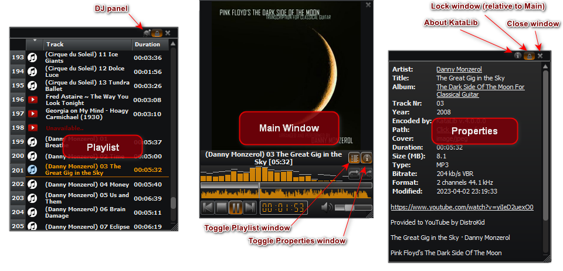
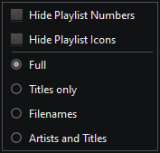

# User Guide

<!-- TOC -->
* [User Guide](#user-guide)
* [Overview](#overview)
  * [Portable mode](#portable-mode)
  * [The ToolBar](#the-toolbar)
* [Detailed info](#detailed-info)
    * [Playlist](#playlist)
      * [DJ sub-panel](#dj-sub-panel)
      * [Preview - Cue dialog](#preview---cue-dialog)
      * [Find](#find)
      * [Visualizer](#visualizer)
    * [Transport](#transport)
    * [Compact View](#compact-view)
    * [Library Collections](#library-collections)
    * [Library Tracks](#library-tracks)
    * [Convert dialog](#convert-dialog)
    * [Edit Metadata](#edit-metadata)
    * [Multi Edit Metadata](#multi-edit-metadata)
    * [Filter](#filter)
      * [Filter Library Collections](#filter-library-collections)
      * [Filter Library Tracks](#filter-library-tracks)
    * [Library Folders window](#library-folders-window)
    * [Preferences](#preferences)
      * [General](#general)
      * [View](#view)
      * [YouTube Settings](#youtube-settings)
      * [Paths](#paths)
      * [Advanced](#advanced)
    * [About](#about)
    * [Truncate/Split Track](#truncatesplit-track)
      * [Truncate](#truncate)
      * [Split](#split)
    * [Rename](#rename)
    * [DropZone](#dropzone)
    * [Visualization Video Setup](#visualization-video-setup)
  * [Context Menus](#context-menus)
    * [Playlist Track](#playlist-track)
    * [Library Track](#library-track)
    * [Library Collection](#library-collection)
    * [Playlist menu](#playlist-menu)
    * [Cover menu](#cover-menu)
    * [Visualization menu](#visualization-menu)
    * [Compact View menu](#compact-view-menu)
    * [DropZone menu](#dropzone-menu)
* [Shortcuts](#shortcuts)
<!-- TOC -->

___

[Οδηγίες Χρήσης στα Ελληνικά.](index_el.md)

# Overview

**[KataLib](https://github.com/noembryo/KataLib)** is a Windows program that can play, convert and organize music (or video) files.    

This is a Layout with all the application's panels enabled.

The user interface consists of the **[Toolbar](#the-toolbar)**, the **[Transport](#transport)**, and three panels, the **[Playlist](#playlist)**, the **[Library](#library-collections)** and the **Properties**.  
- The **[Playlist](#playlist)** panel is where we can drop or add local media files or YouTube links for playback, conversion or metadata editing.  
- The **Library** panel has two views:
  - The [Library Collections](#library-collections), where the contents are virtual Collections, consisting of tracks from local files and/or YouTube links.  
  - The [Library Tracks](#library-tracks), where the contents are the media files of any folder we add to the library.  

- The **Properties** panel is where the metadata of the selected track, either from the Playlist or the Library, are displayed.  
  If the Library Collections are shown and a Collection is selected, the **Properties** panel shows the Collection's tracks instead.  

The panels can be toggled on/off, by the **Layout** menu on the bottom right of the main window.  

The size, position and configuration of the program's window can be saved as a "Layout", and can be easily re-applied from the **User Layouts** sub-menu of the **Layout** menu, or from the menu of the **Preferences** toolbar button.  

There is also an alternative view of the app, the [**Compact View**](#compact-view)...  
  
...that consists of only a Main player window and the **Playlist** and **Properties** independent windows, that can be moved around or turned on/off, to conserve screen space.

While using KataLib, keep in mind that almost all the user interface controls, buttons, etc. have a Tooltip, that briefly explains what they do.  
This Tooltip is shown when you hover your mouse over the corresponding control.  

___

Generally, KataLib can be seen as three programs in one:  
A Player, a Converter and a Librarian.

- **A Player**

    As a Player, it can play any music or video file that we drop on it from the library or from the file explorer. It can load Winamp playlists and can also download YouTube links and/or playlists and play them.  
    By selecting one or more tracks we can do many things like: edit metadata, copy, move, convert or even download the video file itself (if it's a YouTube link track).  

- **A Converter**  

    As a converter, it can [convert](#convert-dialog)
    from these types of audio files...
    
    - ".mp3" - MPEG Audio Stream, Layer III (lossy)
    - ".aac" - Advanced Audio Coding (lossy)
    - ".m4a" - MPEG-4 Part 14 (audio only) can contain AAC (lossy) or ALAC (lossless) stream
    - ".ape" - Monkey's Audio (lossless)
    - ".ogg" - Ogg/Vorbis (lossy)
    - ".oga" - Ogg/Opus Audio (lossy)
    - ".opus" - Opus Interactive Audio Codec (lossy)
    - ".flac" - Free Lossless Audio Codec (lossless)
    - ".ac3" - Dolby AC-3 (lossy)
    - ".wma" - Windows Media Audio (lossy)
    - ".wav" - Waveform Audio (lossless)
    - ".aif" - Audio Interchange File Format (lossless)
    - ".mp4" - MPEG-4 Part 14 multimedia (extracts the aac audio stream)
    - ".mkv" - Matroska Multimedia Container (extracts the audio stream)
    - ".avi" - Audio Video Interleaved Container (extracts the audio stream)
    - ".mov" - QuickTime File Format (extracts the aac audio stream)
    - ".flv" - Flash video (extracts the aac audio stream)
    - ".wv" - WavPack (lossless)
    - ".mpc" - Musepack AKA MPEGplus (lossy)
    - ".mp2" - MPEG-1 Audio Layer II (audio only) (lossy)
    - ".mpga" - MPEG-1 Audio Layer III (audio only) (lossy)
    - ".mpeg" - MPEG-1/2 (extracts the MPEG-1 Audio Layer II audio stream) (lossy)
    - ".webm" - WebM - can contain Ogg or Opus (lossy)
    - ".dts" - DTS - Digital Theater Systems
    - ".m4b" - MPEG-4 Part 14 (audio only) (lossy) used for audiobooks
    - ".dfs" - Direct Stream Digital file (lossless) (convert-only)
    
    ... to these types of audio files  
    
    -   ".mp3" - MPEG Audio Stream, Layer III (lossy)
    -   ".m4a" - MPEG-4 Part 14 (audio only) containing AAC (lossy) stream
    -   ".aac" - Advanced Audio Coding AAC (lossy)
    -   ".ogg" - Ogg/Vorbis (lossy)
    -   ".opus" - Opus Interactive Audio Codec (lossy)
    -   ".flac" - Free Lossless Audio Codec (lossless)
    -   ".wav" - Waveform Audio (lossless)

- **A Librarian**

    As a Librarian, it uses a database to store and display two distinct types of data.  
  - The [Library Collections](#library-collections)  
    who are virtual playlists of local media files and/or YouTube links.  
  - The [Library Tracks](#library-tracks)  
    which are the properties of local media files (Tracks).  

___

## Portable mode

KataLib can also start in a **Portable** mode using a "-p" argument to the shortcut or by running the `KataLib Portable.exe`.  
In the Portable mode the app reads its settings, db, etc. from a `portable_settings` directory inside its folder and not from the Windows current user's settings.  
Using the Portable mode while the app is installed inside the `Program files` directory is not advised, because Windows treat this folder in a special way.  
Any other directory or removable drive is ok, as long as the user can write on it. 

___

## The ToolBar

The ToolBar is at the top of the main window. It contains buttons that can be used to perform various actions.  
These buttons can change or be disabled, depending on the currently focused panel of the app.  
Right-clicking on an empty space of the Toolbar, brings up this menu...  

  
...that lets us change the ToolBar icons' size and appearance.

The permanently visible buttons are:  
  

1. **Convert**  
  Opens the [Convert dialog](#convert-dialog) to configure the way you want to convert the selected track(s).
2. **Files**   
  Shows a menu with the following file management options: 
      - **Copy** the selected file(s) to a new location (uses a file selector).
      - **Move** the selected file(s) to a new location (uses a file selector).
      - [**Rename**](#rename) the selected file(s) using pattern.
      - **Delete** the selected file(s) from the disk. <ins>_**Use with caution!**_</ins> 
3. **Metadata**  
  Depending on the number of the selected tracks, this opens the [Edit Metadata](#edit-metadata) (single selection) or the [Multi Edit Metadata](#multi-edit-metadata) (multiple selected) dialog.
4. **Remove Tracks / Delete files / Delete Collections**  
  This button changes appearance and function, depending on the currently focused panel.  
  If the Playlist has the focus, it removes any selected track(s) from the playlist.  
  If the Library Collections panel is focused, the button removes the selected collection(s) from the Library database.   
  If the Library Tracks panel is selected, it removes the selected file(s) from the Library and <ins>_**deletes them from the disk!**_</ins>  
5. **Preferences**  
  Opens the [Preferences](#preferences) dialog.  
  Clicking the arrow next to the button, opens a drop-down menu with the saved Layouts, and options to manage them, like:
      - **Add** the current Layout as a new Layout
      - **Update** the currently selected layout
      - **Delete** the  currently selected layout
   
   The menu also contain an option to switch to the [Compact View](#compact-view).
6. **About**  
  Shows the [About](#about) dialog, with info about the program and more...

If the Library panel is visible and focused, and the Library Collections are shown, the following buttons are visible:

  

1. **Delete Collections** (**Remove Tracks** if the Playlist panel has focus)  
  Removes the selected collections from the Library.
2. **Library Tracks**  
  Display the Library files instead of Library Collections.
3. **Filter**  
  Opens the [Filter Library Collections](#filter-library-collections) dialog.

If the Library panel is visible and focused, and the Library Tracks are shown, the following buttons are also visible:

  

1. **Delete files**  
  Removes any selected files from the Library and _**<ins>deletes them from the disk!</ins>**_
2. **Library Collections**  
  Toggles showing the Library Collections instead of Library files.
3. **Filter**  
  Opens the [Filter Library Tracks](#filter-library-tracks) dialog. 
4. **Library Folders**  
  Shows the [Library Folders](#library-folders-window) management window.  
  There is a drop-down menu when we click the arrow next to the button.  
  This **Library Folders Menu** has shortcuts to the **Add Folder** and **ReScan Folders** buttons.

# Detailed info

### Playlist

The Playlist panel is the main part of the Player.  
We can drag audio files or playlists here or use the **Find** button to search YouTube or our Collections for tracks.  
The loaded Tracks can be used for Playback, get Converted to various formats, saved as a playlist, etc.  

The buttons that we find under the Playlist are:

- **Repeat** - makes the player start from the beginning when the last Track is played out. 
- **Shuffle** - makes the player play in a random order. 
- **DJ** - opens the [DJ sub-panel](#dj-sub-panel) that lets us crossfade the playing track with the next.
- **Find** - opens the [Find Tracks](#find) dialog to search for Tracks in the Playlist, YouTube or the Library Collections.
- **Playlist** - just opens the [Playlist menu](#playlist-menu).

#### DJ sub-panel

  
The DJ controls are:
- **Auto**  
  If active, it will automatically start cross-fading the next track when the remaining seconds of the currently playing track are equal to the **Duration**.
- **XFade**  
  Pressing this will start a crossfade instantly.
- **Duration**  
  The cross-fade's duration in seconds.
- **Type**  
  Select the fade in/out curves here.
- **Level offset**  
  This is the next track's starting level percent. The track will fade in from this level to the 100% playback level.
- **Position offset**  
  Here we can select the next track's starting position.
- **Preview**  
  Opens the [Preview - Cue](#preview---cue-dialog) dialog to preview/listen for the next track.  
- **CrossFader**  
  Do a crossfade manually.  
  Moving this slider, simultaneously changes the volumes of both the playing track (lower as the slider moves to the right) and the next track (louder as the slider moves to the right).  
  At the far right, the crossfade ends, and the slider returns to its initial position.  

#### Preview - Cue dialog

This dialog lets us preview/listen to the next track, before we do a crossfade.  
This is a different player than the one that plays the track, so it can be paused, stopped, etc.  
It plays whatever track we select from the Playlist or Library.  
Its output can be configured in the [Preferences](#preferences) to be different from the main player's output, so we can preview the track using headphones or another audio system.  

The controls are:  

- The track's **slider** that let us seek inside the track.  
  When positioning the mouse over it without clicking, it will show the track's elapsed and remaining time at the specific slider's position. 
- The **Play/Pause** button, that starts/pauses the preview.  
- The **Set as next** button, moves the currently selected track after the playing one, setting it ready for crossfade and/or **Mark**  (not working when playing a file from Library)  
- The **Mark Offset** button, sets the start [Position Offset](#dj-sub-panel) for the track that will be crossfaded with the playing one (only works if the track after the playing one is selected)  
- The **Time display** can be toggled between elapsed and remaining time.
- The **Volume** slider controls the preview's audio level.

#### Find

Pressing the **Find** button opens the **Find Tracks** dialog that lets us search for Tracks at the following places.  

- **YouTube** 

    
  We can search **YouTube** for a song, and if we find it we can **Add** it to the Playlist. Dropping it to the Playlist works as well.  
  The Clear Playlist button can be used to remove all the tracks from the Playlist, before we add the new-found ones.  
  If the **Playlists only** checkbox is checked, searching YouTube will return only Playlists, and if we add one of those, all its tracks will be added to our Playlist.  
  The **Clipboard Text** button lets us see the YouTube addresses that exist in the clipboard or to type one of our own.

- **Collections**

    
  We can also search for **Collections** in our Library, or for specific Tracks inside these Collections (if the **Track search** is checked).  

- **Playlist**  
    
  Finally, we can search the currently loaded **Playlist** Tracks for a specific track,  and **Play** it. 

#### Visualizer

The Visualizer is a way to visualize the audio data of the currently playing track.  
Can be in one of the three modes of visualization:

* **Spectrum Analyzer**  
  This is the default one, and it shows the frequency spectrum of the currently playing track.  
  
* **Oscilloscope**  
  This shows the waveform of the currently playing track.  
  
* **Spectrogram**  
  This shows the frequency spectrum of the currently playing track too, but also shows the time axis.  
  
* **Peak Meter**  
  This shows the level of the currently playing track.  
  

Clicking on the Visualizer will advance to the next type, while right-clicking will open the [Visualization menu](#visualization-menu).

### Transport

Mostly, self-explanatory playback controls: 

- **Position bar** - Shows the position of the currently playing Track and lets us jump to a specific point. 
- **Waveform** - Optical representation of the audio track that also lets us jump to a specific point.
- **Previous Track** - Go to/Play the previous Track.
- **Stop** - Stop playback.
  Holding `Alt` when clicking, will fade out the track while holding `Shift` when clicking, will stop the playback when the track ends and will select the next one.
- **Play/Pause** - Toggles Play/Pause. 
- **Next Track** - Go to/Play the next Track. 
- **Tap Tempo** - Opens the Tap Tempo dialog that lets you manually measure the BPM of the Track and add it to its metadata. 
- **Time Display** - Shows one of a variety of times, that can be selected either by the menu that opens when right-clicking, or by cycle through with left-clicking on it:
  - Time Elapsed 
  - Time Remaining
  - Total Time Elapsed
  - Total Time Remaining
- **Mute** - Mutes/Un-mutes the audio output. 
- **Volume** - Changes the volume of the audio output. 

### Compact View

This is a minimal view of the app, that consists of only a small, resizable Main window, that shows mostly the Cover Art of the currently playing (or selected) track, the [Visualizer](#visualizer) and the [Transport](#transport) that controls the playback.  

Above the Transport, there is the title of the currently selected/playing Track and two extra buttons that open/close the Playlist and Properties windows.  
Double-clicking this title text, will show the file in Explorer or the YouTube url in the system's browser.  
Double-clicking the Cover Art will open the [Edit Metadata](#edit-metadata) (or [Multi](#multi-edit-metadata)) dialog if the Track(s) have metadata.  
Right-clicking the Cover Art will create a [context menu](#compact-view-menu) with additional options.  

All the **Compact View** windows have a **Close** button (**x**) that closes them.  
The Playlist and Properties windows have the same functionality as in the **Full View**, and also some more buttons.  
The **Lock** button, locks the position of the window relative to the Main window, so when we move the Main window, the locked window moves with it in the same way.  
Additionaly, the Playlist window have a **DJ** button to open the [DJ panel](#dj-sub-panel) of the Playlist, and the Properties window has an **About** button to open the [About](#about) window.  

### Library Collections

When showing **Library Collections**, every row consists of the Collection's name, number of tracks, custom tags, total duration etc.  

  

There are three types of Collections
- YouTube Collections that use YouTube Playlist address url
- Spotify Collections that can use a Spotify Playlist, Album or Podcast list address url
- Custom Collections that can contain any number of local/YouTube tracks and don't use any address url

Favorite Collections can also get **Starred** and use this attribute for filtering or sorting. 

We can create Collections from the Playlist's right-click menu, we can add tracks to existing Collections, we can remove tracks from them, we can delete existing Collections, drop them to the Playlist for playback etc.  

### Library Tracks

When showing **Library Tracks**, every row consists of some basic info (like file size or file type), some info that is contained inside some music files (like Artist or Title) and finally some info that we provide ourselves and aids us into organize our collection (like tags or rating).  
To get the music files into the library, we must provide the program with their location.  
This is done by pressing the **Library Folders** toolbar button.  
In the **Library Folders** dialog we can add/remove folders to/from the library.  
Only folders can be added to the library, not individual files.  
We can re-scan folders to update the library with the changes in their contents, and by checking or un-checking them, we can make them visible or not.  
By selecting a file in the library we can see its properties in the **Properties** panel (if its visible).  
By clicking again on any cell we can edit the contents of that cell. Editing a cell changes the contents of the library but also the metadata of the file itself.  
The file's metadata can be edited either directly by clicking the cells or by pressing the **Metadata** toolbar button.  
This will open the **Edit Metadata** dialog.  
If more than one file is selected when pressing the button, the **Multi Edit Metadata** will open and the changes there will affect all the selected files.  
The selected files can get copied or moved anywhere and also can get converted to many other audio formats with the built-in Converter.  
They can also be played back, but to have them advance automatically (like a list) the Player's Playlist must be empty.

### Convert dialog

A dialog to select the conversion settings.  

 

The usual workflow of a convertion, is to uncompress the files to `.wav` file format, and then re-encode them with the selected encoder.  

Besides the main settings for the encoders, like the _Compression Type_ and the _Quality Control_ of the conversion, there are a few more settings:

-   **Input downmix**  
    This option down-mixes multichannel audio files (5.1, 9.1 etc.) to stereo or mono streams.
-   **Intermediate wav bit depth**  
    This affects the intermediate (or final) wave file's bit depth.
-   **Output Sampling rate**  
    This changes the sampling rate of the encoding.
-   **Output MP3**  
    This affects only the MP3 encoding. It changes the channel algorithm.  
-   **Change Volume**  
    Raises or lowers the volume of the converted tracks.
    -   **Max** (Disabled if `Change Volume` is not enabled)  
        Normalizes the volume of the tracks.  
        Raises or lowers the volume to maximum (before clipping). 
-   **Keep average level at**  
    Keeps the average level of the tracks close to this value.  
    The default value is -18. Going closer to 0 raises the average level.  
    <ins>_**Don't use levels close to 0, because the sound will get distorted!**_</ins>
-   **Trim Silence**  
    Removes the silence from the beginning and ending of the track.
-   **Truncate/Split**  
    Opens an extra dialog that lets you [Truncate](#truncate) the track to a certain length or [Split](#split) it into multiple tracks. 
-   **Keep location**  
    Saves the converted tracks at the same directory as the source tracks (Links are saved to the Download folder).  
    <ins>_**Be careful not to overwrite the original files with the converted ones.**_</ins>
-   **Join (re-encode)**  
    Create one continuous track by joining the selected ones.  
    The files will get uncompressed, joined, and then re-compressed.  
    (Enabled only when more than one tracks of the same format are selected)

The **Reset All** button restore the default settings of the dialog.  
**Convert** starts the conversion process, while **Close** just closes the dialog (but keeps all the changes made).

### Edit Metadata

  

This dialog lets us edit all the track's metadata and also change its filename.  

We can **Copy** and **Paste** metadata (including the Cover image).  
When the Paste is pressed, a **Paste Options** dialog will open, letting we choose what fields from the copied metadata will be pasted.  

There are some "convenience" buttons that require more explanations.
1. This button just opens the **Download Cover** dialog and starts the search automatically (saving us from some extra clicks)
2. This button guesses the missing fields by automatically searching for metadata using any already available tag (works only  for Title, Artist, Album, Track number and Year).
3. These buttons just close the current track's metadata dialog and automatically open the next (or previous) one.

There is also the option to **Search Metadata** from the internet, as long as we provide at least a title for the track.  

The **Get Lyrics** button searches the lyrics for the current track.  
If some lyrics are found, they are added to the comments _after_ any already existing text.

All the changes that are made in this dialog are not written to the file until either the OK or the Next/Prev arrow buttons are pressed.

### Multi Edit Metadata

  

Opens the dialog to change the metadata from all the selected files at once.  
Only the checked (enabled) entries will affect the files.  
If there is no value in a checked (enabled) entry, the respective metadata will be erased.  

Some convenience buttons are:
- **Auto numbering starting from**  
    If the **Track Nr.** is checked, the selected tracks are getting a new Track number, sequentially, starting from the number set here. 
- **Get Lyrics**  
    This button works a little different here.  
    It searches the lyrics for all the selected tracks, and if some of them are found they are automatically added to the respective metadata.   

Of course, nothing is really written to the files until the OK button is pressed. 

### Filter

The **Filter** function help us narrow down what is displayed in the Library.  
Depending on the display mode of the Library (Collections or Tracks), this button opens up different dialogs.

#### Filter Library Collections

   
With this dialog we can filter the Collections using their tags.  
We can select multiple tags and we have the options to: 
- Show Collections containing all the selected tags
- Show Collections containing any of the selected tags
- Show Collections containing none of the selected tags

The _"star"_ button lets us filter using only the **Favorites** Collections, while the "**x**" button clears all the selected tags.  
There is also a number next to every tag name, that depicts the number of Collections that use this tag. 

#### Filter Library Tracks

      
  
With this dialog we can filter the Tracks using their path, their metadata, such as Artist, Album, Title, Genre, Tags, Rating, or All the above.  
Pressing the **Filter** button updates the view and pressing the **Clear** button resets it.  
If the checkbox on the **Filter** button is checked, the view is updated as we type, but that can be laggy if the Library shows many files.  
We can also use boolean operators (OR, AND, NOT in full capitals) with our keywords.  
E.G. `Pink Floyd AND Animals`  
will show us all the Pink Floyd tracks from their "Animals" album. 

### Library Folders window

Manage the Library Folders that contain all the Library Tracks.  
Here we can:

- **Add folder** opens up a folder selection dialog to add a folder to the library.  
  All the music files in the selected folder and the folders inside _that_ selected folder will be added to the library.  
  Any folder entry that happens to also be a subfolder of another folder entry will be removed as superfluous.  
  Of course the files will still be in the library.
- **Remove Selected** removes the selected (not the checked) folders from the library (but not from the disk).
- **ReScan Folders** re-scans the folders of the library to update the metadata if changed and to add new files or remove deleted files if the contents of the library folders are changed.
- **Checked** If Checked is _checked_ (!) only the _checked_ (!!) folders will be scanned if the **ReScan** button is pressed.  
  Otherwise all folders are scanned.
- The **All** checkbox checks/un-checks all the folders

The checkmark in front of a folder also determines if the contents of that folder will be visible to the library.  
We can also drop folders here from the file explorer to be added to the library.  

### Preferences

There are five pages in the Preferences dialog:  

#### General

- **Language**  
  Select the program's language.
- **When the Progress finishes:**
  - Close progress - closes the Progress window  
  - Open destination - opens the destination directory in Explorer  
  - Play sound - make a sound when everything is done  
  - Select [_current sound_]  
    We can select another audio file, by pressing this button and browse for a ".wav" file.
- **Reload last playlist on startup**  
  When the program starts, reload the tracks that where loaded when it was last closed.
- **Auto advance playlist**  
  When a track finishes playing in the playlist, the next one starts playing automatically.  
- **Autoplay opened Track/Playlist**  
  Automatically starts playback if a file or a playlist is opened with KataLib, and the Playlist is empty.
- **Support Multimedia volume changes**  
  Enables the use of multimedia keys to control the playback volume of the player. 
- The **Output section** let us select independently the audio device for the **Main out** of the player, and the **Phones out**, which is what the [Preview/Cue](#preview---cue-dialog) dialog uses.  
- **Auto check for updates**  
  Automatically check online for an updated version.
- **Keep modification date**  
  Keep the original modification date when editing a file's metadata.
- **Show video files**   
  Show video files in Library and also allow them to play in the Playlist.  
  These files are always in the database, we just select if we like to see them or not.  
  Video files are files with extensions like avi, mp4, mov, mkv etc.
- **Gapless Playback**  
  Try to eliminate the silence that is heard during the time it needs for the next track to get loaded.
- **Fade on stop**  
  Fade out the playing track before stopping.
- **Show […] recently played tracks**  
  Select how many tracks to show in the Recently Played menu.
- **Speed**  
  The playback speed of the player. The default is x1.00.
  If the speed is modified, the resulting audio can be saved from the track's right-click menu (Export modified audio).
- **Pitch**  
  The playback pitch of the player in semitones. The default is 0.00.
  If the pitch is modified, the resulting audio can be saved from the track's right-click menu (Export modified audio).
- **Exit to tray**  
  Don't exit KataLib when the close button is pressed, instead minimize it to the tray icon.  
  If this is enabled the only way to exit the program is by the **Exit** entry in the tray icon menu.
- **Prompt for exit**  
  Open a confirmation dialog before exiting the program.

[//]: # (- **Main out**  )

[//]: # (  Select a system Audio output for the playback.)

[//]: # (- **Phones out**  )

[//]: # (  Select a system Audio output for the monitoring/cue.)

#### View

**Theme**  
Select between Light, Dark and Custom themes.  
The custom theme accepts a `.qss` (a Qt flavored `.css`) file.  
These files can also be fast previewed, by drag and drop to the main window (when the Preferences dialog is closed). 

**Playlist view**  
Changes how the tracks at the playlist are displayed.

-   **Full** -> (Artist) Track number Title
-   **Titles only**
-   **Filenames**
-   **Artists and Titles** -> (Artist) Title

We can also hide the Playlist Number and/or the Playlist Icon.  

**Change Playlist font**  
Change the font and the row height of the Playlist entries.

**Change Library font**  
Change the font and the row height of the Library entries.

**Compact Title font size**  
Change the font size of the track Title that is displayed of the **Compact View** layout.

**DropZone**  
Enable the use of the [DropZone](#dropzone) and customize its appearance.

**Toolbar buttons** and **Show text labels**  
Here we can customize the way the Toolbar buttons look.  
We can select the size of the Toolbar icons and even if their icon or text is visible.

**Window Layouts**  
We can save here the window configurations (size, position, open panels, fonts etc.).  

-   **+ / -**  
    Adds the current window configuration / Removes the currently selected layout.
-   **Apply**  
    Applies the currently selected layout.
-   **Arrow up/down**  
    Moves the currently selected layout.
-   **Update**  
    Updates the selected layout with the current window configuration.
-   **Reset**  
    Resets the current window configuration to the default.

**Subtitles**  
We can change the font and position of the subtitle text (for video files that have subtitles). 

#### YouTube Settings

-   **Audio stream**  
    The YouTube's audio stream that will be used for the conversion.
-   **Check clipboard for links**  
    Check the clipboard for any text that contains a video or a playlist address from YouTube.
-   **Trim silence**  
    Trims the silence from the beginning and ending of the track.
-   **Keep average level at**  
    Keep the average playback level of the YouTube tracks close to this value.  
    The default value is -18. Going closer to 0 raises the average level.  
    <ins>Don't use levels close to 0, because the sound will get distorted!</ins>
-   **Add the resolution number to the video filename** when saving a video from YouTube.
-   **SubTitle encoding**  
    This is the encoding (UTF-8/ANSI) that it will be used for the saved subtitle file.
-   **Player to open YouTube links**  
    Select which player we want to use, to handle YouTube links (like VLC or Media Player Classic) 
-   **Downloads folder**  
    This is the directory where the files from YouTube will be downloaded.
-   **Use SSL verification**  
    Disable this if you have problems getting information for the YouTube tracks.

#### Paths

Here we select the paths to the executables that the app uses to
- Convert audio files (like FFMPEG, LAME, OGG, OPUS and NeroAAC)
- Externally edit a track (four different choices)
- File manager to handle the file links (if not the default Windows Explorer)

#### Advanced

**No relative paths in Playlists**  
The Playlists can have both absolute and relative paths.  
The relative paths work only if the position of the playlist remain in the same relation with the position of the files, as it was originally saved.  
So if both are moved and keep their position relation the playlist will work.  
To move only the playlist and not the files, all the paths must be absolute.

**Fast loading for Playlist tracks if more than**  
Fast load tracks using the basic properties and get the rest of the info when possible.

**Prompt to send log after crash**  
If the program crashes, it will ask if we want to send the crash log to the developer for debugging. 

**Use natural sorting for Library paths**  
Normal (alphabetical) sorting gets "Track 11" before "Track 2" but is ~15% faster.  
Natural sorting, sorts numbers in paths as expected (e.g. X1, X2, X11).

**Use global hotkeys**  
Control the playback even when KataLib's window is in the background.  
Pressing the **Change** button opens a dialog that let us select which keyboard combination will do what action.  
For the default settings check the [Shortcuts](#shortcuts) section at the end.

**DataBase**

- **Backup db**  
  Backup the database file for safety.
- **Restore db**  
  Restore the database from a safety copy.
- **Compact db**  
  Compact the database file to save some space.

**Multi-Processing**

- **Threads**  
  The threads (or cores) that the program will use to do parallel processing of multiple tasks.
- **Automatically select**  
  The program will select the number of threads based on the number of physical cores of the processor.

### About

Info about the program in five pages:

- Information about KataLib.
- The User Guide.
- A quick overview of the KataLib's shortcuts.
- The libraries that the program uses and their licenses.
- A log view that prints various debugging info during the application's execution.  

___

### Truncate/Split Track

In this dialog we can choose to Truncate the start and/or end of the selected track, or Split it into multiple different tracks.  
We use numbered fields to do this and the **Preview** button lets us audition the results of our changes. 

#### Truncate

This dialog has just two numeric fields in Hours:Minutes:Seconds, to set the start and end of the track.  
The values are automatically set to the start/end of the track when we first open it.  
The resulting track will have the same metadata as the original one.

#### Split

When we first open this dialog, it contains only one slice that shows the **Start** of the first slice of the track, that _has_ to be 00:00:00 (non-editable).  
Pressing the **Plus (+)** button lets us add a new slice of the track, while pressing the **Minus (-)** button removes the selected slice.  
Clicking on the **Title** column of any slice, lets us change the title of that slice, and consequentially change the title/filename of the resulting track.  
The **Start** field of all slices (other than the first) are editable, and we can preview our changes using the **Preview** button.  

All the resulting tracks will have a copy of the original track's metadata, except the Title and the track number.  
The Title will be the slice's title, and if we check the **Hash (#)** button, the slice number will be the track number in their metadata.  

The **Import cue/txt** button lets us import the offset times from a *.cue or a *.txt file.  
The `*.cue` format is standard, but the format of the `*.txt` file should be:

* One track/slice per line
* Time in the form of `Hours:Minutes:Seconds` or `Minutes:Seconds`
* The format of every line must be one of the below:
  * Time **+** A blank space **+** Title of the track (_e.g._ "14:53 This is a title"), or
  * Title of the track **+** A blank space **+** Time (_e.g._ "This is a title 01:03:46")

Dropping a `*.cue` or `*.txt` file on the dialog will import the times as well. 

### Rename

This dialog lets us rename the selected file(s) using a pattern with variables.  
The variables are:  

{0} = ARTIST  
{1} = TITLE (or FILENAME if no TITLE)  
{2} = ALBUM  
{3} = TRACK NUMBER  
{4} = FILENAME  
{5} = PLAYLIST ROW  
{6} = GENRE  
{7} = YEAR  

It can also create directories by using the \\ character.  

Example: {7} {2}\\{0} - {1}  

Produces: ..\\1998 NYC Live\\Portishead - Sour Times.mp3

### DropZone

The DropZone is this square image that is always on top of all the other windows.  
You can drop YouTube urls from your browser to open them in KataLib, without the need to leave your browser and switch to KataLib.  

We can change its size and transparency level from the **View** tab in **Preferences**, to make it less intrusive.  
There are also some useful actions, that are available from a [menu](#dropzone-menu) that you get if you right-click on it.

### Visualization Video Setup

The first thing that we can select is the video's resolution.  
We can customize what the video is going to display by selecting which of metadata we want to include and which of the visualization widgets we want to show in the video.  
We can also choose what font we want to use.  

With every change we make, the right part of the dialog is updated to reflect what a frame of the video will look like.   
Keep in mind that this is a static preview. The video will have the visualization widgets synchronized to the track's audio.  

Pressing the **Create** button will ask for the location and the name of the video file, and start the rendering.

___

## Context Menus

### Playlist Track

The right-click menu of Playlist Track(s) have different options, depending on the type of selection.  
Some of these options might not be available for some type of Tracks.

|  |  |                          |
|:----------------------------------------------:|:------------------------------------------------:|:------------------------------------------------------------------------:|
|           _One file Track selected_            |         _Multiple file Tracks selected_          | _One file Track selected  (playing or having a  saved position)_ |

|  |  |
|:----------------------------------------------:|:------------------------------------------------:|
|       _One YouTube link Track selected_        |     _Multiple YouTube link Tracks selected_      |

- **[Edit metadata](#edit-metadata)**
- **Save video**  
  -   If only one YouTube track is selected, we get a sub-menu with its available video files (Video and Audio) that we can download.
  -   If more than one YouTube tracks are selected we get the option to open the **Select resolution** window to select for every track.
- **Preview video**  
  This is a sub-menu with the YouTube track's video-only streams that we can use as preview.  
  Of course we can still use the original audio with it.  
  We can also combine and save them to a new video file.
- **[Convert](#convert-dialog)**
- **[File Actions](#files)**
- **[Playlist](#playlist-menu)**
- **Save tracks as new Playlist** and create a **New Library Collection** if more than one Tracks are selected.
- **Add to selected Collection** adds the currently selected Tracks to the currently selected Collection.
- **Position** opens a sub menu that let us save the track's current position or start the playback from its previously saved position.
  - **Save current position** saves the current position of the Track to disk next to it, in a file with the same name as the Track's filename. 
  - **Play from saved position** plays the Track from the previously saved position and is enabled only if the relevant file exists.
  - **Clear saved position** removes the saved position file if it exists. 
- The action **[Create Visualization Video](#visualization-video-setup)**,  opens a dialog that lets us create a video that displays any compination of the visualization widgets and the track's metadata with the audio of the track. This action is available only when a single local file Track is selected.  
- **Open externally**  
  Opens the selected file Track with one of our four Custom Editors (see [Paths](#paths)).
- **PreBuffer YouTube Tracks**  
  Downloads immediately the audio stream of the Track(s) to have it ready to play/convert, without the need of an active net connection.
- **Refresh link** retrieves again the Track's info from YouTube .
- **Recent tracks** let us re-open recently _played_ tracks.
- **Remove tracks** just removes the selected tracks from the playlist.

### Library Track

|  |
|:--------------------------------------------:|
|         _Library Track(s) selected_          |

-   **[Edit metadata](#edit-metadata)**
-   **[Convert](#convert-dialog)**
-   **[File Actions](#files)**
-   **Play with Player**  
    Clears the playlist, adds the selected files and starts playing the first of them.
-   **Append to Player**  
    Adds the selected files to the end of the playlist.
-   **Open externally**  
    Opens the selected files with the system's player.
-   **Delete files**  
    Deletes the selected files from the library <ins>_**and from the disk**_</ins>.

### Library Collection

|  |  |
|:-----------------------------------------------:|:-------------------------------------------------:|
|        _One Library Collection selected_        |      _Multiple Library Collections selected_      |

- **Open Collections** - Select one of the two options:
  - **Open Collections from file** - Open a `.dbc` Collection file, or convert a `.lst` Playlist file to a new Collection.
  - **Open Playlist from YouTube** - Create a Collection from a YouTube Playlist address.
- **Add Playlist tracks as new Collection** - Creates a new Collection from the currently loaded Playlist Tracks.
- **Re-create Collection with Playlist tracks** - Replaces the currently selected Collection's Tracks with the currently loaded Playlist Tracks. 
- **Edit Collection** - Opens a dialog to change the Collection Title, Tags or online address. 
- **Save Collection** - Save the Collection(s) to a `.dbc` file.
- **Save Collection + Tracks** - Save the Collection(s) to a `.dbc` file, and also creates a folder with the Collection's Track files, named after the Collection's name plus a "_tracks" suffix. 
- **Append Collection(s) to Playlist** - Appends the Collection's Tracks to the currently loaded Playlist. 
- **Delete Collection(s)** - Deletes the selected Collection(s) from the Library. 

### Playlist menu

|                Playlist menu                 |                    Sort list menu                    |                    List View menu                    |
|:--------------------------------------------:|:----------------------------------------------------:|:----------------------------------------------------:|
|  |  |  |

- **Load list**  
    Opens a KataLib `.lst` or a WinAmp playlist file.
- **Save list**  
    Saves a KataLib `.lst` or a WinAmp playlist file.
- **Save list + Tracks**  
    Saves a KataLib `.lst` or a WinAmp playlist, but also creates a folder with the list's Track files, named after the Playlist's name plus a "_tracks" suffix.  
    If the Playlist contains YouTube links, they will be converted using the current Conversion settings.
- **Add Tracks**  
    Opens a sub-menu to select what kind of Tracks we want to add to the Playlist.
  - Tracks from local files (audio/video media files)
  - Tracks from a YouTube link (can be a single Track or a YouTube Playlist)
- **Add to Collections**  
    Adds the current Playlist as a Collection to the **[Library Collections](#library-collections)**.
- **Sort list**  
    Opens up the **Sort list menu** that provides basic sorting options.
- **List View**  
    Opens up the **List View menu** that let us toggle the Playlist Numbers and Icons, and also change the Tracks appearances.
- **Reload list**  
    Reloads the local files from the disk and the YouTube links from the web. 
- **Clear list**  
    Removes all the Tracks from the Playlist.

### Cover menu

These options are enabled/disabled depending on the type of the selection.

  

- **View Cover**  
  Opens a window with the cover image at its full resolution (as long as it fits the screen, else it will be the bigger possible).
- **Load Cover**  
  Loads an image from a file as cover.
- **Save Cover**  
  Saves the cover to an image file on disk.
- **Download Cover**  
  This opens the **Download Cover** dialog, that it will search for images based on any of the Artist, Album entries that we provide.
- **Clear Cover**  
  Clears the selected cover image.
- **Copy to clipboard**  
  Copies the image to system's clipboard.
- **Paste from clipboard**  
  If there is an image in the system's clipboard it will be pasted as cover.
- **Downsize cover**  
  Resize the cover image to the size specified on the **Download Cover** dialog (only if the cover image is bigger).
- **Set as Folder Cover**  
  Sets the cover as the image icon of the Track's parent folder (useful for album folders).
- **Open externally**  
  Opens the cover with the system's image viewer.

### Visualization menu

Here we select between the four modes of the [Visualizer](#visualizer)

- **Spectrum Analyzer**
- **Osciloscope**
- **Spectrogram**
- **Peak Meter**
- **None** (Totally hides the visualization). 
 
There is also the option to **Show the Waveform** (or not), under the Position bar of the [Transport](#transport).  

The **Settings** sub-menu contains the following options:

- The **Visualization Color** menu, lets us customize the color of the visualization widgets, or return to the defaults.
- The **Spectrum Analyzer Bars** menu, that lets us select the number of bars that will be used from the Spectrum Analyzer. The default is 32, but we can select a value between 24, 32, 40, 48 and 56.

### Compact View menu

Right-clicking on the [Compact View](#compact-view)'s Cover Art will produce this menu

|  |  |
|:------------------------------------------:|:--------------------------------------------------:|
|          _Compact View Main menu_          |                    _View menu_                     |

- **Track** opens the [Playlist menu](#playlist-menu) for the selected Track
- **Cover** opens the [Cover Art menu](#cover-menu) for the displayed cover art
- **View**
  Shows the View Menu that contains the following
    - **Full View** - Switch the View mode to Full
    - **Layout** sub-menu with options to Save and Restore the current layout of all the Compact View windows
    - **Show Playlist** window toggle switch
    - **Show Properties** window toggle switch
    - **Always on Top** mode toggle switch for all the Compact view windows
- **Find** opens the [Find](#find) dialog
- **Preferences** opens the [Preferences](#preferences) dialog
- **About** opens the [About](#about) dialog
- **Exit from KataLib** exits the application

### DropZone menu

This is the menu that you get if you right-click on DropZone.

- **Paste from clipboard** searches the system's clipboard for any YouTube url and adds it to KataLib. 
- **Show/Hide KataLib window** lets you totally hide all the app's other windows (even from the taskbar), without closing it. 
- **DroZone** is a sub-menu that can change the DropZone's size or even totally hide it.
- **Compact View** toggles between the Normal and Compact views of the app.
- **Preferences** is a shortcut to the Preferences of the app. 
- **Exit from KataLib** exits the application.

___

# Shortcuts

| **General**                |           |
|----------------------------|-----------|
| Toggle Compact View        | Ctrl+D    |
| Convert                    | Alt+C     |
| Files (Copy)               | Alt+V     |
| Edit Metadata              | Ctrl+E    |
| Remove/Delete              | Del       |
| Delete from disk           | Shift+Del |
| Filter Library/Collections | Alt+F     |
| Library Folders            | Ctrl+M    |
| Preferences                | Ctrl+P    |
| About/Info                 | Ctrl+I    |
| Exit KataLib               | Ctrl+Q    |

| **Compact Mode** specific |        |
|---------------------------|--------|
| Toggle Playlist Panel     | Alt+L  |
| Toggle Properties Panel   | Alt+P  |
| Toggle Always on Top      | Ctrl+O |

| **Player**                 |                          |
|----------------------------|--------------------------|
| Play/Pause                 | SpaceBar                 |
| Stop                       | Ctrl+SpaceBar            |
| Stop w/Fade out            | Ctrl+Alt+SpaceBar        |
| Stop when track ends       | Shift+SpaceBar           |
| Seek (PositionBar)         | Left/Right ↔             |
| Play Next                  | Ctrl+Right →             |
| Play Previous              | Ctrl+Left ←              |
| Play Next w/Crossfade      | Alt+Right →              |
| Volume                     | Up/Down ↑↓               |
| Mute                       | Alt+M                    |
| Tap Tempo                  | Alt+T                    |
| Select Next                | Ctrl+Down ↓              |
| Select Previous            | Ctrl+Up ↑                |
| Save Track's position      | Ctrl+Period              |
| Play from position         | Alt+Period               |
| Player speed down by 0.1   | [ or / (Shift for cents) |
| Player speed up by 0.1     | ] or * (Shift for cents) |
| Player pitch semitone down | - or _ (Shift for cents) |
| Player pitch semitone up   | = or + (Shift for cents) |

| **PlayList**               |               |
|----------------------------|---------------|
| Load PlayList              | Ctrl+L        |
| Save PlayList              | Ctrl+S        |
| Clear PlayList             | Ctrl+Del      |
| Reload PlayList            | F5            |
| Add PlayList as Collection | Ctrl+Alt+S    |
| Find Track                 | Ctrl+F        |
| Add Tracks (local files)   | Alt+A         |
| Remove Tracks              | Del           |
| Delete Tracks              | Shift+Del     |
| Repeat All                 | Alt+R         |
| Shuffle                    | Alt+S         |
| DJ show/hide               | Alt+D         |
| Preview how/hide           | Ctrl+SpaceBar |

   
**Hotkeys (Global Shortcuts)**

These are disabled by default.  
To enable them go to `Preferences > Advanced > Use global hotkeys`  
These default assignments can be changed by the user.  
 

| Global Shortcuts | Hotkeys    |
|------------------|------------|
| Play/Pause       | Win+Ctrl+Z |
| Stop             | Win+Ctrl+C |
| Previous         | Win+Ctrl+A |
| Next             | Win+Ctrl+X |
| Seek Right       | Win+Ctrl+] |
| Seek Left        | Win+Ctrl+[ |
| Start crossfade  | Win+Ctrl+W |
| Show/Hide        | Win+Ctrl+S |
| Increase Volume  | Win+.      |
| Decrease Volume  | Win+,      |
