# Οδηγός χρήσης

<!-- TOC -->
* [Οδηγός χρήσης](#οδηγός-χρήσης)
* [Επισκόπηση](#επισκόπηση)
  * [Φορητή λειτουργία](#φορητή-λειτουργία)
  * [Γραμμή εργαλείων](#γραμμή-εργαλείων)
* [Λεπτομερείς πληροφορίες](#λεπτομερείς-πληροφορίες)
    * [Λίστα αναπαραγωγής](#λίστα-αναπαραγωγής)
      * [DJ πάνελ](#dj-πάνελ)
      * [Εύρεση](#εύρεση)
      * [Οπτικοποιητής](#οπτικοποιητής)
    * [Έλεγχος αναπαραγωγής](#έλεγχος-αναπαραγωγής)
    * [Συμπαγής προβολή](#συμπαγής-προβολή)
    * [Συλλογές βιβλιοθήκης](#συλλογές-βιβλιοθήκης)
    * [Κομμάτια βιβλιοθήκης](#κομμάτια-βιβλιοθήκης)
    * [Μετατροπή](#μετατροπή)
    * [Επεξεργασία μεταδεδομένων](#επεξεργασία-μεταδεδομένων)
    * [Πολλαπλή επεξεργασία μεταδεδομένων](#πολλαπλή-επεξεργασία-μεταδεδομένων)
    * [Φιλτράρισμα](#φιλτράρισμα)
      * [Φιλτράρισμα Συλλογών Βιβλιοθήκης](#φιλτράρισμα-συλλογών-βιβλιοθήκης)
      * [Φιλτράρισμα Κομματιών Βιβλιοθήκης](#φιλτράρισμα-κομματιών-βιβλιοθήκης)
    * [Φάκελοι βιβλιοθήκης](#φάκελοι-βιβλιοθήκης)
    * [Προτιμήσεις](#προτιμήσεις)
      * [Γενικά](#γενικά)
      * [Προβολή](#προβολή)
      * [Ρυθμίσεις YouTube](#ρυθμίσεις-youtube)
      * [Διαδρομές](#διαδρομές)
      * [Για προχωρημένους](#για-προχωρημένους)
    * [Σχετικά](#σχετικά)
    * [Truncate/Split Track](#truncatesplit-track)
      * [Περικοπή](#περικοπή)
      * [Διαίρεση](#διαίρεση)
    * [Μετονομασία](#μετονομασία)
    * [Περιοχή Ρίψης](#περιοχή-ρίψης)
  * [Δεξί κλικ Μενού](#δεξί-κλικ-μενού)
    * [Κομμάτι Λίστας](#κομμάτι-λίστας)
    * [Κομμάτι βιβλιοθήκης](#κομμάτι-βιβλιοθήκης)
    * [Συλλογή βιβλιοθήκης](#συλλογή-βιβλιοθήκης)
    * [Μενού Λίστα αναπαραγωγής](#μενού-λίστα-αναπαραγωγής)
    * [Μενού εξώφυλλων](#μενού-εξώφυλλων)
    * [Μενού απεικόνισης](#μενού-απεικόνισης)
    * [Μενού Συμπαγούς προβολής](#μενού-συμπαγούς-προβολής)
    * [Μενού Περιοχής Ρίψης](#μενού-περιοχής-ρίψης)
* [Συντομεύσεις](#συντομεύσεις)
<!-- TOC -->

___

# Επισκόπηση

Το **[KataLib](https://github.com/noembryo/KataLib)** είναι ένα πρόγραμμα των Windows που μπορεί να αναπαράγει, να μετατρέψει και να οργανώσει αρχεία μουσικής (ή βίντεο).    

Αυτή είναι μια διάταξη με όλα τα πάνελ της εφαρμογής ενεργοποιημένα.

Η διεπαφή χρήστη αποτελείται από τη **[Γραμμή εργαλείων](#γραμμή-εργαλείων)**, τον **[Ελεγχο Αναπαραγωγής](#έλεγχος-αναπαραγωγής)** και τρία πάνελ, τη **[Λίστα αναπαραγωγής](#λίστα-αναπαραγωγής)**, τη **[Βιβλιοθήκη](#συλλογές-βιβλιοθήκης)** και τις **Ιδιότητες**.  
- Στο πάνελ **[Λίστα αναπαραγωγής](#λίστα-αναπαραγωγής)** μπορούμε να πετάξουμε ή να προσθέσουμε τοπικά αρχεία πολυμέσων ή συνδέσμους YouTube για αναπαραγωγή, μετατροπή ή επεξεργασία μεταδεδομένων.  
- Το πάνελ **Βιβλιοθήκη** έχει δύο καταστάσεις:
  - Τις [Συλλογές βιβλιοθήκης](#συλλογές-βιβλιοθήκης), όπου τα περιεχόμενα είναι εικονικές Συλλογές, αποτελούμενες από κομμάτια από τοπικά αρχεία ή/και συνδέσμους YouTube.
  - Τα [Κομμάτια βιβλιοθήκης](#κομμάτια-βιβλιοθήκης), όπου τα περιεχόμενα είναι τα αρχεία πολυμέσων κάθε φακέλου που προσθέτουμε στη βιβλιοθήκη.  

- Το πάνελ **Ιδιότητες**, όπου εμφανίζονται τα μεταδεδομένα του επιλεγμένου κομματιού, είτε από τη λίστα αναπαραγωγής είτε από τη βιβλιοθήκη.  
  Εάν εμφανίζονται οι Συλλογές της Βιβλιοθήκης και είναι επιλεγμένη μια Συλλογή, στο πάνελ **Περιγραφές** εμφανίζονται αντί για αυτά τα κομμάτια της Συλλογής.  

Τα πάνελ μπορούν να ενεργοποιηθούν/απενεργοποιηθούν, από το μενού **Διάταξη** στο κάτω δεξιά μέρος του κύριου παραθύρου.
Το μέγεθος, η θέση και η διαμόρφωση του παραθύρου του προγράμματος μπορούν να αποθηκευτούν ως «Διάταξη» και να εφαρμοστούν ξανά εύκολα από το υπομενού **Διατάξεις χρήστη** του μενού **Διάταξη** ή από το μενού του κουμπιού της γραμμής εργαλείων **Προτιμήσεις**.  

Υπάρχει επίσης μια εναλλακτική προβολή της εφαρμογής, η [**Συμπαγής προβολή…**](#συμπαγής-προβολή)  
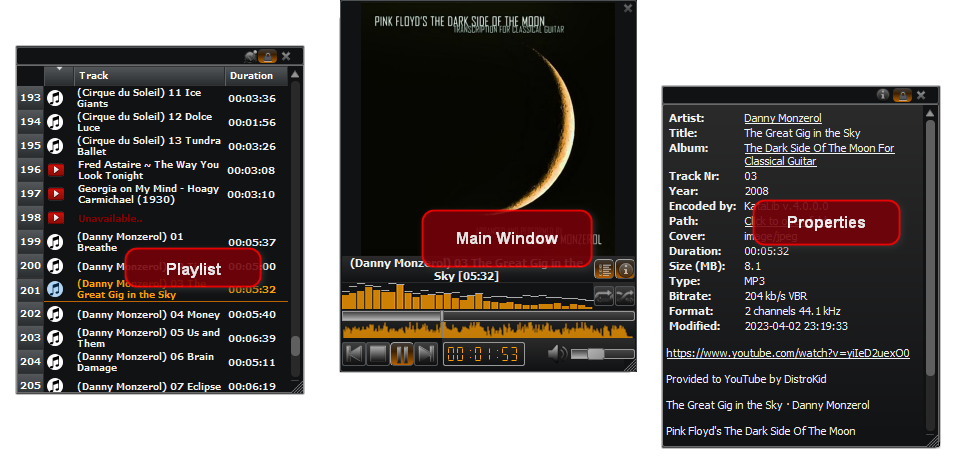  
…που αποτελείται μόνο από ένα κύριο παράθυρο αναπαραγωγής και τα ανεξάρτητα παράθυρα **Λίστα αναπαραγωγής** και **Ιδιότητες**, τα οποία μπορούν να μετακινηθούν ή να ενεργοποιηθούν/απενεργοποιηθούν, για εξοικονόμηση χώρου στην οθόνη.
Κατά τη χρήση της KataLib, να θυμάστε ότι σχεδόν όλα τα στοιχεία ελέγχου της διεπαφής χρήστη, τα κουμπιά κ.λπ. έχουν ένα Tooltip, που εξηγεί εν συντομία τι κάνουν.  
Αυτό το Tooltip εμφανίζεται όταν περνάτε το ποντίκι σας πάνω από το αντίστοιχο στοιχείο ελέγχου.  

___

Γενικά, το KataLib μπορεί να θεωρηθεί ως τρία προγράμματα σε ένα:  
Ένα πρόγραμμα αναπαραγωγής, ένας μετατροπέας και ένας βιβλιοθηκάριος.

- **Ένας Player**

    Ως Player, μπορεί να αναπαράγει οποιοδήποτε αρχείο μουσικής ή βίντεο που του ρίχνουμε από τη βιβλιοθήκη ή από τον εξερευνητή αρχείων. Μπορεί να φορτώσει λίστες αναπαραγωγής του Winamp και μπορεί επίσης να κατεβάσει συνδέσμους ή/και λίστες αναπαραγωγής του YouTube και να τις αναπαράγει.  
    Επιλέγοντας ένα ή περισσότερα κομμάτια μπορούμε να κάνουμε πολλά πράγματα, όπως: επεξεργασία μεταδεδομένων, αντιγραφή, μετακίνηση, μετατροπή ή ακόμη και λήψη του ίδιου του αρχείου βίντεο (αν πρόκειται για κομμάτι με σύνδεσμο στο YouTube).  

- **Ένας μετατροπέας**  

    Ως μετατροπέας, μπορεί να [μετατρέψει](#μετατροπή)
    από αυτούς τους τύπους αρχείων ήχου…
    
    - «.mp3» - MPEG Audio Stream, Layer III (με απώλειες)
    - «.aac» - Προηγμένη κωδικοποίηση ήχου (με απώλειες)
    - «.m4a» - MPEG-4 Part 14 (μόνο ήχος) μπορεί να περιέχει ροή AAC (με απώλειες) ή ALAC (χωρίς απώλειες)
    - «.ape» - Monkey's Audio (χωρίς απώλειες)
    - «.ogg» - Ogg/Vorbis (με απώλειες)
    - «.oga» - Ogg/Opus Audio (με απώλειες)
    - «.opus» - Opus Interactive Audio Codec (με απώλειες)
    - «.flac» - Free Lossless Audio Codec (χωρίς απώλειες)
    - «.ac3» - Dolby AC-3 (με απώλειες)
    - «.wma» - Windows Media Audio (με απώλειες)
    - «.wav» - Waveform Audio (χωρίς απώλειες)
    - «.aif» - Audio Interchange File Format (χωρίς απώλειες)
    - «.mp4» - MPEG-4 Part 14 multimedia (εξάγει τη ροή ήχου aac)
    - «.mkv» - Matroska Multimedia Container (εξάγει τη ροή ήχου)
    - «.avi» - Audio Video Interleaved Container (εξάγει τη ροή ήχου)
    - «.mov» - QuickTime File Format (εξάγει τη ροή ήχου aac)
    - «.flv» - βίντεο Flash (αφαιρεί τη ροή ήχου aac)
    - «.wv» - WavPack (χωρίς απώλειες)
    - «.mpc» - Musepack AKA MPEGplus (με απώλειες)
    - «.mp2» - MPEG-1 Audio Layer II (μόνο ήχος) (με απώλειες)
    - «.mpga» - MPEG-1 Audio Layer III (μόνο ήχος) (με απώλειες)
    - «.mpeg» - MPEG-1/2 (εξάγει τη ροή ήχου MPEG-1 Audio Layer II) (με απώλειες)
    - «.webm» - WebM - μπορεί να περιέχει Ogg ή Opus (με απώλειες)
    - «.dts» - DTS - Συστήματα ψηφιακού θεάτρου
    - «.m4b» - MPEG-4 Part 14 (μόνο ήχος) (με απώλειες) χρησιμοποιείται για ηχητικά βιβλία
    - «.dfs» - Direct Stream Digital αρχείο (χωρίς απώλειες) (μόνο για μετατροπή)
    
    … σε αυτούς τους τύπους αρχείων ήχου  
    
    - «.mp3» - MPEG Audio Stream, Layer III (με απώλειες)
    - «.m4a» - MPEG-4 Part 14 (μόνο ήχος) που περιέχει ροή AAC (με απώλειες)
    - «.aac» - Προηγμένη κωδικοποίηση ήχου AAC (με απώλειες)
    - «.ogg» - Ogg/Vorbis (με απώλειες)
    - «.opus» - Opus Interactive Audio Codec (με απώλειες)
    - «.flac» - Free Lossless Audio Codec (χωρίς απώλειες)
    - «.wav» - Waveform Audio (χωρίς απώλειες)

- **Ένας βιβλιοθηκάριος**

    Ως βιβλιοθηκάριος, χρησιμοποιεί μια βάση δεδομένων για την αποθήκευση και την εμφάνιση δύο διαφορετικών τύπων δεδομένων.  
  - Οι [Συλλογές βιβλιοθήκης](#συλλογές-βιβλιοθήκης)  
    οι οποίες είναι εικονικές λίστες αναπαραγωγής τοπικών αρχείων πολυμέσων ή/και συνδέσμων του YouTube.  
  - Το [Κομμάτια βιβλιοθήκης](#κομμάτια-βιβλιοθήκης)  
    που είναι οι ιδιότητες των τοπικών αρχείων πολυμέσων (Tracks).  

___

## Φορητή λειτουργία

Το KataLib μπορεί επίσης να ξεκινήσει σε **Φορητή** λειτουργία χρησιμοποιώντας το εντολή "-p" στη συντόμευση ή εκτελώντας το `KataLib Portable.exe`.  
Στη φορητή λειτουργία η εφαρμογή διαβάζει τις ρυθμίσεις της, την db, κλπ., από έναν κατάλογο `portable_settings` μέσα στο φάκελό της και όχι από τις ρυθμίσεις του τρέχοντος χρήστη των Windows.  
Η χρήση της φορητής λειτουργίας ενώ η εφαρμογή είναι εγκατεστημένη μέσα στον κατάλογο `Program files` δε συνιστάται, επειδή τα Windows αντιμετωπίζουν αυτόν τον φάκελο με ειδικό τρόπο.  
Οποιοσδήποτε άλλος κατάλογος ή αφαιρούμενος δίσκος είναι εντάξει, αρκεί ο χρήστης να μπορεί να γράψει σε αυτόν. 

___

## Γραμμή εργαλείων

Η γραμμή εργαλείων βρίσκεται στο πάνω μέρος του κύριου παραθύρου.  
Περιέχει κουμπιά που μπορούν να χρησιμοποιηθούν για την εκτέλεση διαφόρων ενεργειών.  
Αυτά τα κουμπιά μπορούν να αλλάξουν ή να απενεργοποιηθούν, ανάλογα με το πάνελ της εφαρμογής στο οποίο είναι εστιασμένο κάθε στιγμή.  
Κάνοντας δεξί κλικ σε ένα κενό σημείο της Γραμμής Εργαλείων, εμφανίζεται αυτό το μενού… 

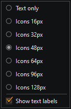  
…που μας επιτρέπει να αλλάξουμε το μέγεθος και την εμφάνιση των εικονιδίων της Γραμμής Εργαλείων.

Τα μόνιμα ορατά κουμπιά είναι: 
&nbsp;&nbsp;

1. **Μετατροπή**
  Ανοίγει το [Διάλογο Μετατροπής](#μετατροπή) για να ρυθμίσετε τον τρόπο με τον οποίο θέλετε να μετατρέψετε το επιλεγμένο(α) κομμάτι(α).
2. **Αρχεία**   
  Εμφανίζει ένα μενού με τις ακόλουθες επιλογές διαχείρισης αρχείων:
      - **Αντιγραφή** των επιλεγμένων αρχείων σε νέα τοποθεσία (χρησιμοποιεί ένα παράθυρο επιλογής αρχείων).
      - **Μετακίνηση** των επιλεγμένων αρχείων σε νέα τοποθεσία (χρησιμοποιεί ένα παράθυρο επιλογής αρχείων).
      - [**Μετονομασία**](#μετονομασία) των επιλεγμένων αρχείων χρησιμοποιώντας πρότυπο.
      - **Διαγραφή** των επιλεγμένων αρχείων από τον δίσκο. <ins>_**Χρησιμοποιήστε το με προσοχή!**_</ins>
3. **Μεταδεδομένα**  
  Ανάλογα με τον αριθμό των επιλεγμένων κομματιών, ανοίγει το παράθυρο διαλόγου [Επεξεργασία Μεταδεδομένων](#επεξεργασία-μεταδεδομένων) (μονή επιλογή) ή το παράθυρο διαλόγου [Πολλαπλή Επεξεργασία Μεταδεδομένων](#πολλαπλή-επεξεργασία-μεταδεδομένων) (πολλαπλή επιλογή).
4. **Διαγραφή κομματιών / Διαγραφή αρχείων / Διαγραφή συλλογών**  
  Αυτό το κουμπί αλλάζει εμφάνιση και λειτουργία, ανάλογα με το πάνελ στο οποίο είναι εστιασμένο τη δεδομένη στιγμή.  
  Εάν η λίστα αναπαραγωγής έχει την εστίαση, αφαιρεί κάθε επιλεγμένο κομμάτι (ή κομμάτια) από τη λίστα αναπαραγωγής.  
  Αν ο πίνακας Συλλογές Βιβλιοθήκης είναι εστιασμένος, το κουμπί αφαιρεί την/τις επιλεγμένη/ες συλλογή/ες από τη βάση δεδομένων της Βιβλιοθήκης.   
  Εάν είναι εστιασμένο το πάνελ με τα Κομμάτια βιβλιοθήκης, αφαιρεί το επιλεγμένο αρχείο (ή τα επιλεγμένα αρχεία) από τη Βιβλιοθήκη και <ins>_**τα διαγράφει από το δίσκο!**_</ins>  
5. **Προτιμήσεις**  
  Ανοίγει το παράθυρο διαλόγου [Προτιμήσεις](#προτιμήσεις).  
  Κάνοντας κλικ στο βέλος δίπλα στο κουμπί, ανοίγει ένα πτυσσόμενο μενού με τις αποθηκευμένες Διατάξεις και επιλογές για τη διαχείρισή τους, όπως:
      - **Προσθήκη** της τρέχουσας διάταξης ως νέας διάταξης
      - **Ανανέωση** της τρέχουσας επιλεγμένης διάταξης
      - **Διαγραφή** της τρέχουσας επιλεγμένης διάταξης
   
   Το μενού περιέχει επίσης μια επιλογή για μετάβαση στη [Συμπαγή προβολή](#συμπαγής-προβολή).
6. **Σχετικά**  
  Εμφανίζει το παράθυρο διαλόγου [Περί του KataLib](#σχετικά), με πληροφορίες για το πρόγραμμα και άλλα…

Εάν ο πίνακας Βιβλιοθήκη είναι ορατός και εστιασμένος, και εμφανίζονται οι Συλλογές Βιβλιοθήκης, είναι ορατά τα ακόλουθα κουμπιά:

  

1. **Διαγραφή συλλογών** (**Αφαίρεση κομματιών** αν το πάνελ Λίστα αναπαραγωγής έχει εστίαση)  
  Αφαιρεί τις επιλεγμένες συλλογές από τη Βιβλιοθήκη.
2. **Library Tracks**  
  Εμφανίζει τα αρχεία της Βιβλιοθήκης αντί για τις Συλλογές της Βιβλιοθήκης.
3. **Φίλτρο**  
  Ανοίγει το παράθυρο διαλόγου [Φιλτράρισμα συλλογών βιβλιοθήκης](#φιλτράρισμα-συλλογών-βιβλιοθήκης).
Εάν ο πίνακας Βιβλιοθήκη είναι ορατός και εστιασμένος και εμφανίζονται οι διαδρομές της Βιβλιοθήκης, εμφανίζονται επίσης τα ακόλουθα κουμπιά:

  

1. **Διαγραφή αρχείων**  
  Αφαιρεί τυχόν επιλεγμένα αρχεία από τη Βιβλιοθήκη και _**<ins>διαγράφει τα αρχεία αυτά από το δίσκο!</ins>**_
2. **Συλλογές βιβλιοθήκης**  
  Αλλάζει την εμφάνιση των Συλλογών της Βιβλιοθήκης αντί των αρχείων της Βιβλιοθήκης.
3. **Φίλτρο**  
  Ανοίγει το παράθυρο διαλόγου [Φιλτράρισμα Κομματιών Βιβλιοθήκης](#φιλτράρισμα-κομματιών-βιβλιοθήκης). 
4. **Φάκελοι βιβλιοθήκης**  
  Εμφανίζει το παράθυρο διαχείρισης [Φάκελοι Βιβλιοθήκης](#φάκελοι-βιβλιοθήκης).  
  Υπάρχει ένα αναπτυσσόμενο μενού όταν κάνουμε κλικ στο βέλος δίπλα στο κουμπί.  
  Αυτό το **Μενού φακέλων βιβλιοθήκης** έχει συντομεύσεις για τα κουμπιά **Προσθήκη φακέλου** και **Ξαναδιάβασμα φακέλων**.

# Λεπτομερείς πληροφορίες

### Λίστα αναπαραγωγής

Ο πίνακας Λίστα αναπαραγωγής είναι το κύριο μέρος του προγράμματος αναπαραγωγής.  
Μπορούμε να σύρουμε εδώ αρχεία ήχου ή λίστες αναπαραγωγής ή να χρησιμοποιήσουμε το κουμπί **Εύρεση** για να αναζητήσουμε κομμάτια στο YouTube ή στις Συλλογές μας.  
Τα φορτωμένα κομμάτια μπορούν να χρησιμοποιηθούν για αναπαραγωγή, να μετατραπούν σε διάφορες μορφές, να αποθηκευτούν ως λίστα αναπαραγωγής κ.λπ.  

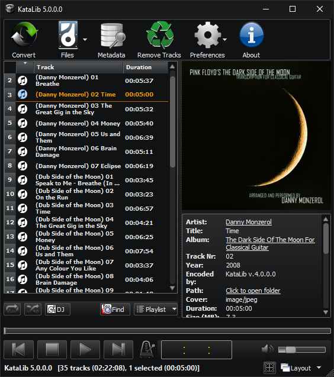
Τα κουμπιά που βρίσκονται κάτω από τη λίστα αναπαραγωγής είναι τα εξής:

- **Επανάληψη** - κάνει τη συσκευή αναπαραγωγής να ξεκινήσει από την αρχή όταν αναπαραχθεί το τελευταίο κομμάτι. 
- **Shuffle** - κάνει τη συσκευή αναπαραγωγής να παίζει με τυχαία σειρά. 
- **DJ** - ανοίγει το [DJ πάνελ](#dj-πάνελ) που μας επιτρέπει να διασταυρώνουμε το κομμάτι που παίζει με το επόμενο.
- **Εύρεση** - ανοίγει το παράθυρο διαλόγου [Εύρεση κομματιών](#εύρεση) για την αναζήτηση κομματιών στη λίστα αναπαραγωγής, στο YouTube ή στις συλλογές της βιβλιοθήκης.
- **Λίστα αναπαραγωγής** - ανοίγει απλώς το μενού [Λίστα αναπαραγωγής](#λίστα-αναπαραγωγής).

#### DJ πάνελ

  
Τα στοιχεία ελέγχου του DJ είναι τα εξής:
- **Auto**  
  Εάν είναι ενεργή, θα ξεκινήσει αυτόματα τη διασταύρωση του επόμενου κομματιού όταν τα εναπομείναντα δευτερόλεπτα του τρέχοντος κομματιού αναπαραγωγής είναι ίσα με τη **Διάρκεια**.
- **XFade**  
  Πατώντας αυτό το κουμπί θα ξεκινήσει αμέσως μια διασταύρωση.
- **Διάρκεια**  
  Η διάρκεια της διασταύρωσης σε δευτερόλεπτα.
- **Type**  
  Επιλέξτε εδώ τις καμπύλες εισόδου/εξόδου.
- **Μετατόπιση επιπέδου**  
  Αυτό είναι το αρχικό ποσοστό στάθμης του επόμενου κομματιού. Το κομμάτι θα σβήνει από αυτό το επίπεδο στο επίπεδο αναπαραγωγής 100%.
- **Position offset**  
  Εδώ μπορούμε να επιλέξουμε τη θέση εκκίνησης του επόμενου κομματιού.
- **CrossFader**  
  Πραγματοποιήστε χειροκίνητα ένα crossfade.  
  Μετακινώντας αυτό το ρυθμιστικό, αλλάζει ταυτόχρονα η ένταση τόσο του αναπαραγόμενου κομματιού (χαμηλότερη όσο το ρυθμιστικό μετακινείται προς τα δεξιά) όσο και του επόμενου κομματιού (δυνατότερη όσο το ρυθμιστικό μετακινείται προς τα δεξιά).  
  Στο τέρμα δεξιά, το crossfade τελειώνει και το ρυθμιστικό επιστρέφει στην αρχική του θέση.  

#### Εύρεση

Πατώντας το κουμπί **Find** ανοίγει το παράθυρο διαλόγου **Find Tracks** που μας επιτρέπει να αναζητήσουμε Tracks στα ακόλουθα σημεία.  

- **YouTube** 

    
  Μπορούμε να αναζητήσουμε στο **YouTube** ένα τραγούδι και αν το βρούμε μπορούμε να το **προσθέσουμε** στη λίστα αναπαραγωγής. Η απόρριψή του στη λίστα αναπαραγωγής λειτουργεί επίσης.  
  Το κουμπί Clear Playlist μπορεί να χρησιμοποιηθεί για να αφαιρέσουμε όλα τα κομμάτια από τη λίστα αναπαραγωγής, πριν προσθέσουμε τα καινούργια.  
  Αν είναι επιλεγμένο το πλαίσιο ελέγχου **Μόνο λίστες αναπαραγωγής**, η αναζήτηση στο YouTube θα επιστρέφει μόνο λίστες αναπαραγωγής και αν προσθέσουμε μία από αυτές, όλα τα κομμάτια της θα προστεθούν στη λίστα αναπαραγωγής μας.  
  Το κουμπί **Κείμενο στο πρόχειρο** μας επιτρέπει να δούμε τις διευθύνσεις YouTube που υπάρχουν στο πρόχειρο ή να πληκτρολογήσουμε μια δική μας.

- **Συλλογές**

    
  Μπορούμε επίσης να κάνουμε αναζήτηση για **Συλλογές** στη Βιβλιοθήκη μας ή για συγκεκριμένα κομμάτια μέσα σε αυτές τις Συλλογές (αν είναι ενεργοποιημένη η επιλογή **Αναζήτηση κομματιών**).  

- **Λίστα αναπαραγωγής**  
    
  Τέλος, μπορούμε να αναζητήσουμε τα τρέχοντα φορτωμένα **Playlist** Tracks για ένα συγκεκριμένο κομμάτι και να το **παίξουμε**. 

#### Οπτικοποιητής

Ο οπτικοποιητής είναι ένας τρόπος οπτικοποίησης των δεδομένων ήχου του τρέχοντος αναπαραγόμενου κομματιού.  
Μπορεί να είναι σε έναν από τους τρεις τρόπους οπτικοποίησης:

* **Αναλυτής φάσματος**  
  Αυτός είναι ο προεπιλεγμένος και εμφανίζει το φάσμα συχνοτήτων του τρέχοντος αναπαραγόμενου κομματιού.  
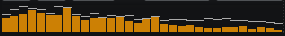  
* **Ο παλμογράφος**  
  Αυτό δείχνει την κυματομορφή του τρέχοντος κομματιού που παίζει.  
  
* **Φασματογράφος**  
  Αυτό δείχνει επίσης το φάσμα συχνοτήτων του τρέχοντος αναπαραγόμενου κομματιού, αλλά δείχνει επίσης τον άξονα χρόνου.  
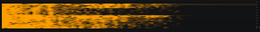  

Κάνοντας κλικ στον Οπτικοποιητή, αλλάζουμε τύπο οπτικοποίησης, ενώ κάνοντας δεξί κλικ θα ανοίξει το [μενού Απεικόνησης](#μενού-απεικόνισης).

### Έλεγχος αναπαραγωγής

Ως επί το πλείστον, αυτονόητοι έλεγχοι αναπαραγωγής: 
- **Μπάρα θέσης** - Εμφανίζει τη θέση του τρέχοντος αναπαραγόμενου κομματιού και μας επιτρέπει να μεταπηδήσουμε σε ένα συγκεκριμένο σημείο. 
- **Waveform** - Οπτική αναπαράσταση του ηχητικού κομματιού που μας επιτρέπει επίσης να μεταπηδήσουμε σε ένα συγκεκριμένο σημείο.
- **Προηγούμενο κομμάτι** - Μετάβαση/αναπαραγωγή του προηγούμενου κομματιού.
- **Stop** - Διακοπή της αναπαραγωγής.
  Κρατώντας πατημένο το `Alt` όταν κάνετε κλικ, θα σβήσετε το κομμάτι, ενώ κρατώντας πατημένο το `Shift` όταν κάνετε κλικ, θα σταματήσετε την αναπαραγωγή όταν τελειώσει το κομμάτι και θα επιλέξετε το επόμενο.
- **Play/Pause** - Εναλλαγή μεταξύ αναπαραγωγής/παύσης. 
- **Επόμενο κομμάτι** - Μετάβαση στο/αναπαραγωγή του επόμενου κομματιού. 
- **Tap Tempo** - Ανοίγει το παράθυρο διαλόγου Tap Tempo που σας επιτρέπει να μετρήσετε χειροκίνητα το BPM του κομματιού και να το προσθέσετε στα μεταδεδομένα του. 
- **Οθόνη χρόνου** - Εμφανίζει έναν από μια ποικιλία χρόνων, που μπορούν να επιλεγούν είτε από το μενού που ανοίγει όταν κάνετε δεξί κλικ, είτε με κύκλο με αριστερό κλικ πάνω του:
  - Χρόνος που παρήλθε 
  - Υπολειπόμενος χρόνος
  - Συνολικός χρόνος που παρήλθε
  - Συνολικός υπολειπόμενος χρόνος
- **Σίγαση** - Σίγαση/αποσύνδεση της εξόδου ήχου. 
- **Volume** - Αλλάζει την ένταση της εξόδου ήχου. 

### Συμπαγής προβολή

Αυτή είναι μια ελάχιστη προβολή της εφαρμογής, η οποία αποτελείται από ένα μικρό, με δυνατότητα αλλαγής μεγέθους, Κύριο παράθυρο, το οποίο εμφανίζει κυρίως το εξώφυλλο του τρέχοντος αναπαραγόμενου (ή επιλεγμένου) κομματιού, τον [Οπτικοποιητή](#οπτικοποιητής) και τον [Έλεγχο Αναπαραγωγής](#έλεγχος-αναπαραγωγής) που ελέγχει την αναπαραγωγή.  

Πάνω από τον Έλεγχο Αναπαραγωγής, υπάρχει ο τίτλος του τρέχοντος επιλεγμένου/αναπαραγόμενου κομματιού και δύο επιπλέον κουμπιά που ανοίγουν/κλείνουν τα παράθυρα της Λίστας Αναπαραγωγής και των Ιδιοτήτων.  
Κάνοντας διπλό κλικ σε αυτό το κείμενο του τίτλου, θα εμφανιστεί το αρχείο στον Explorer ή το url του YouTube στο πρόγραμμα περιήγησης του συστήματος.  
Κάνοντας διπλό κλικ στο εξώφυλλο θα ανοίξει ο διάλογος [Επεξεργασίας Μεταδεδομένων](#επεξεργασία-μεταδεδομένων) (ή [Πολλαπλών Μεταδεδομένων](#πολλαπλή-επεξεργασία-μεταδεδομένων)) αν το(τα) κομμάτι(α) έχει(ουν) μεταδεδομένα.  
Με δεξί κλικ στο Cover Art θα δημιουργηθεί ένα [μενού Συμπαγούς προβολής](#μενού-συμπαγούς-προβολής) με πρόσθετες επιλογές.  

Όλα τα παράθυρα **Συμπαγούς προβολής** διαθέτουν ένα κουμπί **Κλείσιμο** (**x**) που τα κλείνει.  
Τα παράθυρα Λίστα αναπαραγωγής και Ιδιότητες έχουν την ίδια λειτουργικότητα με την **Πλήρη προβολή**, καθώς επίσης και κάποια ακόμα κουμπιά.  
Το κουμπί **Κλείδωμα**, κλειδώνει τη θέση του παραθύρου σε σχέση με το Κύριο παράθυρο, οπότε όταν μετακινούμε το Κύριο παράθυρο, το κλειδωμένο παράθυρο μετακινείται μαζί του με τον ίδιο τρόπο.  
Επιπλέον, το παράθυρο Λίστα αναπαραγωγής διαθέτει ένα κουμπί **DJ** για να ανοίξει το παράθυρο [DJ πάνελ](#dj-πάνελ) της λίστας αναπαραγωγής και το παράθυρο Ιδιότητες διαθέτει ένα κουμπί **About** για να ανοίξει το παράθυρο [Περί του KataLib](#σχετικά).  

### Συλλογές βιβλιοθήκης

Όταν εμφανίζονται οι **Συλλογές βιβλιοθήκης**, κάθε γραμμή αποτελείται από το όνομα της Συλλογής, τον αριθμό των κομματιών, τις προσαρμοσμένες ετικέτες, τη συνολική διάρκεια κ.λπ.  

  

Υπάρχουν τρεις τύποι συλλογών
- Συλλογές YouTube που χρησιμοποιούν τη διεύθυνση url της λίστας αναπαραγωγής του YouTube
- Συλλογές Spotify που μπορούν να χρησιμοποιήσουν μια διεύθυνση url λίστας αναπαραγωγής, άλμπουμ ή λίστας podcast του Spotify
- Προσαρμοσμένες συλλογές που μπορούν να περιέχουν οποιονδήποτε αριθμό κομματιών local/YouTube και δεν χρησιμοποιούν καμία διεύθυνση url

Οι Αγαπημένες Συλλογές μπορούν επίσης να πάρουν **Αστέρι** και να χρησιμοποιήσουν αυτό το χαρακτηριστικό για φιλτράρισμα ή ταξινόμηση. 

Μπορούμε να δημιουργήσουμε Συλλογές από το μενού δεξιού κλικ της Λίστας αναπαραγωγής, μπορούμε να προσθέσουμε κομμάτια σε υπάρχουσες Συλλογές, μπορούμε να αφαιρέσουμε κομμάτια από αυτές, μπορούμε να διαγράψουμε υπάρχουσες Συλλογές, να τις αφήσουμε στη Λίστα αναπαραγωγής για αναπαραγωγή κ.λπ.  

### Κομμάτια βιβλιοθήκης
Όταν εμφανίζονται τα **Τραγούδια της βιβλιοθήκης**, κάθε γραμμή αποτελείται από κάποιες βασικές πληροφορίες (όπως το μέγεθος του αρχείου ή ο τύπος αρχείου), κάποιες πληροφορίες που περιέχονται μέσα σε κάποια μουσικά αρχεία (όπως ο καλλιτέχνης ή ο τίτλος) και τέλος κάποιες πληροφορίες που παρέχουμε εμείς οι ίδιοι και μας βοηθούν να οργανώσουμε τη συλλογή μας (όπως ετικέτες ή βαθμολογία).  
Για να εισάγουμε τα μουσικά αρχεία στη βιβλιοθήκη, πρέπει να δώσουμε στο πρόγραμμα τη θέση τους.  
Αυτό γίνεται πατώντας το κουμπί **Φάκελοι βιβλιοθήκης** της γραμμής εργαλείων.  
Στο παράθυρο διαλόγου **Φάκελοι βιβλιοθήκης** μπορούμε να προσθέσουμε/αφαιρέσουμε φακέλους στη/από τη βιβλιοθήκη.  
Μόνο φάκελοι μπορούν να προστεθούν στη βιβλιοθήκη, όχι μεμονωμένα αρχεία.  
Μπορούμε να σαρώσουμε εκ νέου τους φακέλους για να ενημερώσουμε τη βιβλιοθήκη με τις αλλαγές στα περιεχόμενά τους και, ελέγχοντας ή καταργώντας τον έλεγχο, μπορούμε να τους κάνουμε ορατούς ή όχι.  
Επιλέγοντας ένα αρχείο στη βιβλιοθήκη μπορούμε να δούμε τις ιδιότητές του στον πίνακα **Ιδιότητες** (αν είναι ορατό).  
Κάνοντας ξανά κλικ σε οποιοδήποτε κελί μπορούμε να επεξεργαστούμε τα περιεχόμενα αυτού του κελιού. Η επεξεργασία ενός κελιού αλλάζει τα περιεχόμενα της βιβλιοθήκης αλλά και τα μεταδεδομένα του ίδιου του αρχείου.  
Τα μεταδεδομένα του αρχείου μπορούν να επεξεργαστούν είτε απευθείας κάνοντας κλικ στα κελιά είτε πατώντας το κουμπί **Μεταδεδομένα** της γραμμής εργαλείων.  
Αυτό θα ανοίξει το παράθυρο διαλόγου **Επεξεργασία μεταδεδομένων**.
Εάν κατά το πάτημα του κουμπιού είναι επιλεγμένα περισσότερα από ένα αρχεία, θα ανοίξει το **Multi Edit Metadata** και οι αλλαγές εκεί θα επηρεάσουν όλα τα επιλεγμένα αρχεία.  
Τα επιλεγμένα αρχεία μπορούν να αντιγραφούν ή να μετακινηθούν οπουδήποτε και μπορούν επίσης να μετατραπούν σε πολλές άλλες μορφές ήχου με τον ενσωματωμένο μετατροπέα.  
Μπορούν επίσης να αναπαραχθούν, αλλά για να προωθηθούν αυτόματα (όπως μια λίστα) η λίστα αναπαραγωγής του Player πρέπει να είναι κενή.

### Μετατροπή

Ένα παράθυρο διαλόγου για την επιλογή των ρυθμίσεων μετατροπής.  

   
Η συνήθης ροή εργασιών μιας μετατροπής, είναι να αποσυμπιέσετε τα αρχεία σε μορφή αρχείου `.wav` και στη συνέχεια να τα κωδικοποιήσετε εκ νέου με τον επιλεγμένο κωδικοποιητή.  

Εκτός από τις κύριες ρυθμίσεις για τους κωδικοποιητές, όπως ο _Τύπος συμπίεσης_ και ο _Ελέγχος ποιότητας_ της μετατροπής, υπάρχουν μερικές ακόμη ρυθμίσεις:

- **Μίξη Εισόδου**  
    Αυτή η επιλογή μετατρέπει πολυκάναλα αρχεία ήχου (5.1, 9.1 κ.λπ.) σε στερεοφωνικά ή μονοφωνικά.
- **bit εύρος του ενδιάμεσου wav**  
    Αυτή η επιλογή επηρεάζει το εύρος σε bit του ενδιάμεσου (ή τελικού) αρχείου wave.
- **Συχνότητα δειγματοληψίας**  
    Αυτό αλλάζει την συχνότητα δειγματοληψίας της κωδικοποίησης.
- **Έξοδος MP3**  
    Αυτό επηρεάζει μόνο την κωδικοποίηση MP3. Αλλάζει τον αλγόριθμο του καναλιού.  
- **Αλλαγή έντασης ήχου**  
    Αυξάνει ή μειώνει την ένταση των μετασχηματισμένων κομματιών.
    - **Max** (Απενεργοποιημένο αν δεν είναι ενεργοποιημένη η επιλογή `Αλαγή έντασης`)  
    Κανονικοποιεί την ένταση του ήχου των κομματιών.  
    Αυξάνει ή μειώνει την ένταση του ήχου στο μέγιστο (πριν από το ψαλίδισμα). 
- **Μέση στάθμη στα**  
    Διατηρεί τη μέση στάθμη των κομματιών κοντά σε αυτή την τιμή.  
    Η προεπιλεγμένη τιμή είναι -18. Πλησιάζοντας προς το 0 αυξάνει η μέση στάθμη.  
    <ins>_**Μην χρησιμοποιείτε επίπεδα κοντά στο 0, γιατί ο ήχος θα παραμορφωθεί!**_</ins>
- **Αφαίρεση κενών**  
    Αφαιρεί τη σιωπή από την αρχή και το τέλος του κομματιού.
- **Περικοπή/Διαίρεση**  
    Ανοίγει ένα επιπλέον παράθυρο διαλόγου που σας επιτρέπει να [περικόψετε](#περικοπή) το κομμάτι σε ένα συγκεκριμένο μήκος ή να το [διαιρέσετε](#διαίρεση) σε πολλαπλά κομμάτια. 
- **Αρχική θέση**  
    Αποθηκεύει τα μετατρεμμένα κομμάτια στην ίδια διεύθυνση με τα κομμάτια προέλευσης (οι σύνδεσμοι αποθηκεύονται στο φάκελο Λήψη).  
    <ins>_**Προσοχή να μην αντικαταστήσετε τα αρχικά αρχεία με τα μετατρεμμένα.**_</ins>
- **Ένωση (επανακωδικοποίηση)**  
    Δημιουργήστε ένα συνεχές κομμάτι με την ένωση των επιλεγμένων κομματιών.  
    Τα αρχεία θα αποσυμπιεστούν, θα ενωθούν και στη συνέχεια θα συμπιεστούν εκ νέου.  
    (Ενεργοποιείται μόνο όταν έχουν επιλεγεί περισσότερα από ένα κομμάτια της ίδιας μορφής)

Το κουμπί **Reset All** επαναφέρει τις προεπιλεγμένες ρυθμίσεις του διαλόγου.  
Το **Convert** ξεκινά τη διαδικασία μετατροπής, ενώ το **Close** απλώς κλείνει το παράθυρο διαλόγου (αλλά διατηρεί όλες τις αλλαγές που έχουν γίνει).

### Επεξεργασία μεταδεδομένων

  

Αυτός ο διάλογος μας επιτρέπει να επεξεργαστούμε όλα τα μεταδεδομένα του κομματιού και επίσης να αλλάξουμε το όνομα αρχείου του.  

Μπορούμε να **αντιγράψουμε** και να **επικολλήσουμε** τα μεταδεδομένα (συμπεριλαμβανομένης της εικόνας του εξωφύλλου).  
Όταν πατηθεί το κουμπί Επικόλληση, θα ανοίξει ένας διάλογος **Προτιμήσεις επικόλλησης**, που μας επιτρέπει να επιλέξουμε ποια πεδία από τα αντιγραμμένα μεταδεδομένα θα επικολληθούν.  
Υπάρχουν ορισμένα κουμπιά «ευκολίας» που απαιτούν περισσότερες εξηγήσεις.
1. Αυτό το κουμπί απλά ανοίγει το παράθυρο διαλόγου **Κάλυμμα λήψης** και ξεκινάει αυτόματα την αναζήτηση (γλιτώνοντας μας από μερικά επιπλέον κλικ).
2. Αυτό το κουμπί μαντεύει τα πεδία που λείπουν αναζητώντας αυτόματα μεταδεδομένα χρησιμοποιώντας οποιαδήποτε ήδη διαθέσιμη ετικέτα (λειτουργεί μόνο για τους τίτλους, τον καλλιτέχνη, το άλμπουμ, τον αριθμό του κομματιού και το έτος).
3. Αυτά τα κουμπιά απλώς κλείνουν το παράθυρο διαλόγου μεταδεδομένων του τρέχοντος κομματιού και ανοίγουν αυτόματα το επόμενο (ή το προηγούμενο).

Υπάρχει επίσης η επιλογή για **Αναζήτηση μεταδεδομένων** από το διαδίκτυο, εφόσον παρέχουμε τουλάχιστον έναν τίτλο για το κομμάτι.  
Το κουμπί **Πάρε στίχους** αναζητά τους στίχους για το τρέχον κομμάτι.  
Αν βρεθούν κάποιοι στίχοι, προστίθενται στα σχόλια _μετά_ από οποιοδήποτε ήδη υπάρχον κείμενο.

Όλες οι αλλαγές που γίνονται σε αυτό το παράθυρο διαλόγου δεν εγγράφονται στο αρχείο μέχρι να πατήσετε είτε το κουμπί OK είτε τα κουμπιά με τα βέλη Next/Prev.

### Πολλαπλή επεξεργασία μεταδεδομένων

  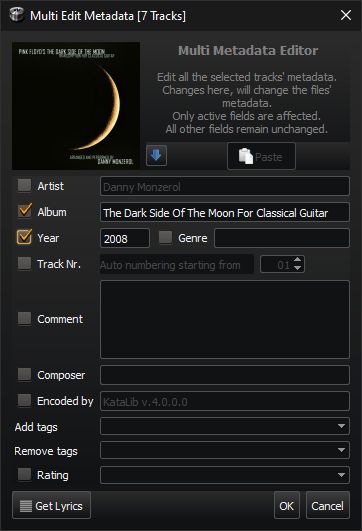

Ανοίγει το παράθυρο διαλόγου για να αλλάξετε τα μεταδεδομένα από όλα τα επιλεγμένα αρχεία ταυτόχρονα.  
Μόνο οι επιλεγμένες (ενεργοποιημένες) καταχωρήσεις θα επηρεάσουν τα αρχεία.  
Εάν δεν υπάρχει τιμή σε μια επιλεγμένη (ενεργοποιημένη) καταχώρηση, τα αντίστοιχα μεταδεδομένα θα διαγραφούν.  
Μερικά κουμπιά ευκολίας είναι:
- **Αυτόματη αρίθμηση ξεκινώντας από**  
    Εάν είναι επιλεγμένο το **Track Nr.**, τα επιλεγμένα κομμάτια λαμβάνουν έναν νέο αριθμό Track, διαδοχικά, ξεκινώντας από τον αριθμό που έχει οριστεί εδώ. 
- **Πάρε στίχους**  
    Αυτό το κουμπί λειτουργεί λίγο διαφορετικά εδώ.  
    Ψάχνει τους στίχους για όλα τα επιλεγμένα κομμάτια και, αν βρεθούν κάποιοι από αυτούς, προστίθενται αυτόματα στα αντίστοιχα μεταδεδομένα.   

Φυσικά, τίποτα δεν εγγράφεται πραγματικά στα αρχεία μέχρι να πατηθεί το κουμπί OK. 

### Φιλτράρισμα

Η λειτουργία **Φίλτρο** μας βοηθάει να περιορίσουμε αυτά που εμφανίζονται στη Βιβλιοθήκη.  
Ανάλογα με τον τρόπο εμφάνισης της Βιβλιοθήκης (Συλλογές ή Κομμάτια), αυτό το κουμπί ανοίγει διαφορετικά παράθυρα διαλόγου.

#### Φιλτράρισμα Συλλογών Βιβλιοθήκης

   
Με αυτόν τον διάλογο μπορούμε να φιλτράρουμε τις Συλλογές χρησιμοποιώντας τις ετικέτες τους.  
Μπορούμε να επιλέξουμε πολλαπλές ετικέτες και έχουμε τις εξής επιλογές: 
- Εμφάνιση συλλογών που περιέχουν όλες τις επιλεγμένες ετικέτες
- Εμφάνιση συλλογών που περιέχουν οποιαδήποτε από τις επιλεγμένες ετικέτες
- Εμφάνιση συλλογών που δεν περιέχουν καμία από τις επιλεγμένες ετικέτες

Το κουμπί _«αστέρι»_ μας επιτρέπει να φιλτράρουμε χρησιμοποιώντας μόνο τις Συλλογές **Αγαπημένα**, ενώ το κουμπί «**x**» διαγράφει όλες τις επιλεγμένες ετικέτες.  
Υπάρχει επίσης ένας αριθμός δίπλα σε κάθε όνομα ετικέτας, ο οποίος απεικονίζει τον αριθμό των Συλλογών που χρησιμοποιούν αυτή την ετικέτα. 

#### Φιλτράρισμα Κομματιών Βιβλιοθήκης

 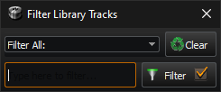     
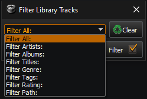  
Με αυτό το παράθυρο διαλόγου μπορούμε να φιλτράρουμε τα Tracks χρησιμοποιώντας τη διαδρομή τους, τα μεταδεδομένα τους, όπως Καλλιτέχνης, Άλμπουμ, Τίτλος, Είδος, Ετικέτες, Βαθμολογία ή Όλα τα παραπάνω.  
Πατώντας το κουμπί **Filter** ενημερώνεται η προβολή και πατώντας το κουμπί **Clear** μηδενίζεται.  
Αν το πλαίσιο ελέγχου στο κουμπί **Φίλτρο** είναι επιλεγμένο, η προβολή ενημερώνεται καθώς πληκτρολογούμε, αλλά αυτό μπορεί να έχει καθυστερήσεις αν η Βιβλιοθήκη παρουσιάζει πολλά αρχεία.  
Μπορούμε επίσης να χρησιμοποιήσουμε τελεστές boolean (OR, AND, NOT με κεφαλαία γράμματα) με τις λέξεις-κλειδιά μας.  
Π.χ. `Pink Floyd AND Animals`  
θα μας δείξει όλα τα κομμάτια των Pink Floyd από το άλμπουμ τους «Animals». 

### Φάκελοι βιβλιοθήκης

Διαχειριστείτε τους φακέλους της βιβλιοθήκης που περιέχουν όλα τα κομμάτια της βιβλιοθήκης.  
Εδώ μπορούμε να:

- **προσθήκη φακέλου** ανοίγει ένα παράθυρο διαλόγου επιλογής φακέλου για την προσθήκη ενός φακέλου στη βιβλιοθήκη.  
  Όλα τα μουσικά αρχεία στον επιλεγμένο φάκελο και οι φάκελοι μέσα σε _αυτόν_ τον επιλεγμένο φάκελο θα προστεθούν στη βιβλιοθήκη.  
  Κάθε καταχώρηση φακέλου που τυχαίνει να είναι επίσης υποφάκελος μιας άλλης καταχώρησης φακέλου θα αφαιρείται ως περιττή.  
  Φυσικά, τα αρχεία θα εξακολουθούν να βρίσκονται στη βιβλιοθήκη.
- Η επιλογή **Αφαίρεση επιλεγμένων** αφαιρεί τους επιλεγμένους (όχι τους επιλεγμένους) φακέλους από τη βιβλιοθήκη (αλλά όχι από το δίσκο).
- **ReScan Folders** σαρώνει εκ νέου τους φακέλους της βιβλιοθήκης για να ενημερώσει τα μεταδεδομένα αν έχουν αλλάξει και για να προσθέσει νέα αρχεία ή να αφαιρέσει διαγραμμένα αρχεία αν έχουν αλλάξει τα περιεχόμενα των φακέλων της βιβλιοθήκης.
- **Επιλεγμένο** Εάν το Checked είναι _επιλεγμένο_ (!), μόνο οι _επιλεγμένοι_ (!!) φάκελοι θα σαρωθούν εάν πατηθεί το κουμπί **ReScan**.  
  Διαφορετικά, σαρώνονται όλοι οι φάκελοι.
- Το πλαίσιο ελέγχου **Όλοι** ελέγχει/αποελέγχει όλους τους φακέλους

Το σημάδι ελέγχου μπροστά από έναν φάκελο καθορίζει επίσης αν τα περιεχόμενα αυτού του φακέλου θα είναι ορατά στη βιβλιοθήκη.  
Μπορούμε επίσης να αφήσουμε εδώ φακέλους από τον εξερευνητή αρχείων για να προστεθούν στη βιβλιοθήκη.  

### Προτιμήσεις

Υπάρχουν πέντε σελίδες στο παράθυρο διαλόγου Προτιμήσεις:  

#### Γενικά

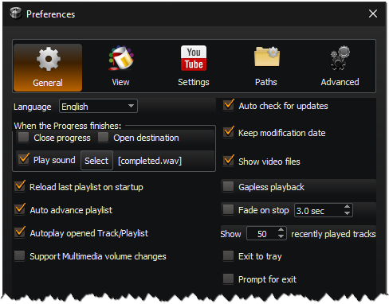

- **Γλώσσα**  
  Επιλέξτε τη γλώσσα του προγράμματος.
- **Όταν τελειώσει η Πρόοδος:**
  - Κλείσιμο προόδου - κλείνει το παράθυρο προόδου  
  - Άνοιγμα προορισμού - ανοίγει τον κατάλογο προορισμού στην Εξερεύνηση  
  - Αναπαραγωγή ήχου - κάντε έναν ήχο όταν όλα είναι έτοιμα  
  - Επιλέξτε [_current sound_]  
    Μπορούμε να επιλέξουμε ένα άλλο αρχείο ήχου, πατώντας αυτό το κουμπί και αναζητώντας ένα αρχείο «.wav».
- **Επαναφορά της τελευταίας λίστας αναπαραγωγής κατά την εκκίνηση**  
  Κατά την εκκίνηση του προγράμματος, επαναφορτώνει τα κομμάτια που είχαν φορτωθεί όταν έκλεισε τελευταία φορά.
- **Αυτόματη προώθηση λίστας αναπαραγωγής**  
  Όταν τελειώσει η αναπαραγωγή ενός κομματιού στη λίστα αναπαραγωγής, αρχίζει αυτόματα η αναπαραγωγή του επόμενου.  
- **Αυτόματη αναπαραγωγή ανοιγμένου κομματιού/λίστας αναπαραγωγής**  
  Ξεκινά αυτόματα την αναπαραγωγή, εάν ένα αρχείο ή μια λίστα αναπαραγωγής έχει ανοιχτεί με το KataLib και η λίστα αναπαραγωγής είναι κενή.
- **Υποστήριξη αλλαγών έντασης ήχου πολυμέσων**  
  Επιτρέπει τη χρήση των πλήκτρων πολυμέσων για τον έλεγχο της έντασης αναπαραγωγής της συσκευής αναπαραγωγής. 
- **Αυτόματος έλεγχος για ενημερώσεις** 
 Αυτόματος έλεγχος στο διαδίκτυο για ενημερωμένη έκδοση.
- **Διατήρηση ημερομηνίας τροποποίησης** 
 Διατήρηση της αρχικής ημερομηνίας τροποποίησης κατά την επεξεργασία των μεταδεδομένων ενός αρχείου.
- **Εμφάνιση αρχείων βίντεο** 
 Εμφάνιση αρχείων βίντεο στη Βιβλιοθήκη και επίσης δυνατότητα αναπαραγωγής τους στη λίστα αναπαραγωγής.  
  Αυτά τα αρχεία βρίσκονται πάντα στη βάση δεδομένων, απλά επιλέγουμε αν θέλουμε να τα βλέπουμε ή όχι.  
  Τα αρχεία βίντεο είναι αρχεία με επεκτάσεις όπως avi, mp4, mov, mkv κλπ.
- **Fade on stop** 
 Σβήνει το κομμάτι που αναπαράγεται πριν από τη διακοπή.
- **Αναπαραγωγή χωρίς κενά**
  Προσπαθήστε να εξαλείψετε τη σιωπή που ακούγεται κατά τη διάρκεια του χρόνου που χρειάζεται για να φορτωθεί το επόμενο κομμάτι.
- **Έξοδος στο δίσκο**  
  Μην βγαίνετε από το KataLib όταν πατάτε το κουμπί κλεισίματος, αντίθετα ελαχιστοποιήστε το στο εικονίδιο του δίσκου.  
  Αν αυτό είναι ενεργοποιημένο, ο μόνος τρόπος εξόδου από το πρόγραμμα είναι η καταχώρηση **Έξοδος** στο μενού του εικονιδίου του δίσκου.
- **Πρόσκληση για έξοδο**  
  Άνοιγμα ενός διαλόγου επιβεβαίωσης πριν από την έξοδο από το πρόγραμμα.

[//]: # (- **Κεντρική έξοδος** )

[//]: # ( Επιλέξτε μια έξοδο ήχου του συστήματος για την αναπαραγωγή).

[//]: # (- **Εξοδος τηλεφώνων** )

[//]: # ( Επιλέξτε μια έξοδο ήχου του συστήματος για την παρακολούθηση/συνθήκη.)

#### Προβολή

**Θέμα**  
Επιλέξτε μεταξύ των θεμάτων Light, Dark και Custom.  
Το προσαρμοσμένο θέμα δέχεται ένα αρχείο `.qss` (ένα αρχείο `.css` με γεύση Qt).  
Αυτά τα αρχεία μπορούν επίσης να κάνουν γρήγορη προεπισκόπηση, με σύρσιμο και απόθεση στο κύριο παράθυρο (όταν το παράθυρο διαλόγου Προτιμήσεις είναι κλειστό). 

**Προβολή λίστας αναπαραγωγής**  
Αλλάζει τον τρόπο με τον οποίο εμφανίζονται τα κομμάτια στη λίστα αναπαραγωγής.

- **Πλήρης** -> (Καλλιτέχνης) Αριθμός κομματιού Τίτλος
- **Μόνο τίτλοι**
- **Ονόματα αρχείων**
- **Καλλιτέχνες και τίτλοι** -> (Καλλιτέχνης) Τίτλος

Μπορούμε επίσης να αποκρύψουμε τον αριθμό της λίστας αναπαραγωγής ή/και το εικονίδιο της λίστας αναπαραγωγής.  

**Αλλαγή γραμματοσειράς λίστας αναπαραγωγής**  
Αλλάξτε τη γραμματοσειρά και το ύψος γραμμής των καταχωρήσεων της λίστας αναπαραγωγής.

**Αλλαγή γραμματοσειράς βιβλιοθήκης** 
Αλλαγή της γραμματοσειράς και του ύψους γραμμής των καταχωρήσεων της βιβλιοθήκης.

**Μέγεθος γραμματοσειράς συμπαγούς τίτλου** 
Αλλάξτε το μέγεθος γραμματοσειράς του τίτλου του κομματιού που εμφανίζεται στη διάταξη **Συμπυκνή προβολή**.

**DropZone** 
Ενεργοποιήστε τη χρήση της [Περιοχής Ρίψης](#περιοχή-ρίψης) και προσαρμόστε την εμφάνισή της.

**Κουμπιά γραμμής εργαλείων** και **Εμφάνιση ετικετών κειμένου** 
Εδώ μπορούμε να προσαρμόσουμε τον τρόπο εμφάνισης των κουμπιών της γραμμής εργαλείων.  
Μπορούμε να επιλέξουμε το μέγεθος των εικονιδίων της Γραμμής Εργαλείων και ακόμη και αν το εικονίδιο ή το κείμενό τους είναι ορατό.

**Διάταξη παραθύρων**
Μπορούμε να αποθηκεύσουμε εδώ τις διαμορφώσεις των παραθύρων (μέγεθος, θέση, ανοιχτά πάνελ, γραμματοσειρές κ.λπ.).  

- **+ / -**  
    Προσθέτει την τρέχουσα διαμόρφωση παραθύρου / Αφαιρεί την τρέχουσα επιλεγμένη διάταξη.
- **Εφαρμογή**  
    Εφαρμόζει την τρέχουσα επιλεγμένη διάταξη.
- **Βέλος πάνω/κάτω**  
    Μετακινεί την τρέχουσα επιλεγμένη διάταξη.
- **Ενημέρωση**  
    Ενημερώνει την επιλεγμένη διάταξη με την τρέχουσα διαμόρφωση παραθύρου.
- **Επαναφορά**  
    Επαναφέρει την τρέχουσα διαμόρφωση παραθύρου στην προεπιλεγμένη.

**Υπότιτλοι**  
Μπορούμε να αλλάξουμε τη γραμματοσειρά και τη θέση του κειμένου υποτίτλων (για αρχεία βίντεο που διαθέτουν υπότιτλους). 

#### Ρυθμίσεις YouTube

- **Ρεύμα ήχου** 
 Το ρεύμα ήχου του YouTube που θα χρησιμοποιηθεί για τη μετατροπή.
- **Ελέγξτε το πρόχειρο για συνδέσμους** 
 Ελέγξτε το πρόχειρο για οποιοδήποτε κείμενο που περιέχει ένα βίντεο ή μια διεύθυνση λίστας αναπαραγωγής από το YouTube.
- **Trim silence** 
 Κόβει τη σιωπή από την αρχή και το τέλος του κομματιού.
- **Keep average level at** 
 Διατηρεί το μέσο επίπεδο αναπαραγωγής των κομματιών του YouTube κοντά σε αυτή την τιμή.  
    Η προεπιλεγμένη τιμή είναι -18. Πλησιάζοντας προς το 0 αυξάνεται η μέση στάθμη. 
 &lt;ins&gt;Μην χρησιμοποιείτε επίπεδα κοντά στο 0, γιατί ο ήχος θα παραμορφωθεί!&lt;/ins&gt,
- **Προσθέστε τον αριθμό ανάλυσης στο όνομα αρχείου του βίντεο** όταν αποθηκεύετε ένα βίντεο από το YouTube.
- **Κωδικοποίηση υποτίτλων**  
    Αυτή είναι η κωδικοποίηση (UTF-8/ANSI) που θα χρησιμοποιηθεί για το αποθηκευμένο αρχείο υποτίτλων.
- **Player για το άνοιγμα των συνδέσμων του YouTube**  
    Επιλέγουμε τον player που θέλουμε να χρησιμοποιήσουμε, για να χειριζόμαστε τους συνδέσμους του YouTube (όπως το VLC ή το Media Player Classic) 
- **Φάκελος λήψεων**  
    Αυτός είναι ο κατάλογος όπου θα γίνεται η λήψη των αρχείων από το YouTube.
- **Χρησιμοποιήστε επαλήθευση SSL**  
    Απενεργοποιήστε αυτό το στοιχείο, εάν έχετε προβλήματα στη λήψη πληροφοριών για τα κομμάτια του YouTube.

#### Διαδρομές

Εδώ επιλέγουμε τις διαδρομές των εκτελέσιμων αρχείων που χρησιμοποιεί η εφαρμογή για να
- Μετατροπή αρχείων ήχου (όπως FFMPEG, LAME, OGG, OPUS και NeroAAC)
- Εξωτερική επεξεργασία ενός κομματιού (τέσσερις διαφορετικές επιλογές)
- Διαχειριστής αρχείων για τον χειρισμό των συνδέσμων αρχείων (αν δεν είναι ο προεπιλεγμένος Εξερευνητής των Windows)

#### Για προχωρημένους

**Δεν υπάρχουν σχετικές διαδρομές στις λίστες αναπαραγωγής**  
Οι λίστες αναπαραγωγής μπορούν να έχουν τόσο απόλυτες όσο και σχετικές διαδρομές.  
Οι σχετικές διαδρομές λειτουργούν μόνο εάν η θέση της λίστας αναπαραγωγής παραμένει στην ίδια σχέση με τη θέση των αρχείων, όπως είχε αρχικά αποθηκευτεί.  
Έτσι, αν μετακινηθούν και τα δύο και διατηρήσουν τη σχέση θέσης τους, η λίστα αναπαραγωγής θα λειτουργήσει.  
Για να μετακινήσετε μόνο τη λίστα αναπαραγωγής και όχι τα αρχεία, όλες οι διαδρομές πρέπει να είναι απόλυτες.

**Γρήγορη φόρτωση για τα κομμάτια της λίστας αναπαραγωγής αν είναι περισσότερα από**  
Γρήγορη φόρτωση των κομματιών χρησιμοποιώντας τις βασικές ιδιότητες και λάβετε τις υπόλοιπες πληροφορίες όταν είναι δυνατόν.

**Πρόσκληση για αποστολή αρχείου καταγραφής μετά από συντριβή**  
Αν το πρόγραμμα καταρρεύσει, θα ρωτάει αν θέλουμε να στείλουμε το αρχείο καταγραφής της συντριβής στον προγραμματιστή για αποσφαλμάτωση. 

**Χρησιμοποιήστε φυσική ταξινόμηση για τις διαδρομές της βιβλιοθήκης**  
Η κανονική (αλφαβητική) ταξινόμηση φέρνει το «Track 11» πριν από το «Track 2», αλλά είναι ~15% ταχύτερη.  
Φυσική ταξινόμηση, ταξινομεί τους αριθμούς σε διαδρομές όπως αναμένεται (π.χ. X1, X2, X11).

**Χρήση παγκόσμιων πλήκτρων συντόμευσης**  
Ελέγξτε την αναπαραγωγή ακόμη και όταν το παράθυρο του KataLib βρίσκεται στο παρασκήνιο.  
Πατώντας το κουμπί **Αλλαγή** ανοίγει ένα παράθυρο διαλόγου που μας επιτρέπει να επιλέξουμε ποιος συνδυασμός πληκτρολογίου θα κάνει ποια ενέργεια.  
Για τις προεπιλεγμένες ρυθμίσεις ελέγξτε την ενότητα [Συντομεύσεις](#συντομεύσεις) στο τέλος.

**Βάση δεδομένων**

- **Backup db**  
  Δημιουργία αντιγράφου ασφαλείας του αρχείου της βάσης δεδομένων για λόγους ασφαλείας.
- **Restore db**  
  Επαναφορά της βάσης δεδομένων από ένα αντίγραφο ασφαλείας.
- **Compact db**  
  Συμπίεση του αρχείου βάσης δεδομένων για εξοικονόμηση χώρου.

**Πολλαπλή επεξεργασία**

- **Threads**  
  Τα νήματα (ή πυρήνες) που θα χρησιμοποιήσει το πρόγραμμα για την παράλληλη επεξεργασία πολλαπλών εργασιών.
- **Αυτόματη επιλογή**  
  Το πρόγραμμα θα επιλέξει τον αριθμό των νημάτων με βάση τον αριθμό των φυσικών πυρήνων του επεξεργαστή.

### Σχετικά

Πληροφορίες σχετικά με το πρόγραμμα σε πέντε σελίδες:

- Πληροφορίες σχετικά με την KataLib.
- Ο οδηγός χρήσης.
- Μια γρήγορη επισκόπηση των συντομεύσεων του KataLib.
- Οι βιβλιοθήκες που χρησιμοποιεί το πρόγραμμα και οι άδειες χρήσης τους.
- Μια προβολή αρχείου καταγραφής που εκτυπώνει διάφορες πληροφορίες εντοπισμού σφαλμάτων κατά τη διάρκεια της εκτέλεσης της εφαρμογής.  

___

### Truncate/Split Track
Σε αυτό το παράθυρο διαλόγου μπορούμε να επιλέξουμε να περικόψουμε την αρχή ή/και το τέλος του επιλεγμένου κομματιού ή να το χωρίσουμε σε πολλά διαφορετικά κομμάτια.  
Χρησιμοποιούμε αριθμημένα πεδία για να το κάνουμε αυτό και το κουμπί **Προεπισκόπηση** μας επιτρέπει να ακούσουμε τα αποτελέσματα των αλλαγών μας. 

#### Περικοπή

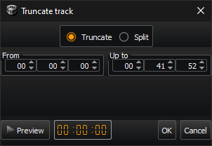

Αυτός ο διάλογος έχει μόνο δύο αριθμητικά πεδία σε ώρες:λεπτά:δευτερόλεπτα, για να ορίσετε την αρχή και το τέλος του κομματιού.  
Οι τιμές τίθενται αυτόματα στην αρχή/τέλος του κομματιού όταν το ανοίγουμε για πρώτη φορά.  
Το κομμάτι που προκύπτει θα έχει τα ίδια μεταδεδομένα με το αρχικό.

#### Διαίρεση

Όταν ανοίγουμε για πρώτη φορά αυτό το παράθυρο διαλόγου, περιέχει μόνο ένα slice που δείχνει την **Αρχή** του πρώτου slice του κομματιού, το οποίο _πρέπει_ να είναι 00:00:00 (μη επεξεργάσιμο).  
Πατώντας το κουμπί **Plus (+)** μπορούμε να προσθέσουμε μια νέα φέτα του κομματιού, ενώ πατώντας το κουμπί **Minus (-)** αφαιρούμε την επιλεγμένη φέτα.  
Κάνοντας κλικ στη στήλη **Τίτλος** οποιασδήποτε φέτας, μπορούμε να αλλάξουμε τον τίτλο αυτής της φέτας, και κατά συνέπεια να αλλάξουμε τον τίτλο/το όνομα αρχείου του κομματιού που προκύπτει.  
Το πεδίο **Start** όλων των φέτες (εκτός της πρώτης) είναι επεξεργάσιμο και μπορούμε να κάνουμε προεπισκόπηση των αλλαγών μας χρησιμοποιώντας το κουμπί **Προεπισκόπηση**.  
Όλα τα κομμάτια που θα προκύψουν θα έχουν ένα αντίγραφο των μεταδεδομένων του αρχικού κομματιού, εκτός από τον τίτλο και τον αριθμό του κομματιού.  
Ο Τίτλος θα είναι ο τίτλος του κομματιού, και αν τσεκάρουμε το κουμπί **Hash (#)**, ο αριθμός του κομματιού θα είναι ο αριθμός του κομματιού στα μεταδεδομένα τους.  

Το κουμπί **Εισαγωγή cue/txt** μας επιτρέπει να εισάγουμε τους χρόνους μετατόπισης από ένα αρχείο *.cue ή ένα αρχείο *.txt.  
Η μορφή του αρχείου `*.cue` είναι τυπική, αλλά η μορφή του αρχείου `*.txt` θα πρέπει να είναι:

* Ένα κομμάτι/κομμάτι ανά γραμμή
* Χρόνος με τη μορφή `Ώρες:Λεπτά:Δευτερόλεπτα` ή ` Λεπτά:Δευτερόλεπτα`.
* Η μορφή κάθε γραμμής πρέπει να είναι μία από τις παρακάτω:
  * Ώρα **+** Ένα κενό διάστημα **+** Τίτλος του κομματιού (_π.χ._ «14:53 This is a title»), ή
  * Τίτλος του κομματιού **+** Ένα κενό διάστημα **+** Χρόνος (_π.χ._ «Αυτός είναι ένας τίτλος 01:03:46»)

Η ρίψη ενός αρχείου `*.cue` ή `*.txt` στο παράθυρο διαλόγου θα εισαγάγει και τους χρόνους. 

### Μετονομασία

Αυτό το παράθυρο διαλόγου μας επιτρέπει να μετονομάσουμε το επιλεγμένο(α) αρχείο(α) χρησιμοποιώντας ένα μοτίβο με μεταβλητές.  
Οι μεταβλητές είναι οι εξής:  

{0} = ARTIST  
{1} = ΤΙΤΛΟΣ (ή ΟΝΟΜΑ ΑΡΧΕΙΟΥ αν δεν υπάρχει ΤΙΤΛΟΣ)  
{2} = ALBUM  
{3} = ΑΡΙΘΜΌΣ ΚΟΜΜΑΤΙΟΎ  
{4} = FILENAME  
{5} = ΣΕΙΡΆ ΛΊΣΤΑΣ ΑΝΑΠΑΡΑΓΩΓΉΣ  
{6} = ΓΕΝΙΑ  
{7} = ΕΤΟΣ  

Μπορεί επίσης να δημιουργήσει καταλόγους χρησιμοποιώντας τον χαρακτήρα \.  

Παράδειγμα: {7} {2}\{0} - {1}  

Παράγει: ..\1998 NYC Live\Portishead - Sour Times.mp3

### Περιοχή Ρίψης

Το DropZone είναι αυτή η τετράγωνη εικόνα που βρίσκεται πάντα πάνω από όλα τα άλλα παράθυρα.  
Μπορείτε να αφήσετε urls του YouTube από το πρόγραμμα περιήγησής σας για να τα ανοίξετε στο KataLib, χωρίς να χρειάζεται να αφήσετε το πρόγραμμα περιήγησής σας και να μεταβείτε στο KataLib.  

Μπορούμε να αλλάξουμε το μέγεθος και το επίπεδο διαφάνειάς της από την καρτέλα **Προβολή** στις **Προτιμήσεις**, για να την κάνουμε λιγότερο ενοχλητική.  
Υπάρχουν επίσης κάποιες χρήσιμες ενέργειες, οι οποίες είναι διαθέσιμες από το [μενού της Περιοχής Ρίψης](#μενού-περιοχής-ρίψης) που λαμβάνετε αν κάνετε δεξί κλικ πάνω του.

___

## Δεξί κλικ Μενού
### Κομμάτι Λίστας

Το μενού δεξιού κλικ των κομματιών της Λίστας αναπαραγωγής, έχει διαφορετικές επιλογές, ανάλογα με τον τύπο της επιλογής.  
Ορισμένες από αυτές τις επιλογές ενδέχεται να μην είναι διαθέσιμες για ορισμένους τύπους κομματιών.

|           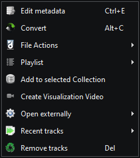           |  |
|:------------------------------------------------------------------:|:------------------------------------------------:|
|                 _Επιλεγμένη διαδρομή ενός αρχείου_                 |     _Επιλεγμένη διαδρομή πολλαπλών αρχείων_      |
|                    |                                                  |
| _One file Track selected (playing or having a saved position)_ |                                                  |

|  |  |
|:----------------------------------------------:|:------------------------------------------------:|
|       _One YouTube link Track selected_        |     _Multiple YouTube link Tracks selected_      |

- **[Επεξεργασία μεταδεδομένων](#επεξεργασία-μεταδεδομένων)**
- **Save video**  
  - Αν επιλεγεί μόνο ένα κομμάτι του YouTube, εμφανίζεται ένα υπομενού με τα διαθέσιμα αρχεία βίντεο (βίντεο και ήχου) που μπορούμε να κατεβάσουμε.
  - Εάν έχουν επιλεγεί περισσότερα από ένα κομμάτια YouTube, έχουμε τη δυνατότητα να ανοίξουμε το παράθυρο **Επιλογή ανάλυσης** για να επιλέξουμε για κάθε κομμάτι.
- **Προβολή βίντεο**  
  Πρόκειται για ένα υπομενού με τις ροές του κομματιού YouTube μόνο για βίντεο που μπορούμε να χρησιμοποιήσουμε ως προεπισκόπηση.  
  Φυσικά, μπορούμε να εξακολουθήσουμε να χρησιμοποιούμε τον αρχικό ήχο με αυτό.  
  Μπορούμε επίσης να τα συνδυάσουμε και να τα αποθηκεύσουμε σε ένα νέο αρχείο βίντεο.
- **[Μετατροπή](#μετατροπή)**
- **[Ενέργειες αρχείων](#files)**
- **[Λιστα αναπαραγωγής](#μενού-λίστα-αναπαραγωγής)**
- **Αποθήκευση σε νέα λίστα αναπαραγωγής** και δημιουργία μιας **Νέας συλλογής βιβλιοθήκης** εάν έχουν επιλεγεί περισσότερα από ένα κομμάτια.
- Η επιλογή **Προσθήκη στην επιλεγμένη Συλλογή** προσθέτει τα τρέχοντα επιλεγμένα κομμάτια στην τρέχουσα επιλεγμένη Συλλογή.
- **Σημείο αναπαραγωγής** Ανοίγει ένα υπο-μενού που μας επιτρέπει να αποθηκεύσουμε την τρέχουσα θέση του κομματιού ή να ξεκινήσουμε την αναπαραγωγή από την προηγουμένως αποθηκευμένη θέση του.
  - **Αποθήκευση τρέχουσας θέσης** αποθηκεύει την τρέχουσα θέση του κομματιού στο δίσκο δίπλα του, σε ένα αρχείο με το ίδιο όνομα με το όνομα αρχείου του κομματιού. 
  - **Αναπαραγωγή από αποθηκευμένη θέση** αναπαράγει το κομμάτι από την προηγουμένως αποθηκευμένη θέση και είναι ενεργοποιημένη μόνο εάν υπάρχει το σχετικό αρχείο.
  - **Καθαρισμός αποθηκευμένης θέσης** αφαιρεί το αρχείο αποθηκευμένης θέσης εάν υπάρχει. 
- **Άνοιγμα εξωτερικά**  
  Ανοίγει το επιλεγμένο αρχείο Track με έναν από τους τέσσερις προσαρμοσμένους επεξεργαστές μας (βλ. [Διαδρομές](#διαδρομές)).
- **PreBuffer YouTube Tracks**  
  Κατεβάζει αμέσως τη ροή ήχου του Track(s) για να το έχει έτοιμο για αναπαραγωγή/μετατροπή, χωρίς να χρειάζεται ενεργή σύνδεση στο δίκτυο.
- **Σύνδεσμος ανανέωσης** ανακτά ξανά τις πληροφορίες του κομματιού από το YouTube .
- **Προηγούμενα κομμάτια** μας επιτρέπει να ανοίξουμε ξανά τα κομμάτια που αναπαράχθηκαν πρόσφατα.
- **Αφαίρεση κομματιών** απλώς αφαιρεί τα επιλεγμένα κομμάτια από τη λίστα αναπαραγωγής.

### Κομμάτι βιβλιοθήκης

|  |
|:--------------------------------------------:|
|    _Επιλεγμένα κομμάτια της βιβλιοθήκης_     |

- **[Επεξεργασία μεταδεδομένων](#επεξεργασία-μεταδεδομένων)**
- **[Μετατροπή](#μετατροπή)**
- **[Ενέργειες αρχείων](#files)**
- **Παίζει με τον Player**  
    Καθαρίζει τη λίστα αναπαραγωγής, προσθέτει τα επιλεγμένα αρχεία και ξεκινά την αναπαραγωγή του πρώτου από αυτά.
- **Προσθήκη στη συσκευή αναπαραγωγής**  
    Προσθέτει τα επιλεγμένα αρχεία στο τέλος της λίστας αναπαραγωγής.
- **Άνοιγμα εξωτερικά**  
    Ανοίγει τα επιλεγμένα αρχεία με τη συσκευή αναπαραγωγής του συστήματος.
- **Διαγραφή αρχείων**  
    Διαγράφει τα επιλεγμένα αρχεία από τη βιβλιοθήκη <ins>_**και από το δίσκο**_</ins>.

### Συλλογή βιβλιοθήκης

|  | 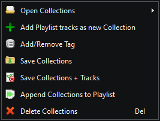 |
|:-----------------------------------------------:|:-------------------------------------------------:|
|      _Επιλεγμένη μία συλλογή βιβλιοθήκης_       |   _Επιλεγμένες πολλαπλές συλλογές βιβλιοθήκης_    |

- **Άνοιγμα συλλογών** - Επιλέξτε μία από τις δύο επιλογές:
  - **Άνοιγμα συλλογών από αρχείο** - Ανοίξτε ένα αρχείο συλλογής `.dbc` ή μετατρέψτε ένα αρχείο λίστας αναπαραγωγής `.lst` σε μια νέα συλλογή.
  - **Άνοιγμα λίστας αναπαραγωγής από το YouTube** - Δημιουργήστε μια συλλογή από μια διεύθυνση λίστας αναπαραγωγής του YouTube.
- **Προσθήκη κομματιών λίστας αναπαραγωγής ως νέα Συλλογή** - Δημιουργεί μια νέα Συλλογή από τα τρέχοντα φορτωμένα κομμάτια λίστας αναπαραγωγής.
- **Δημιουργία Συλλογής με κομμάτια λίστας αναπαραγωγής** - Αντικαθιστά τα κομμάτια της τρέχουσας επιλεγμένης Συλλογής με τα τρέχοντα φορτωμένα κομμάτια λίστας αναπαραγωγής. 
- **Επεξεργασία συλλογής** - Ανοίγει ένα παράθυρο διαλόγου για να αλλάξετε τον τίτλο της συλλογής, τις ετικέτες ή την ηλεκτρονική διεύθυνση. 
- **Αποθήκευση συλλογής** - Αποθήκευση της συλλογής (των συλλογών) σε αρχείο `.dbc`.
- **Αποθήκευση Συλλογής + Τραγούδια** - Αποθηκεύει τη Συλλογή(ες) σε ένα αρχείο `.dbc` και δημιουργεί επίσης έναν φάκελο με τα αρχεία τραγουδιών της Συλλογής, με όνομα το όνομα της Συλλογής συν την κατάληξη «_tracks». 
- **προσθήκη συλλογής(ών) στη λίστα αναπαραγωγής** - Προσθέτει τα κομμάτια της συλλογής στη λίστα αναπαραγωγής που είναι φορτωμένη. 
- **Διαγραφή Συλλογής(ών)** - Διαγράφει την επιλεγμένη Συλλογή(ών) από τη Βιβλιοθήκη. 

### Μενού Λίστα αναπαραγωγής

|           Μενού Λίστα αναπαραγωγής            |               Μενού ταξινόμησης λίστας               |                Μενού προβολής λίστας                 |
|:---------------------------------------------:|:----------------------------------------------------:|:----------------------------------------------------:|
|   | 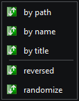 |  |

- **Φορτώστε τη λίστα**  
    Ανοίγει ένα αρχείο λίστας αναπαραγωγής KataLib `.lst` ή WinAmp.
- **Αποθήκευση λίστας**  
    Αποθηκεύει ένα αρχείο KataLib `.lst` ή ένα αρχείο λίστας αναπαραγωγής WinAmp.
- **Save list + Tracks**  
    Αποθηκεύει μια λίστα αναπαραγωγής KataLib `.lst` ή WinAmp, αλλά δημιουργεί επίσης ένα φάκελο με τα αρχεία Track της λίστας, με όνομα το όνομα της λίστας αναπαραγωγής συν την κατάληξη «_tracks».  
    Εάν η λίστα αναπαραγωγής περιέχει συνδέσμους YouTube, αυτοί θα μετατραπούν χρησιμοποιώντας τις τρέχουσες ρυθμίσεις μετατροπής.
- **Προσθήκη κομματιών**  
    Ανοίγει ένα υπομενού για να επιλέξουμε τι είδους Tracks θέλουμε να προσθέσουμε στη λίστα αναπαραγωγής.
  - Κομμάτια από τοπικά αρχεία (αρχεία πολυμέσων ήχου/βίντεο)
  - Τραγούδια από σύνδεσμο YouTube (μπορεί να είναι ένα μεμονωμένο κομμάτι ή μια λίστα αναπαραγωγής YouTube)
- **Προσθήκη σε συλλογές**  
    Προσθέτει την τρέχουσα λίστα αναπαραγωγής ως Συλλογή στις **[Συλλογές βιβλιοθήκης](#συλλογές-βιβλιοθήκης)**.
- **Λίστα ταξινόμησης**  
    Ανοίγει το μενού **Λίστα ταξινόμησης** που παρέχει βασικές επιλογές ταξινόμησης.
- **Προβολή λίστας**  
    Ανοίγει το μενού **Προβολή λίστας** που μας επιτρέπει την εναλλαγή των αριθμών και των εικονιδίων της λίστας αναπαραγωγής, καθώς και την αλλαγή της εμφάνισης των κομματιών.
- **Λίστα επαναφοράς**  
    Επαναφορτώνει τα τοπικά αρχεία από το δίσκο και τις συνδέσεις YouTube από τον ιστό. 
- **Καθαρισμός λίστας**  
    Αφαιρεί όλα τα κομμάτια από τη λίστα αναπαραγωγής.

### Μενού εξώφυλλων

Αυτές οι επιλογές ενεργοποιούνται/απενεργοποιούνται ανάλογα με τον τύπο της επιλογής.
  

- **Δείτε το εξώφυλλο**  
  Ανοίγει ένα παράθυρο με την εικόνα του εξωφύλλου σε πλήρη ανάλυση (εφόσον χωράει στην οθόνη, αλλιώς θα είναι η μεγαλύτερη δυνατή).
- **Load Cover**  
  Φορτώνει μια εικόνα από ένα αρχείο ως εξώφυλλο.
- **Αποθήκευση καλύμματος**  
  Αποθηκεύει το εξώφυλλο σε ένα αρχείο εικόνας στο δίσκο.
- **Λήψη καλύμματος**  
  Ανοίγει το παράθυρο διαλόγου **Download Cover**, το οποίο θα αναζητήσει εικόνες με βάση οποιαδήποτε από τις καταχωρήσεις Artist, Album που παρέχουμε.
- **Clear Cover**  
  Καθαρίζει την επιλεγμένη εικόνα εξωφύλλου.
- **Αντιγραφή στο πρόχειρο**  
  Αντιγράφει την εικόνα στο πρόχειρο του συστήματος.
- **Επικόλληση από το πρόχειρο**  
  Εάν υπάρχει μια εικόνα στο πρόχειρο του συστήματος, θα επικολληθεί ως κάλυψη.
- **Μείωση μεγέθους εξωφύλλου**  
  Αλλάζει το μέγεθος της εικόνας του εξωφύλλου στο μέγεθος που καθορίζεται στο παράθυρο διαλόγου **Κατέβασμα εξωφύλλου** (μόνο αν η εικόνα του εξωφύλλου είναι μεγαλύτερη).
- **Ορισμός ως εξώφυλλο φακέλου**  
  Ορίζει το εξώφυλλο ως το εικονίδιο εικόνας του γονικού φακέλου του κομματιού (χρήσιμο για φακέλους άλμπουμ).
- **Άνοιγμα εξωτερικά**  
  Ανοίγει το εξώφυλλο με το πρόγραμμα προβολής εικόνων του συστήματος.

### Μενού απεικόνισης

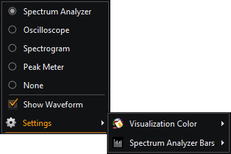

Εδώ επιλέγουμε μεταξύ των τριών τρόπων λειτουργίας του [Οπτικοποιητή](#οπτικοποιητής)

- **Αναλυτής φάσματος**
- **Παλμογράφος**
- **Φασματογράφος**
Μπορούμε επίσης να το αποκρύψουμε εντελώς, επιλέγοντας την επιλογή **Καμία**.  
Υπάρχει επίσης η επιλογή για την **Εμφάνιση της κυματομορφής** (ή όχι), κάτω από τη γραμμή θέσης του [Ελεγχου Αναπαραγωγής](#έλεγχος-αναπαραγωγής).  
Το μενού **Χρώμα απεικόνισης**, μας επιτρέπει να προσαρμόσουμε το χρώμα της απεικόνισης ή να επιστρέψουμε στο προεπιλογμένο.

### Μενού Συμπαγούς προβολής

Κάνοντας δεξί κλικ στο εξώφυλλο της [Συμπαγούς προβολής](#συμπαγής-προβολή), θα εμφανιστεί αυτό το μενού

|  |  |
|:------------------------------------------:|:--------------------------------------------------:|
|    _Κεντρικό μενού συμπαγούς προβολήςu_    |                 _Μενού προβολήςu_                  |

- **Τραγούδι** ανοίγει το μενού της [Λίστας Αναπαραγωγής](#μενού-λίστα-αναπαραγωγής) για το επιλεγμένο τραγούδι
- **Εξώφυλλο** ανοίγει το [μενού](#μενού-εξώφυλλων) για το εμφανιζόμενο εξώφυλλο
- **Προβολή**
  Εμφανίζει το μενού προβολής που περιέχει τα εξής
    - **Πλήρης προβολή** - Αλλαγή της λειτουργίας προβολής σε Πλήρης
    - **Διάταξη** υπο-μενού με επιλογές για την αποθήκευση και την επαναφορά της τρέχουσας διάταξης όλων των παραθύρων της συμπαγούς προβολής
    - **Εμφάνιση λίστας αναπαραγωγής** Διακόπτης εναλλαγής παραθύρου
    - **Εμφάνιση ιδιοτήτων** Διακόπτης εναλλαγής παραθύρου
    - **Πάντα στο προσκήνιο** Διακόπτης για όλα τα παράθυρα συμπαγούς προβολής
- **Εύρεση** ανοίγει το παράθυρο διαλόγου [Εύρεση](#εύρεση)
- **Προτιμήσεις** ανοίγει τον διάλογο [Προτιμήσεις](#προτιμήσεις)
- **Σχετικά** ανοίγει τον διάλογο [Περί του KataLib](#σχετικά)
- **Έξοδος από την KataLib** τερματίζει την εφαρμογή

### Μενού Περιοχής Ρίψης

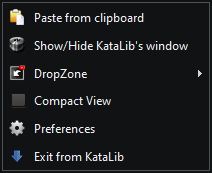

Αυτό είναι το μενού που εμφανίζεται αν κάνετε δεξί κλικ στη Περιοχή Ρίψης.

- **Επικόλληση από το πρόχειρο** αναζητά στο πρόχειρο του συστήματος οποιοδήποτε url του YouTube και το προσθέτει στο KataLib. 
- **Εμφάνιση/Απόκρυψη παραθύρου KataLib** σας επιτρέπει να αποκρύψετε εντελώς όλα τα άλλα παράθυρα της εφαρμογής (ακόμη και από τη γραμμή εργασιών), χωρίς να την κλείσετε. 
- Το **DroZone** είναι ένα υπομενού που μπορεί να αλλάξει το μέγεθος του DropZone ή ακόμα και να το αποκρύψει εντελώς.
- **Compact View** αλλάζει μεταξύ της κανονικής και της συμπαγούς προβολής της εφαρμογής.
- **Προτιμήσεις** είναι μια συντόμευση για τις προτιμήσεις της εφαρμογής. 
- **Έξοδος από την KataLib** τερματίζει την εφαρμογή.

___

# Συντομεύσεις

| **Γενικά**                  |           |
|-----------------------------|-----------|
| Εναλλαγή συμπαγούς προβολής | Ctrl+D    |
| Μετατροπή                   | Alt+C     |
| Αρχεία (Αντιγραφή)          | Alt+V     |
| Επεξεργασία μεταδεδομένων   | Ctrl+E    |
| Κατάργηση/Διαγραφή          | Del       |
| Διαγραφή από το δίσκο       | Shift+Del |
| Φίλτρο Βιβλιοθήκη/Συλλογές  | Alt+F     |
| Φάκελοι βιβλιοθήκης         | Ctrl+M    |
| Προτιμήσεις                 | Ctrl+P    |
| About/Info                  | Ctrl+I    |
| Exit KataLib                | Ctrl+Q    |

| **Συμπυκνωμένη λειτουργία** συγκεκριμένα |                     |
|------------------------------------------|---------------------|
| Εναλλαγή πίνακα λίστας αναπαραγωγής      | Alt+L               |
| Εναλλαγή του πίνακα ιδιοτήτων            | Alt+P               |
| Toggle Always on Top                     | Ctrl+O              |

| **Παίκτης**                         |                    |
|-------------------------------------|--------------------|
| Play/Pause                          | SpaceBar           |
| Stop                                | Ctrl+SpaceBar      |
| Stop w/Fade out                     | Ctrl+Alt+SpaceBar  |
| Stop όταν τελειώνει το κομμάτι      | Shift+SpaceBar     |
| Seek (PositionBar)                  | Αριστερά/Δεξιά ↔   |
| Αναπαραγωγή επόμενου                | Ctrl+Δεξιά →       |
| Αναπαραγωγή προηγούμενου            | Ctrl+Αριστερά ←    |
| Αναπαραγωγή επόμενου με διασταύρωση | Alt+Δεξιά →        |
| Ένταση ήχου                         | Πάνω/κάτω ↑↓       |
| Σίγαση                              | Alt+M              |
| Tap Tempo                           | Alt+T              |
| Select Next                         | Ctrl+Down ↓        |
| Επιλογή προηγούμενου                | Ctrl+Up ↑          |
| Αποθήκευση της θέσης της διαδρομής  | Ctrl+Περίοδος      |
| Αναπαραγωγή από τη θέση             | Alt+Περίοδος       |

| **Λίστα αναπαραγωγής**             |            |
|------------------------------------|------------|
| Φόρτωση λίστας αναπαραγωγής        | Ctrl+L     |
| Αποθήκευση λίστας αναπαραγωγής     | Ctrl+S     |
| Clear PlayList                     | Ctrl+Del   |
| Reload PlayList                    | F5         |
| Add PlayList as Collection         | Ctrl+Alt+S |
| Find Track                         | Ctrl+F     |
| Προσθήκη κομματιών (τοπικά αρχεία) | Alt+A      |
| Κατάργηση κομματιών                | Del        |
| Διαγραφή ιχνών                     | Shift+Del  |
| Επανάληψη όλων                     | Alt+R      |
| Shuffle                            | Alt+S      |
| DJ show/hide                       | Alt+D      |

   
**Hotkeys (παγκόσμιες συντομεύσεις)**

Αυτά είναι απενεργοποιημένα από προεπιλογή.  
Για να τα ενεργοποιήσετε πηγαίνετε στις `Προτιμήσεις > Για προχωρημένους > Χρήση γενικών συντομεύσεων`  
Αυτές οι προεπιλεγμένες αντιστοιχίσεις μπορούν να αλλάξουν από τον χρήστη.  
 

| Global Shortcuts   | Hotkeys    |
|--------------------|------------|
| Αναπαραγωγή/Παύση  | Win+Ctrl+Z |
| Stop               | Win+Ctrl+C |
| Προηγούμενο        | Win+Ctrl+A |
| Επόμενο            | Win+Ctrl+X |
| Seek Right         | Win+Ctrl+] |
| Αναζήτηση αριστερά | Win+Ctrl+[ |
| Start crossfade    | Win+Ctrl+W |
| Εμφάνιση/Απόκρυψη  | Win+Ctrl+S |
| Αύξηση έντασης     | Win+.      |
| Μείωση έντασης     | Win+,      |
