# Οδηγός χρήσης

<!-- TOC -->
* [Οδηγός χρήσης](#οδηγός-χρήσης)
* [Επισκόπηση](#επισκόπηση)
  * [Φορητή λειτουργία](#φορητή-λειτουργία)
  * [Γραμμή εργαλείων](#γραμμή-εργαλείων)
* [Λεπτομερείς πληροφορίες](#λεπτομερείς-πληροφορίες)
    * [Λίστα αναπαραγωγής](#λίστα-αναπαραγωγής)
      * [DJ πάνελ](#dj-πάνελ)
      * [Εύρεση](#εύρεση)
      * [Οπτικοποιητής](#οπτικοποιητής)
    * [Έλεγχος αναπαραγωγής](#έλεγχος-αναπαραγωγής)
    * [Συμπαγής προβολή](#συμπαγής-προβολή)
    * [Συλλογές βιβλιοθήκης](#συλλογές-βιβλιοθήκης)
    * [Κομμάτια βιβλιοθήκης](#κομμάτια-βιβλιοθήκης)
    * [Μετατροπή](#μετατροπή)
    * [Επεξεργασία μεταδεδομένων](#επεξεργασία-μεταδεδομένων)
    * [Πολλαπλή επεξεργασία μεταδεδομένων](#πολλαπλή-επεξεργασία-μεταδεδομένων)
    * [Φιλτράρισμα](#φιλτράρισμα)
      * [Φιλτράρισμα Συλλογών Βιβλιοθήκης](#φιλτράρισμα-συλλογών-βιβλιοθήκης)
      * [Φιλτράρισμα Κομματιών Βιβλιοθήκης](#φιλτράρισμα-κομματιών-βιβλιοθήκης)
    * [Φάκελοι βιβλιοθήκης](#φάκελοι-βιβλιοθήκης)
    * [Προτιμήσεις](#προτιμήσεις)
      * [Γενικά](#γενικά)
      * [Εμφάνιση](#εμφάνιση)
      * [Ρυθμίσεις YouTube](#ρυθμίσεις-youtube)
      * [Διαδρομές](#διαδρομές)
      * [Για προχωρημένους](#για-προχωρημένους)
    * [Σχετικά](#σχετικά)
    * [Περικοπή/Διαίρεση](#περικοπήδιαίρεση)
      * [Περικοπή](#περικοπή)
      * [Διαίρεση](#διαίρεση)
    * [Μετονομασία](#μετονομασία)
    * [Περιοχή Ρίψης](#περιοχή-ρίψης)
  * [Δεξί κλικ Μενού](#δεξί-κλικ-μενού)
    * [Κομμάτι Λίστας](#κομμάτι-λίστας)
    * [Κομμάτι βιβλιοθήκης](#κομμάτι-βιβλιοθήκης)
    * [Συλλογή βιβλιοθήκης](#συλλογή-βιβλιοθήκης)
    * [Μενού Λίστας αναπαραγωγής](#μενού-λίστας-αναπαραγωγής)
    * [Μενού εξώφυλλων](#μενού-εξώφυλλων)
    * [Μενού απεικόνισης](#μενού-απεικόνισης)
    * [Μενού Συμπαγούς προβολής](#μενού-συμπαγούς-προβολής)
    * [Μενού Περιοχής Ρίψης](#μενού-περιοχής-ρίψης)
* [Συντομεύσεις](#συντομεύσεις)
<!-- TOC -->

___

[The User Guide in English.](index.md)

# Επισκόπηση

Το **[KataLib](https://github.com/noembryo/KataLib)** είναι ένα πρόγραμμα των Windows που μπορεί να αναπαράγει, να μετατρέψει και να οργανώσει αρχεία μουσικής (ή βίντεο).    

Αυτή είναι μια διάταξη με όλα τα πάνελ της εφαρμογής ενεργοποιημένα.  

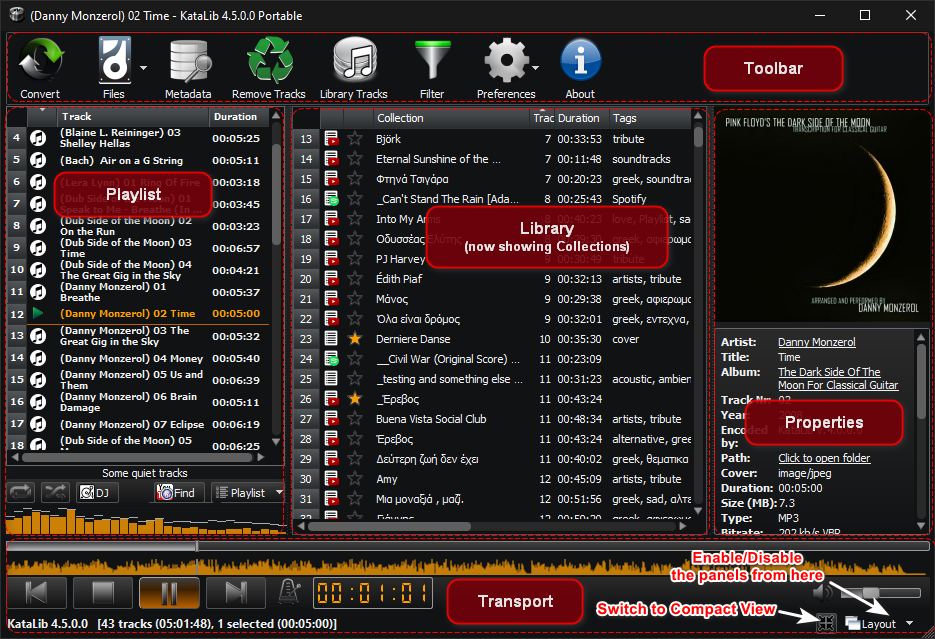  

Το περιβάλον του χρήστη αποτελείται από τη **[Γραμμή εργαλείων](#γραμμή-εργαλείων)**, τον **[Ελεγχο Αναπαραγωγής](#έλεγχος-αναπαραγωγής)** και τρία πάνελ, τη **[Λίστα αναπαραγωγής](#λίστα-αναπαραγωγής)**, τη **[Βιβλιοθήκη](#συλλογές-βιβλιοθήκης)** και τις **Ιδιότητες**.  
- Στο πάνελ της **[Λίστας αναπαραγωγής](#λίστα-αναπαραγωγής)**, μπορούμε να σύρουμε ή να προσθέσουμε τοπικά αρχεία πολυμέσων ή συνδέσμους YouTube για αναπαραγωγή, μετατροπή ή επεξεργασία μεταδεδομένων.  
- Το πάνελ της **Βιβλιοθήκης** έχει δύο καταστάσεις:
  - Τις [Συλλογές βιβλιοθήκης](#συλλογές-βιβλιοθήκης), όπου τα περιεχόμενα είναι εικονικές Συλλογές, αποτελούμενες από κομμάτια τοπικών αρχείων ή/και συνδέσμους YouTube.
  - Τα [Κομμάτια βιβλιοθήκης](#κομμάτια-βιβλιοθήκης), όπου τα περιεχόμενα είναι τα αρχεία πολυμέσων κάθε φακέλου που προσθέτουμε στη βιβλιοθήκη.  

- Το πάνελ **Ιδιότητες**, όπου εμφανίζονται τα μεταδεδομένα του επιλεγμένου κομματιού, είτε από τη λίστα αναπαραγωγής είτε από τη βιβλιοθήκη.  
  Εάν βλέπουμε τις Συλλογές της Βιβλιοθήκης και είναι επιλεγμένη μια Συλλογή, στο πάνελ **Ιδιότητες** εμφανίζονται τα κομμάτια της Συλλογής.  

Τα πάνελ μπορούν να ενεργοποιηθούν/απενεργοποιηθούν, από το μενού **Διάταξη** στο κάτω δεξιά μέρος του κύριου παραθύρου.
Το μέγεθος, η θέση και η διαμόρφωση του παραθύρου του προγράμματος μπορούν να αποθηκευτούν ως «Διάταξη» και να εφαρμοστούν ξανά εύκολα από το υπομενού **Διατάξεις χρήστη** του μενού **Διάταξη** ή από το μενού του κουμπιού της γραμμής εργαλείων **Προτιμήσεις**.  

Υπάρχει επίσης μια εναλλακτική προβολή της εφαρμογής, η [**Συμπαγής προβολή…**](#συμπαγής-προβολή)  
  
…που αποτελείται μόνο από ένα κύριο παράθυρο αναπαραγωγής και τα ανεξάρτητα παράθυρα **Λίστα αναπαραγωγής** και **Ιδιότητες**, τα οποία μπορούν να μετακινηθούν ή να ενεργοποιηθούν/απενεργοποιηθούν, για εξοικονόμηση χώρου στην οθόνη.
Κατά τη χρήση της KataLib, να θυμάστε ότι σχεδόν όλα τα στοιχεία ελέγχου της διεπαφής χρήστη, τα κουμπιά κ.λπ. έχουν ένα Tooltip, που εξηγεί εν συντομία τι κάνουν.  
Αυτό το Tooltip εμφανίζεται όταν περνάτε το ποντίκι σας πάνω από το αντίστοιχο στοιχείο ελέγχου.  

___

Γενικά, το KataLib μπορεί να θεωρηθεί ως τρία προγράμματα σε ένα:  
Ένα πρόγραμμα αναπαραγωγής, ένας μετατροπέας και ένας βιβλιοθηκάριος.

- **Πρόγραμμα αναπαραγωγής**

    Μπορεί να αναπαράγει οποιοδήποτε αρχείο μουσικής ή βίντεο που του ρίχνουμε από τη βιβλιοθήκη ή από τον εξερευνητή αρχείων.  
    Μπορεί να φορτώσει λίστες αναπαραγωγής του Winamp και μπορεί επίσης να κατεβάσει συνδέσμους ή/και λίστες αναπαραγωγής του YouTube και να τις αναπαράγει.  
    Επιλέγοντας ένα ή περισσότερα κομμάτια μπορούμε να κάνουμε πολλά πράγματα, όπως: επεξεργασία μεταδεδομένων, αντιγραφή, μετακίνηση, μετατροπή ή ακόμη και λήψη του ίδιου του αρχείου βίντεο (αν πρόκειται για κομμάτι με σύνδεσμο στο YouTube).  

- **Μετατροπέας**  

    Ως μετατροπέας, μπορεί να [μετατρέψει](#μετατροπή)
    από αυτούς τους τύπους αρχείων ήχου…
    
    - «.mp3» - MPEG Audio Stream, Layer III (με απώλειες)
    - «.aac» - Προηγμένη κωδικοποίηση ήχου (με απώλειες)
    - «.m4a» - MPEG-4 Part 14 (μόνο ήχος) μπορεί να περιέχει ροή AAC (με απώλειες) ή ALAC (χωρίς απώλειες)
    - «.ape» - Monkey's Audio (χωρίς απώλειες)
    - «.ogg» - Ogg/Vorbis (με απώλειες)
    - «.oga» - Ogg/Opus Audio (με απώλειες)
    - «.opus» - Opus Interactive Audio Codec (με απώλειες)
    - «.flac» - Free Lossless Audio Codec (χωρίς απώλειες)
    - «.ac3» - Dolby AC-3 (με απώλειες)
    - «.wma» - Windows Media Audio (με απώλειες)
    - «.wav» - Waveform Audio (χωρίς απώλειες)
    - «.aif» - Audio Interchange File Format (χωρίς απώλειες)
    - «.mp4» - MPEG-4 Part 14 multimedia (εξάγει τη ροή ήχου aac)
    - «.mkv» - Matroska Multimedia Container (εξάγει τη ροή ήχου)
    - «.avi» - Audio Video Interleaved Container (εξάγει τη ροή ήχου)
    - «.mov» - QuickTime File Format (εξάγει τη ροή ήχου aac)
    - «.flv» - βίντεο Flash (αφαιρεί τη ροή ήχου aac)
    - «.wv» - WavPack (χωρίς απώλειες)
    - «.mpc» - Musepack AKA MPEGplus (με απώλειες)
    - «.mp2» - MPEG-1 Audio Layer II (μόνο ήχος) (με απώλειες)
    - «.mpga» - MPEG-1 Audio Layer III (μόνο ήχος) (με απώλειες)
    - «.mpeg» - MPEG-1/2 (εξάγει τη ροή ήχου MPEG-1 Audio Layer II) (με απώλειες)
    - «.webm» - WebM - μπορεί να περιέχει Ogg ή Opus (με απώλειες)
    - «.dts» - DTS - Συστήματα ψηφιακού θεάτρου
    - «.m4b» - MPEG-4 Part 14 (μόνο ήχος) (με απώλειες) χρησιμοποιείται για ηχητικά βιβλία
    - «.dfs» - Direct Stream Digital αρχείο (χωρίς απώλειες) (μόνο για μετατροπή)
    
    … σε αυτούς τους τύπους αρχείων ήχου  
    
    - «.mp3» - MPEG Audio Stream, Layer III (με απώλειες)
    - «.m4a» - MPEG-4 Part 14 (μόνο ήχος) που περιέχει ροή AAC (με απώλειες)
    - «.aac» - Προηγμένη κωδικοποίηση ήχου AAC (με απώλειες)
    - «.ogg» - Ogg/Vorbis (με απώλειες)
    - «.opus» - Opus Interactive Audio Codec (με απώλειες)
    - «.flac» - Free Lossless Audio Codec (χωρίς απώλειες)
    - «.wav» - Waveform Audio (χωρίς απώλειες)

- **Βιβλιοθηκάριος**

    Ως βιβλιοθηκάριος, χρησιμοποιεί μια βάση δεδομένων για την αποθήκευση και την εμφάνιση δύο διαφορετικών τύπων δεδομένων.  
  - Τις [Συλλογές βιβλιοθήκης](#συλλογές-βιβλιοθήκης)  
    οι οποίες είναι εικονικές λίστες αναπαραγωγής τοπικών αρχείων πολυμέσων ή/και συνδέσμων του YouTube.  
  - Τα [Κομμάτια βιβλιοθήκης](#κομμάτια-βιβλιοθήκης)  
    που είναι οι ιδιότητες των τοπικών αρχείων πολυμέσων (Tracks).  

___

## Φορητή λειτουργία

Το KataLib μπορεί επίσης να ξεκινήσει σε **Φορητή** λειτουργία χρησιμοποιώντας το εντολή "-p" στη συντόμευση ή εκτελώντας το `KataLib Portable.exe`.  
Στη φορητή λειτουργία η εφαρμογή διαβάζει τις ρυθμίσεις της, την βάση δεδομένων, κλπ., από έναν κατάλογο `portable_settings` μέσα στο φάκελό της και όχι από τις ρυθμίσεις του τρέχοντος χρήστη των Windows.  
Η χρήση της φορητής λειτουργίας ενώ η εφαρμογή είναι εγκατεστημένη μέσα στον κατάλογο `Program files` δε συνιστάται, επειδή τα Windows αντιμετωπίζουν αυτόν τον φάκελο με ειδικό τρόπο.  
Οποιοσδήποτε άλλος κατάλογος ή αφαιρούμενος δίσκος είναι εντάξει, αρκεί ο χρήστης να μπορεί να γράψει σε αυτόν. 

___

## Γραμμή εργαλείων

Η γραμμή εργαλείων βρίσκεται στο πάνω μέρος του κύριου παραθύρου.  
Περιέχει κουμπιά που μπορούν να χρησιμοποιηθούν για την εκτέλεση διαφόρων ενεργειών.  
Αυτά τα κουμπιά μπορούν να αλλάξουν ή να απενεργοποιηθούν, ανάλογα με το πάνελ της εφαρμογής το οποίο είναι εστιασμένο κάθε στιγμή.  
Κάνοντας δεξί κλικ σε ένα κενό σημείο της Γραμμής Εργαλείων, εμφανίζεται αυτό το μενού… 

  
…που μας επιτρέπει να αλλάξουμε το μέγεθος και την εμφάνιση των εικονιδίων της Γραμμής Εργαλείων.

Τα μόνιμα ορατά κουμπιά είναι:  
&nbsp;&nbsp;  

1. **Μετατροπή**  
  Ανοίγει το [Διάλογο Μετατροπής](#μετατροπή) για να ρυθμίσετε τον τρόπο με τον οποίο θέλετε να μετατρέψετε το επιλεγμένο(α) κομμάτι(α).
2. **Αρχεία**   
  Εμφανίζει ένα μενού με τις ακόλουθες επιλογές διαχείρισης αρχείων:
      - **Αντιγραφή** των επιλεγμένων αρχείων σε νέα τοποθεσία (χρησιμοποιεί ένα παράθυρο επιλογής αρχείων).
      - **Μετακίνηση** των επιλεγμένων αρχείων σε νέα τοποθεσία (χρησιμοποιεί ένα παράθυρο επιλογής αρχείων).
      - [**Μετονομασία**](#μετονομασία) των επιλεγμένων αρχείων χρησιμοποιώντας πρότυπο.
      - **Διαγραφή** των επιλεγμένων αρχείων από τον δίσκο. <ins>_**Χρησιμοποιήστε το με προσοχή!**_</ins>
3. **Μεταδεδομένα**  
  Ανάλογα με τον αριθμό των επιλεγμένων κομματιών, ανοίγει το παράθυρο διαλόγου [Επεξεργασία Μεταδεδομένων](#επεξεργασία-μεταδεδομένων) (επιλογή ενός κομματιού) ή το παράθυρο διαλόγου [Πολλαπλή Επεξεργασία Μεταδεδομένων](#πολλαπλή-επεξεργασία-μεταδεδομένων) (πολλαπλή επιλογή).
4. **Διαγραφή κομματιών / Διαγραφή αρχείων / Διαγραφή συλλογών**  
  Αυτό το κουμπί αλλάζει εμφάνιση και λειτουργία, ανάλογα με το πάνελ στο οποίο είναι εστιασμένο τη δεδομένη στιγμή.  
  Εάν η λίστα αναπαραγωγής έχει την εστίαση, αφαιρεί κάθε επιλεγμένο κομμάτι (ή κομμάτια) από τη λίστα αναπαραγωγής.  
  Αν ο πίνακας Συλλογές Βιβλιοθήκης είναι εστιασμένος, το κουμπί αφαιρεί την/τις επιλεγμένη/ες συλλογή/ες από τη βάση δεδομένων της Βιβλιοθήκης.   
  Εάν είναι εστιασμένο το πάνελ με τα Κομμάτια βιβλιοθήκης, αφαιρεί το επιλεγμένο αρχείο (ή τα επιλεγμένα αρχεία) από τη Βιβλιοθήκη και <ins>_**τα διαγράφει από το δίσκο!**_</ins>  
5. **Προτιμήσεις**  
  Ανοίγει το παράθυρο διαλόγου [Προτιμήσεις](#προτιμήσεις).  
  Κάνοντας κλικ στο βέλος δίπλα στο κουμπί, ανοίγει ένα πτυσσόμενο μενού με τις αποθηκευμένες Διατάξεις και επιλογές για τη διαχείρισή τους, όπως:
      - **Προσθήκη** της τρέχουσας διάταξης ως νέας διάταξης
      - **Ανανέωση** της τρέχουσας επιλεγμένης διάταξης
      - **Διαγραφή** της τρέχουσας επιλεγμένης διάταξης
   
   Το μενού περιέχει επίσης μια επιλογή για μετάβαση στη [Συμπαγή προβολή](#συμπαγής-προβολή).
6. **Σχετικά**  
  Εμφανίζει το παράθυρο διαλόγου [Περί του KataLib](#σχετικά), με πληροφορίες για το πρόγραμμα και άλλα…

Εάν το πάνελ της Βιβλιοθήκης είναι ορατό και εστιασμένο, και βλέπουμε τις Συλλογές Βιβλιοθήκης, τα ακόλουθα κουμπιά είναι ορατά:

  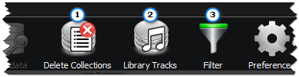  

1. **Διαγραφή συλλογών** (Αν το πάνελ της Λίστας αναπαραγωγής έχει εστιαστεί, τότε γίνεται **Αφαίρεση κομματιών**)  
  Αφαιρεί τις επιλεγμένες συλλογές από τη Βιβλιοθήκη.
2. **Κομμάτια βιβλιοθήκης**  
  Εμφανίζει τα αρχεία της Βιβλιοθήκης αντί για τις Συλλογές της Βιβλιοθήκης.
3. **Φίλτρο**  
  Ανοίγει το παράθυρο διαλόγου [Φιλτράρισμα Συλλογών βιβλιοθήκης](#φιλτράρισμα-συλλογών-βιβλιοθήκης).

Εάν το πάνελ της Βιβλιοθήκης είναι ορατό και εστιασμένο, και βλέπουμε τα κομμάτια της Βιβλιοθήκης, εμφανίζονται επίσης τα ακόλουθα κουμπιά:

  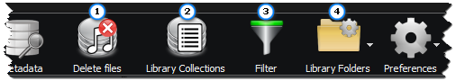  

1. **Διαγραφή αρχείων**  
  Αφαιρεί τυχόν επιλεγμένα αρχεία από τη Βιβλιοθήκη και <ins>_**διαγράφει τα αρχεία αυτά από το δίσκο!**_</ins>
2. **Συλλογές βιβλιοθήκης**  
  Εμφανίζει τις Συλλογές της Βιβλιοθήκης αντί των κομματιών της Βιβλιοθήκης.
3. **Φίλτρο**  
  Ανοίγει το παράθυρο διαλόγου [Φιλτράρισμα Κομματιών βιβλιοθήκης](#φιλτράρισμα-κομματιών-βιβλιοθήκης). 
4. **Φάκελοι βιβλιοθήκης**  
  Εμφανίζει το παράθυρο διαχείρισης των [Φακέλων Βιβλιοθήκης](#φάκελοι-βιβλιοθήκης).  
  Αν κάνουμε κλικ στο βέλος που βρίσκεται δίπλα στο κουμπί, εμφανίζεται ένα αναπτυσσόμενο μενού.  
  Αυτό το **Μενού φακέλων βιβλιοθήκης** έχει συντομεύσεις για τα κουμπιά **Προσθήκη φακέλου** και **Ξαναδιάβασμα φακέλων**.

# Λεπτομερείς πληροφορίες

### Λίστα αναπαραγωγής

Ο τομέας της Λίστα αναπαραγωγής είναι το κύριο μέρος του προγράμματος αναπαραγωγής.  
Μπορούμε να σύρουμε εδώ αρχεία ήχου ή λίστες αναπαραγωγής ή να χρησιμοποιήσουμε το κουμπί **Εύρεση** για να αναζητήσουμε κομμάτια στο YouTube ή στις Συλλογές μας.  
Τα φορτωμένα κομμάτια μπορούν να χρησιμοποιηθούν για αναπαραγωγή, να μετατραπούν σε διάφορες μορφές, να αποθηκευτούν ως λίστα αναπαραγωγής κ.λπ.  

  
Τα κουμπιά που βρίσκονται κάτω από τη λίστα αναπαραγωγής είναι τα εξής:

- **Επανάληψη όλων** - κάνει τη συσκευή αναπαραγωγής να ξεκινήσει από την αρχή όταν αναπαραχθεί το τελευταίο κομμάτι. 
- **Ανακάτεμα** - κάνει τη συσκευή αναπαραγωγής να παίζει με τυχαία σειρά. 
- **DJ** - ανοίγει το [DJ πάνελ](#dj-πάνελ) που μας επιτρέπει να μιξάρουμε το κομμάτι που παίζει με το επόμενο.
- **Εύρεση** - ανοίγει το παράθυρο της [Εύρεση κομματιών](#εύρεση) για την αναζήτηση κομματιών στη λίστα αναπαραγωγής, στο YouTube ή στις Συλλογές της βιβλιοθήκης.
- **Λίστα** - ανοίγει το μενού της [Λίστα αναπαραγωγής](#λίστα-αναπαραγωγής).

#### DJ πάνελ

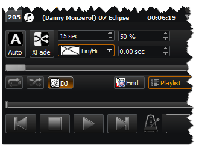  
Τα στοιχεία ελέγχου του DJ είναι τα εξής:
- **Auto**  
  Εάν είναι ενεργό, μόλις τα εναπομείναντα δευτερόλεπτα του τρέχοντος κομματιού αναπαραγωγής είναι ίσα με τη **Διάρκεια**, θα ξεκινήσει αυτόματα τη μίξη με το επόμενο κομμάτι.
- **Μίξη**  
  Πατώντας αυτό το κουμπί ξεκινάει κατευθείαν η μίξη με το επόμενο κομμάτι.
- **Διάρκεια**  
  Η διάρκεια της μίξης σε δευτερόλεπτα.
- **Είδος**  
  Επιλέξτε εδώ τις καμπύλες σβησίματος/εκκίνησης.
- **Στάθμη εκκίνησης**  
  Αυτό είναι η αρχική στάθμη έντασης του επόμενου κομματιού. Το κομμάτι θα δυναμώσει από αυτή τη στάθμη μέχρι το 100%.
- **Χρόνος εκκίνησης**  
  Εδώ μπορούμε να επιλέξουμε το χρονικό σημείο από όπου θα ξεκινήσει το επόμενο κομμάτι.
- **Μίκτης**  
  Πραγματοποιεί μία μίξη χειροκίνητα.  
  Μετακινώντας αυτή την μπάρα, αλλάζει ταυτόχρονα η ένταση τόσο του αναπαραγόμενου κομματιού (χαμηλώνει όσο η μπάρα μετακινείται προς τα δεξιά) όσο και του επόμενου κομματιού (δυναμώνει όσο η μπάρα μετακινείται προς τα δεξιά).  
  Στο τέρμα δεξιά, η μίξη τελειώνει και η μπάρα επιστρέφει στην αρχική της θέση.  

#### Εύρεση

Πατώντας το κουμπί της **Εύρεσης** ανοίγει το παράθυρο **Εύρεση κομματιών** που μας επιτρέπει να αναζητήσουμε κομμάτια στα ακόλουθα μέρη.  

- **YouTube** 

    
  Μπορούμε να αναζητήσουμε στο **YouTube** ένα τραγούδι και αν το βρούμε μπορούμε να το **Προσθέσουμε** στη λίστα αναπαραγωγής. Μπορούμε επίσης και να το σύρουμε στη λίστα αναπαραγωγής.  
  Το κουμπί **Καθαρισμός Λίστας** μπορεί να χρησιμοποιηθεί για να αφαιρέσουμε όλα τα κομμάτια από τη λίστα αναπαραγωγής, πριν προσθέσουμε τα καινούργια.  
  Αν είναι επιλεγμένο το τσεκ **Μόνο λίστες**, η αναζήτηση στο YouTube θα επιστρέφει μόνο Λίστες αναπαραγωγής και αν προσθέσουμε μία από αυτές, όλα τα κομμάτια της θα προστεθούν στη λίστα αναπαραγωγής μας.  
  Το κουμπί **Κείμενο στο πρόχειρο** μας επιτρέπει να δούμε τις διευθύνσεις YouTube που υπάρχουν στο πρόχειρο ή να πληκτρολογήσουμε μία δική μας.

- **Συλλογές**

    
  Μπορούμε επίσης να κάνουμε αναζήτηση για **Συλλογές** στη Βιβλιοθήκη μας ή για συγκεκριμένα κομμάτια μέσα σε αυτές τις Συλλογές (αν είναι ενεργοποιημένη η επιλογή **Αναζήτηση κομματιών**).  

- **Λίστα**  
    
  Τέλος, μπορούμε να βρούμε ένα συγκεκριμένο κομμάτι μέσα στα ήδη φορτωμένα κομμάτια της **Λίστας**, και να το **Παίξουμε**. 

#### Οπτικοποιητής

Ο οπτικοποιητής είναι ένας τρόπος οπτικοποίησης των δεδομένων ήχου του τρέχοντος αναπαραγόμενου κομματιού.  
Μπορούμε να επιλέξουμε έναν από τους τρεις τρόπους οπτικοποίησης:

* **Αναλυτής φάσματος**  
  Αυτός είναι ο προεπιλεγμένος και εμφανίζει το φάσμα συχνοτήτων του τρέχοντος αναπαραγόμενου κομματιού.  
  
* **Ο παλμογράφος**  
  Αυτό μας δείχνει την κυματομορφή του κομματιού που παίζει.  
  
* **Φασματογράφος**  
  Αυτό δείχνει επίσης το φάσμα συχνοτήτων του αναπαραγόμενου κομματιού, αλλά περιέχει επίσης και τον άξονα του χρόνου.  
  
* **Μετρητής έντασης**  
  Αυτό μας δείχνει την ένταση του τρέχοντος κομματιού που παίζει.
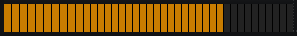  

Κάνοντας κλικ στον Οπτικοποιητή, αλλάζουμε τύπο οπτικοποίησης, ενώ κάνοντας δεξί κλικ ανοίγουμε το [Μενού απεικόνησης](#μενού-απεικόνισης).

### Έλεγχος αναπαραγωγής

  

Ως επί το πλείστον, αυτονόητοι έλεγχοι της αναπαραγωγής των κομματιών: 
- **Μπάρα θέσης** - Εμφανίζει τη θέση του τρέχοντος αναπαραγόμενου κομματιού και μας επιτρέπει να μεταπηδήσουμε σε ένα συγκεκριμένο σημείο. 
- **Κυματομορφή** - Οπτική αναπαράσταση του κομματιού που επίσης μας επιτρέπει να μεταπηδήσουμε σε ένα συγκεκριμένο σημείο.
- **Προηγούμενο κομμάτι** - Μετάβαση/αναπαραγωγή του προηγούμενου κομματιού.
- **Σταμάτημα** - Διακοπή της αναπαραγωγής.
  Κρατώντας πατημένο το `Alt` όταν κάνουμε κλικ, το κομμάτι θα σβήσει σταδιακά, ενώ κρατώντας πατημένο το `Shift` όταν κάνουμε κλικ, θα σταματήσει όλη η αναπαραγωγή όταν τελειώσει το κομμάτι και θα επιλέξετε το επόμενο.
- **Αναπαραγωγή/Παύση** - Εναλλαγή μεταξύ αναπαραγωγής/παύσης. 
- **Επόμενο κομμάτι** - Μετάβαση/αναπαραγωγή του επόμενου κομματιού. 
- **Υπολογισμός ταχύτητας** - Ανοίγει το παράθυρο διαλόγου **Υπολογισμός ΒΡΜ** που μας επιτρέπει να μετρήσουμε χειροκίνητα τα BPM του κομματιού και να το προσθέσουμε στα μεταδεδομένα του. 
- **Οθόνη χρόνου** - Εμφανίζει έναν από τους χρόνους, που μπορούν να επιλεγούν είτε από το μενού που ανοίγει όταν κάνετε δεξί κλικ, είτε με κλικ πάνω του:
  - Χρόνος που έχει περάσει από την αρχή του κομματιού
  - Υπολειπόμενος χρόνος μέχρι το τέλος του κομματιού
  - Συνολικός χρόνος που παρήλθε από την αρχή της Λίστας
  - Συνολικός υπολειπόμενος χρόνος μέχρι το τέλος της Λίστας
- **Σίγαση** - Κλείνει την εξόδο του ήχου. 
- **Ένταση** - Αλλάζει την ένταση της εξόδου ήχου. 

### Συμπαγής προβολή

  
Αυτή είναι μια συμπτυγμένη προβολή της εφαρμογής, η οποία αποτελείται από ένα μικρό, με δυνατότητα αλλαγής μεγέθους, Κύριο παράθυρο, το οποίο περιέχει το εξώφυλλο του τρέχοντος αναπαραγόμενου (ή επιλεγμένου) κομματιού, τον [Οπτικοποιητή](#οπτικοποιητής) και τον [Έλεγχο Αναπαραγωγής](#έλεγχος-αναπαραγωγής).  

Πάνω από τον Έλεγχο Αναπαραγωγής, υπάρχει ο τίτλος του τρέχοντος επιλεγμένου/αναπαραγόμενου κομματιού και δύο επιπλέον κουμπιά που ανοιγοκλείνουν τα παράθυρα της Λίστας Αναπαραγωγής και των Ιδιοτήτων.  
Κάνοντας διπλό κλικ σε αυτό το κείμενο του τίτλου, θα εμφανιστεί το αρχείο στην Εξερεύνηση των Windows ή το url του YouTube στο πρόγραμμα περιήγησης του συστήματος.  
Κάνοντας διπλό κλικ στο εξώφυλλο θα ανοίξει το παράθυρο [Επεξεργασίας Μεταδεδομένων](#επεξεργασία-μεταδεδομένων) (ή [Πολλαπλών Μεταδεδομένων](#πολλαπλή-επεξεργασία-μεταδεδομένων)) αν το(τα) κομμάτι(α) έχει(ουν) μεταδεδομένα.  
Με δεξί κλικ στο εξώφυλλο, εμφανίζει το [μενού Συμπαγούς προβολής](#μενού-συμπαγούς-προβολής), με πρόσθετες επιλογές.  

Όλα τα παράθυρα **Συμπαγούς προβολής** διαθέτουν ένα κουμπί **Κλείσιμο** (**x**) που τα κλείνει.  
Τα παράθυρα της **Λίστας** αναπαραγωγής και των **Ιδιοτήτων** έχουν την ίδια λειτουργικότητα με την **Πλήρη προβολή**, καθώς επίσης και κάποια ακόμα κουμπιά.  
Το κουμπί **Κλείδωμα**, κλειδώνει τη θέση του παραθύρου σε σχέση με το Κύριο παράθυρο, οπότε όταν μετακινούμε το Κύριο παράθυρο, το κλειδωμένο παράθυρο μετακινείται μαζί του με τον ίδιο τρόπο.  
Επιπλέον, το παράθυρο Λίστα αναπαραγωγής διαθέτει ένα κουμπί **DJ** για να ανοίξει το παράθυρο [DJ πάνελ](#dj-πάνελ) της λίστας αναπαραγωγής και το παράθυρο Ιδιότητες διαθέτει ένα κουμπί **About** για να ανοίξει το παράθυρο [Περί του KataLib](#σχετικά).  

### Συλλογές βιβλιοθήκης

Όταν εμφανίζονται οι **Συλλογές βιβλιοθήκης**, κάθε γραμμή αποτελείται από το όνομα της Συλλογής, τον αριθμό των κομματιών, τις προσαρμοσμένες ετικέτες, τη συνολική διάρκεια κ.λπ.  

  

Υπάρχουν τρεις τύποι συλλογών
- Συλλογές YouTube που χρησιμοποιούν τη διεύθυνση url της λίστας αναπαραγωγής του YouTube
- Συλλογές Spotify που μπορούν να χρησιμοποιήσουν μια διεύθυνση url λίστας αναπαραγωγής, άλμπουμ ή λίστας podcast του Spotify
- Προσαρμοσμένες συλλογές που μπορούν να περιέχουν οποιονδήποτε αριθμό κομματιών local/YouTube και δεν χρησιμοποιούν καμία διεύθυνση url

Μπορούμε επίσης να σημαδέψουμε τις Αγαπημένες Συλλογές με ένα **Αστέρι** και να χρησιμοποιήσουμε αυτό το χαρακτηριστικό τους για φιλτράρισμα ή ταξινόμηση. 

Μπορούμε να δημιουργήσουμε Συλλογές από το μενού (δεξί κλικ) της **Λίστας** αναπαραγωγής, μπορούμε να προσθέσουμε κομμάτια σε υπάρχουσες Συλλογές, μπορούμε να αφαιρέσουμε κομμάτια από αυτές, μπορούμε να διαγράψουμε υπάρχουσες Συλλογές, να τις σύρουμε στη Λίστα αναπαραγωγής για αναπαραγωγή κ.λπ.  

### Κομμάτια βιβλιοθήκης
Όταν εμφανίζονται τα **Κομμάτια της βιβλιοθήκης**, κάθε γραμμή αποτελείται από κάποιες βασικές πληροφορίες (όπως το μέγεθος του αρχείου ή ο τύπος αρχείου), πληροφορίες που περιέχονται μέσα σε κάποια μουσικά αρχεία (όπως ο Καλλιτέχνης ή ο Τίτλος) και τέλος κάποιες πληροφορίες που παρέχουμε εμείς οι ίδιοι και μας βοηθούν να οργανώσουμε τη συλλογή μας (όπως ετικέτες ή βαθμολογία).  
Για να εισάγουμε τα μουσικά αρχεία στη βιβλιοθήκη, πρέπει να δώσουμε στο πρόγραμμα τη θέση τους.  
Αυτό γίνεται πατώντας το κουμπί **Φάκελοι βιβλιοθήκης** της γραμμής εργαλείων.  
Στο παράθυρο διαλόγου **Φάκελοι βιβλιοθήκης** μπορούμε να προσθαφαιρέσουμε φακέλους στη βιβλιοθήκη.  
Μόνο φάκελοι μπορούν να προστεθούν στη βιβλιοθήκη, όχι μεμονωμένα αρχεία.  
Μπορούμε να σαρώσουμε εκ νέου τους φακέλους για να ενημερώσουμε τη βιβλιοθήκη με τις αλλαγές στα περιεχόμενά τους και, τσεκάροντας ή όχι το τσεκ, μπορούμε να τους κάνουμε ορατούς ή όχι.  
Επιλέγοντας ένα αρχείο στη βιβλιοθήκη μπορούμε να δούμε τις ιδιότητές του στον πίνακα **Ιδιότητες** (αν είναι ορατός).  
Κάνοντας ξανά κλικ σε οποιοδήποτε κελί μπορούμε να επεξεργαστούμε τα περιεχόμενα αυτού του κελιού. Η επεξεργασία ενός κελιού αλλάζει τα περιεχόμενα της βιβλιοθήκης αλλά και τα μεταδεδομένα του ίδιου του αρχείου.  
Τα μεταδεδομένα του αρχείου μπορούν να επεξεργαστούν είτε απευθείας κάνοντας κλικ στα κελιά είτε πατώντας το κουμπί **Μεταδεδομένα** της γραμμής εργαλείων.  
Αυτό θα ανοίξει το παράθυρο [**Επεξεργασία μεταδεδομένων**](#επεξεργασία-μεταδεδομένων) για την επεξεργασία των μεταδεδομένων του αρχείου.
Εάν κατά το πάτημα του κουμπιού είναι επιλεγμένα περισσότερα από ένα αρχεία, τότε θα ανοίξει η [**Πολλαπλή Επεξεργασία μεταδεδομένων**](#πολλαπλή-επεξεργασία-μεταδεδομένων), και οι αλλαγές εκεί θα επηρεάσουν όλα τα επιλεγμένα αρχεία.  
Τα επιλεγμένα αρχεία μπορούν να αντιγραφούν ή να μετακινηθούν οπουδήποτε και μπορούν επίσης να μετατραπούν σε πολλές άλλες μορφές ήχου με τον ενσωματωμένο μετατροπέα.  
Μπορούν επίσης να αναπαραχθούν, αλλά για να παιχτούν αυτόματα το ένα μετά το άλλο (όπως μια λίστα), η **Λίστα αναπαραγωγής** πρέπει να είναι κενή.

### Μετατροπή

Ένα παράθυρο για την επιλογή των ρυθμίσεων μετατροπής.  

   
Τα συνηθισμένα βήματα μιας μετατροπής, είναι η αποσυμπίεση των αρχείων σε μορφή `.wav` και στη συνέχεια η κωδικοποίηση εκ νέου με τον επιλεγμένο κωδικοποιητή.  

Εκτός από τις κύριες ρυθμίσεις για τους κωδικοποιητές, όπως ο _Τύπος συμπίεσης_ και ο _Ελέγχος ποιότητας_ της μετατροπής, υπάρχουν μερικές ακόμη ρυθμίσεις:

- **Μίξη Εισόδου**  
    Αυτή η επιλογή μετατρέπει πολυκάναλα αρχεία ήχου (5.1, 9.1 κ.λπ.) σε στερεοφωνικά ή μονοφωνικά.
- **Βit εύρος ενδιάμεσου wav**  
    Αυτή η επιλογή επηρεάζει το εύρος σε bit του ενδιάμεσου (ή τελικού) αρχείου wave.
- **Συχνότητα δειγματοληψίας**  
    Αυτό αλλάζει τη συχνότητα δειγματοληψίας της κωδικοποίησης.
- **Έξοδος MP3**  
    Αυτό επηρεάζει μόνο την κωδικοποίηση MP3. Αλλάζει τον αλγόριθμο του καναλιού.  
- **Αλλαγή έντασης ήχου**  
    Αυξάνει ή μειώνει την ένταση των μετασχηματισμένων κομματιών.
    - **Μέγιστο** (Απενεργοποιημένο αν δεν είναι ενεργοποιημένη η επιλογή `Αλαγή έντασης`)  
    Μεγιστοποιεί την ένταση του ήχου των κομματιών.  
    Αυξάνει ή μειώνει την ένταση του ήχου στο μέγιστο (πριν από το ψαλίδισμα). 
- **Μέση στάθμη στα**  
    Διατηρεί τη μέση στάθμη των κομματιών κοντά σε αυτή την τιμή.  
    Η προεπιλεγμένη τιμή είναι -18. Πλησιάζοντας προς το 0 αυξάνει η μέση στάθμη.  
    <ins>_**Μην χρησιμοποιείτε επίπεδα κοντά στο 0, γιατί ο ήχος θα παραμορφωθεί!**_</ins>
- **Αφαίρεση κενών**  
    Αφαιρεί τη σιωπή από την αρχή και το τέλος του κομματιού.
- **Περικοπή/Διαίρεση**  
    Ανοίγει ένα επιπλέον παράθυρο διαλόγου που σας επιτρέπει να [περικόψετε](#περικοπή) το κομμάτι σε ένα συγκεκριμένο μήκος ή να το [διαιρέσετε](#διαίρεση) σε πολλαπλά κομμάτια. 
- **Αρχική θέση**  
    Αποθηκεύει τα μετατρεμμένα κομμάτια στην ίδια διεύθυνση με τα κομμάτια προέλευσης (οι σύνδεσμοι αποθηκεύονται στο φάκελο Λήψης).  
    <ins>_**Προσοχή να μην αντικαταστήσετε τα αρχικά αρχεία με τα μετατρεμμένα.**_</ins>
- **Ένωση (επανακωδικοποίηση)**  
    Δημιουργήστε ένα συνεχές κομμάτι με την ένωση των επιλεγμένων κομματιών.  
    Τα αρχεία θα αποσυμπιεστούν, θα ενωθούν και στη συνέχεια θα συμπιεστούν εκ νέου.  
    (Ενεργοποιείται μόνο όταν έχουν επιλεγεί περισσότερα από ένα κομμάτια της ίδιας μορφής)

Το κουμπί **Επαναφορά** επαναφέρει τις προεπιλεγμένες ρυθμίσεις του διαλόγου.  
Το **Μετατροπή** ξεκινά τη διαδικασία μετατροπής, ενώ το **Close** απλώς κλείνει το παράθυρο διαλόγου (αλλά διατηρεί όλες τις αλλαγές που έχουν γίνει).

### Επεξεργασία μεταδεδομένων

    

Αυτός το παράθυρο μας επιτρέπει να επεξεργαστούμε όλα τα μεταδεδομένα του κομματιού και επίσης να αλλάξουμε το όνομα του αρχείου.  

Μπορούμε να **αντιγράψουμε** και να **επικολλήσουμε** τα μεταδεδομένα (συμπεριλαμβανομένης της εικόνας του εξωφύλλου) μεταξύ διαφορετικών κομματιών.  
Όταν πατηθεί το κουμπί Επικόλληση, θα ανοίξει ένας διάλογος **Προτιμήσεις επικόλλησης**, που μας επιτρέπει να επιλέξουμε ποια πεδία από τα αντιγραμμένα μεταδεδομένα θα επικολληθούν.  

Υπάρχουν ορισμένα κουμπιά «ευκολίας» που απαιτούν περισσότερες εξηγήσεις.
1. Αυτό το κουμπί απλά ανοίγει το παράθυρο διαλόγου **Λήψη Εξωφύλλου** και ξεκινάει αυτόματα την αναζήτηση (γλιτώνοντας μας από μερικά επιπλέον κλικ).
2. Αυτό το κουμπί μαντεύει τα πεδία που λείπουν, αναζητώντας αυτόματα μεταδεδομένα χρησιμοποιώντας οποιοδήποτε ήδη διαθέσιμο στοιχείο (λειτουργεί μόνο για τους τίτλους, τον καλλιτέχνη, το άλμπουμ, τον αριθμό του κομματιού και το έτος).
3. Αυτά τα κουμπιά απλώς κλείνουν το παράθυρο διαλόγου μεταδεδομένων του τρέχοντος κομματιού και ανοίγουν αυτόματα το επόμενο (ή το προηγούμενο).

Υπάρχει επίσης η επιλογή για **Αναζήτηση μεταδεδομένων** από το διαδίκτυο, εφόσον παρέχουμε τουλάχιστον έναν τίτλο για το κομμάτι.  
Το κουμπί **Λήψη Στίχων** αναζητά στο δίκτιο τους στίχους για το τρέχον κομμάτι.  
Αν βρεθούν κάποιοι στίχοι, προστίθενται στα σχόλια _μετά_ από οποιοδήποτε ήδη υπάρχον κείμενο.

Όλες οι αλλαγές που γίνονται σε αυτό το παράθυρο διαλόγου δεν γράφονται στο αρχείο μέχρι να πατήσετε είτε το κουμπί OK είτε τα κουμπιά με τα βέλη Next/Prev.

### Πολλαπλή επεξεργασία μεταδεδομένων

    

Ανοίγει το παράθυρο διαλόγου για να αλλάξετε τα μεταδεδομένα από όλα τα επιλεγμένα αρχεία ταυτόχρονα.  
Μόνο οι τσεκαρισμένες (ενεργοποιημένες) καταχωρήσεις θα αλλάξουν στα αρχεία.  
Εάν δεν υπάρχει τιμή σε μια τσεκαρισμένη (ενεργοποιημένη) καταχώρηση, τα αντίστοιχα μεταδεδομένα θα διαγραφούν.  
Μερικά κουμπιά ευκολίας είναι:
- **Αυτόματη αρίθμηση ξεκινώντας από**  
    Εάν είναι επιλεγμένο το **Νο. κομματιού**, τα επιλεγμένα κομμάτια λαμβάνουν έναν νέο αριθμό Κομματιού, διαδοχικά, ξεκινώντας από τον αριθμό που έχει οριστεί εδώ. 
- **Λήψη Στίχων**  
    Αυτό το κουμπί λειτουργεί λίγο διαφορετικά εδώ.  
    Ψάχνει τους στίχους για όλα τα επιλεγμένα κομμάτια και, αν βρεθούν κάποιοι από αυτούς, προστίθενται αυτόματα στα αντίστοιχα μεταδεδομένα.   

Φυσικά, τίποτα δεν εγγράφεται πραγματικά στα αρχεία μέχρι να πατηθεί το κουμπί OK. 

### Φιλτράρισμα

Η λειτουργία **Φιλτράρισμα** μας βοηθάει να περιορίσουμε αυτά που εμφανίζονται στη Βιβλιοθήκη.  
Ανάλογα με το είδος εμφάνισης της Βιβλιοθήκης (Συλλογές ή Κομμάτια), αυτό το κουμπί ανοίγει διαφορετικά παράθυρα.

#### Φιλτράρισμα Συλλογών Βιβλιοθήκης

 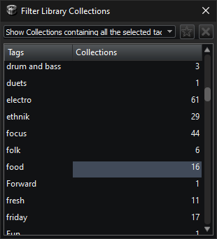  
Με αυτόν το παράθυρο μπορούμε να φιλτράρουμε τις Συλλογές χρησιμοποιώντας τις ετικέτες τους.  
Μπορούμε να επιλέξουμε πολλαπλές ετικέτες και έχουμε τις εξής επιλογές: 
- Εμφάνιση συλλογών που περιέχουν όλες τις επιλεγμένες ετικέτες
- Εμφάνιση συλλογών που περιέχουν οποιαδήποτε από τις επιλεγμένες ετικέτες
- Εμφάνιση συλλογών που δεν περιέχουν καμία από τις επιλεγμένες ετικέτες

Το κουμπί με το _«αστέρι»_ μας επιτρέπει να φιλτράρουμε χρησιμοποιώντας μόνο τις **Αγαπημένες** Συλλογές, ενώ το κουμπί με το «**x**» αποεπιλέγει όλες τις επιλεγμένες ετικέτες.  
Υπάρχει επίσης ένα νούμερο δίπλα σε κάθε όνομα ετικέτας, το οποίο απεικονίζει τον αριθμό των Συλλογών που χρησιμοποιούν αυτή την ετικέτα. 

#### Φιλτράρισμα Κομματιών Βιβλιοθήκης

   
  
Με αυτό το παράθυρο μπορούμε να φιλτράρουμε τα κομμάτια χρησιμοποιώντας τη διεύθυνση τους, τα μεταδεδομένα τους, όπως Καλλιτέχνης, Άλμπουμ, Τίτλος, Είδος, Ετικέτες, Βαθμολογία ή Όλα τα παραπάνω.  
Πατώντας το κουμπί **Φιλτράρισμα** ενημερώνεται η βιβλιοθήκη και πατώντας το κουμπί **Καθαρισμός** σβήνεται το φίλτρο.  
Αν το τσεκ στο κουμπί **Φιλτράρισμα** είναι επιλεγμένο, η βιβλιοθήκη ενημερώνεται καθώς πληκτρολογούμε, αλλά αυτό μπορεί να έχει καθυστερήσεις αν η Βιβλιοθήκη περιέχει πολλά αρχεία.  
Μπορούμε επίσης να χρησιμοποιήσουμε όρους boolean (OR, AND, NOT με κεφαλαία γράμματα) με τις λέξεις-κλειδιά μας.  
Π.χ. `Pink Floyd AND Animals`  
θα μας δείξει όλα τα κομμάτια των Pink Floyd από το άλμπουμ τους «Animals». 

### Φάκελοι βιβλιοθήκης

  

Διαχείρηση των φακέλων της βιβλιοθήκης, που εμπεριέχουν όλα τα κομμάτια της βιβλιοθήκης.  
Έχουμε τις εξής επιλογές:

- **Προσθήκη φακέλου** ανοίγει ένα παράθυρο επιλογής φακέλου για την προσθήκη ενός φακέλου στη βιβλιοθήκη.  
  Όλα τα μουσικά αρχεία στον επιλεγμένο φάκελο (και των φακέλων μέσα σε _αυτόν_), θα προστεθούν στη βιβλιοθήκη.  
  Κάθε καταχώρηση φακέλου που τυχαίνει να είναι επίσης υποφάκελος μιας άλλης καταχώρησης φακέλου θα αφαιρείται ως περιττή.  
  Φυσικά, τα αρχεία θα εξακολουθούν να βρίσκονται στη βιβλιοθήκη.
- Η επιλογή **Κατάργηση επιλεγμένων** αφαιρεί τους επιλεγμένους (όχι τους τσεκαρισμένους) φακέλους από τη βιβλιοθήκη (αλλά όχι από το δίσκο).
- **Ανανέωση φακέλων** σαρώνει εκ νέου τους φακέλους της βιβλιοθήκης για να ενημερώσει τα μεταδεδομένα αν έχουν αλλάξει και για να προσθέσει νέα αρχεία ή να αφαιρέσει διαγραμμένα αρχεία αν έχουν αλλάξει τα περιεχόμενα των φακέλων της βιβλιοθήκης.
- **Τσεκαρισμένοι** Εάν αυτό το τσεκ είναι _τσεκαρισμένο_ (!), μόνο οι _τσεκαρισμένοι_ (!!) φάκελοι θα σαρωθούν εάν πατηθεί το κουμπί **Ανανέωση φακέλων**.  
  Διαφορετικά, σαρώνονται όλοι οι φάκελοι.
- Το πλαίσιο ελέγχου **Όλα** ξε/τσεκάρει όλους τους φακέλους της βιβλιοθήκης.

Το τσεκ μπροστά από έναν φάκελο καθορίζει επίσης αν τα περιεχόμενα αυτού του φακέλου θα είναι ορατά στη βιβλιοθήκη.  
Μπορούμε να σύρουμε εδώ φακέλους από την Εξερεύνηση των Windows για να προστεθούν στη βιβλιοθήκη.  

### Προτιμήσεις

Υπάρχουν πέντε σελίδες στο παράθυρο διαλόγου Προτιμήσεις:  

#### Γενικά

  

- **Γλώσσα**  
  Επιλέξτε τη γλώσσα του προγράμματος.
- **Όταν η Πρόοδος ολοκληρωθεί:**
  - Κλείσιμο προόδου - κλείνει το παράθυρο προόδου  
  - Άνοιγμα προορισμού - ανοίγει την διεύθυνση προορισμού στην Εξερεύνηση των Windows  
  - Αναπαραγωγή ήχου - παίζει έναν ήχο όταν όλα είναι έτοιμα  
  - Επιλογή [_τρέχων ήχος_]  
    Μπορούμε να επιλέξουμε ένα άλλο αρχείο ήχου, πατώντας αυτό το κουμπί και αναζητώντας ένα αρχείο «.wav».
- **Επαναφόρτωση της τελευταίας λίστας**  
  Κατά την εκκίνηση του προγράμματος, επαναφορτώνει τα κομμάτια που ήταν φορτωμένα όταν έκλεισε τελευταία φορά.
- **Αναπαραγωγή επόμενου κομματιού**  
  Όταν τελειώσει η αναπαραγωγή ενός κομματιού στη λίστα αναπαραγωγής, αρχίζει αυτόματα η αναπαραγωγή του επόμενου.  
- **Αυτόματη αναπαραγωγή στο άνοιγμα**  
  Ξεκινά αυτόματα την αναπαραγωγή, εάν ένα αρχείο ή μια λίστα αναπαραγωγής έχει ανοιχτεί με το KataLib και η λίστα αναπαραγωγής είναι κενή.
- **Υποστήριξη έντασης πολυμέσων**  
  Επιτρέπει τη χρήση των πλήκτρων πολυμέσων για τον έλεγχο της έντασης αναπαραγωγής της συσκευής αναπαραγωγής. 
- **Αυτόματος έλεγχος για ενημερώσεις**  
 Αυτόματος έλεγχος στο διαδίκτυο για ενημερωμένη έκδοση.
- **Διατήρηση ημερομηνίας**  
 Διατήρηση της αρχικής ημερομηνίας τροποποίησης κατά την επεξεργασία των μεταδεδομένων ενός αρχείου.
- **Εμφάνιση αρχείων video**  
 Εμφάνιση αρχείων βίντεο στη Βιβλιοθήκη και επίσης δυνατότητα αναπαραγωγής τους στη λίστα αναπαραγωγής.  
  Αυτά τα αρχεία βρίσκονται πάντα στη βάση δεδομένων, απλά επιλέγουμε αν θέλουμε να τα βλέπουμε ή όχι.  
  Τα αρχεία βίντεο είναι αρχεία με επεκτάσεις όπως avi, mp4, mov, mkv κλπ.
- **Αναπαραγωγή χωρίς κενά**  
  Προσπάθεια εξάλειψης της σιωπής που ακούγεται κατά τη διάρκεια του χρόνου που χρειάζεται για να φορτωθεί το επόμενο κομμάτι.
- **Σβήσιμο στο σταμάτημα**  
 Χαμήλωμα του κομματιού που παίζει πριν το σταμάτημα της αναπαραγωγής.
- **Έξοδος σε εικονίδιο**  
  Όταν πατάμε το κουμπί κλεισίματος το KataLib, το πρόγραμμα δεν κλείνει τελείως, αντίθετα ελαχιστοποιείται στο εικονίδιο της περιοχής των ειδοποιήσεων.  
  Όταν είναι ενεργοποιημένο, ο μόνος τρόπος εξόδου από το πρόγραμμα είναι η επιλογή **Έξοδος** στο μενού του εικονιδίου της περιοχής των ειδοποιήσεων.
- **Επιβεβαίωση εξόδου**  
  Άνοιγμα ενός διαλόγου επιβεβαίωσης πριν από την έξοδο από το πρόγραμμα.

[//]: # (- **Κεντρική έξοδος** )

[//]: # (- Επιλέξτε μια έξοδο ήχου του συστήματος για την αναπαραγωγή. )

[//]: # (- **Έξοδος ακουστικών** )

[//]: # ( Επιλέξτε μια έξοδο ήχου του συστήματος για την παρακολούθηση/συνθήκη. )

#### Εμφάνιση
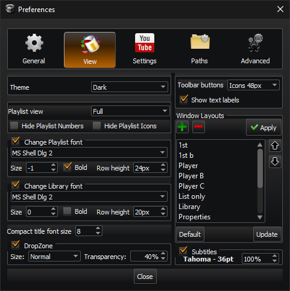  

**Στυλ**  
Επιλέξτε μεταξύ των θεμάτων Φωτεινό, Σκούρο και Προσαρμογή.  
Το προσαρμοσμένο θέμα δέχεται ένα αρχείο `.qss` (ένα αρχείο `.css` για Qt).  
Μπορούμε να κάνουμε μια γρήγορη προεπισκόπηση αυτών των αρχείων, με σύρσιμο και απόθεση στο κύριο παράθυρο (όταν το παράθυρο διαλόγου Προτιμήσεις είναι κλειστό). 

**Προβολή λίστας**  
Αλλάζει τον τρόπο με τον οποίο εμφανίζονται τα κομμάτια στη λίστα αναπαραγωγής.

- **Πλήρης** -> (Καλλιτέχνης) Αριθμός κομματιού Τίτλος
- **Μόνο τίτλοι**
- **Ονόματα αρχείων**
- **Καλλιτέχνες και τίτλοι** -> (Καλλιτέχνης) Τίτλος

Μπορούμε επίσης να αποκρύψουμε τον αριθμό της λίστας αναπαραγωγής ή/και το εικονίδιο της λίστας αναπαραγωγής.  

**Αλλαγή γραμματοσειράς λίστας**  
Αλλάξτε τη γραμματοσειρά και το ύψος γραμμής των καταχωρήσεων της λίστας αναπαραγωγής.

**Αλλαγή γραμματοσειράς βιβλιοθήκης**  
Αλλαγή της γραμματοσειράς και του ύψους γραμμής των καταχωρήσεων της βιβλιοθήκης.

**Μέγεθος γραμματοσειράς συμπαγούς τίτλου**  
Αλλάξτε το μέγεθος γραμματοσειράς του τίτλου του κομματιού στη **Συμπαγή εμφάνιση**.

**Περιοχή Ρίψης**  
Ενεργοποιήστε τη χρήση της [Περιοχής Ρίψης](#περιοχή-ρίψης) και προσαρμόστε την εμφάνισή της.

**Κουμπιά γραμμής εργαλείων** και **Εμφάνιση κειμένου**  
Εδώ μπορούμε να προσαρμόσουμε τον τρόπο εμφάνισης των κουμπιών της γραμμής εργαλείων.  
Μπορούμε να επιλέξουμε το μέγεθος των εικονιδίων της Γραμμής Εργαλείων και ακόμη και αν το εικονίδιο ή το κείμενό τους είναι ορατό.

**Διατάξεις παραθύρων**  
Μπορούμε να αποθηκεύσουμε εδώ τις διατάξεις των παραθύρων (μέγεθος, θέση, ανοιχτά πάνελ, γραμματοσειρές κ.λπ.).  

- **+ / -**  
    Προσθέτει την τρέχουσα διάταξη παραθύρου / Αφαιρεί την τρέχουσα επιλεγμένη διάταξη.
- **Εφαρμογή**  
    Εφαρμόζει την τρέχουσα επιλεγμένη διάταξη.
- **Βέλος πάνω/κάτω**  
    Αλλάζει θέση στην τρέχουσα επιλεγμένη διάταξη στη λίστα.
- **Ανανέωση**  
    Ενημερώνει την επιλεγμένη διάταξη με την τρέχουσα διάταξη παραθύρου.
- **Αρχικό**  
    Επαναφέρει την τρέχουσα διαμόρφωση παραθύρου στην αρχική της κατάσταση.

**Υπότιτλοι**  
Μπορούμε να αλλάξουμε τη γραμματοσειρά και τη θέση του κειμένου υποτίτλων (για αρχεία βίντεο που διαθέτουν υπότιτλους). 

#### Ρυθμίσεις YouTube
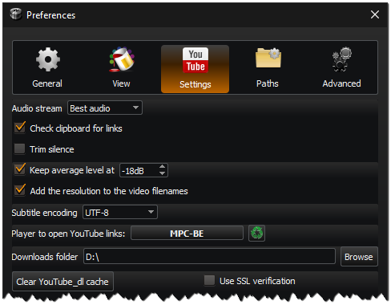  

- **Κανάλι ήχου**  
 Το κανάλι ήχου του YouTube που θα χρησιμοποιηθεί για τη μετατροπή.
- **Έλεγχος προχείρου για συνδέσμους**  
 Ελέγχει το πρόχειρο για οποιοδήποτε κείμενο που περιέχει μια διεύθυνση βίντεο ή λίστας αναπαραγωγής από το YouTube.
- **Αφαίρεση κενών**  
 Αφαίρεση της σιωπής από την αρχή και το τέλος του κομματιού.
- **Μέση στάθμη στα**  
 Διατηρεί το μέσο επίπεδο αναπαραγωγής των κομματιών του YouTube κοντά σε αυτή την τιμή.  
    Η προεπιλεγμένη τιμή είναι -18. Πλησιάζοντας προς το 0 αυξάνεται η μέση στάθμη. 
 <ins>_**Μη χρησιμοποιείτε επίπεδα κοντά στο 0, γιατί ο ήχος θα παραμορφωθεί!**_</ins>,
- **Προσθήκη της βίντεο ανάλυσης στο όνομα** του αρχείου, όταν αποθηκεύετε ένα βίντεο από το YouTube.
- **Κωδικοποίηση υποτίτλων**  
    Αυτή είναι η κωδικοποίηση (UTF-8/ANSI) που θα χρησιμοποιηθεί για το αποθηκευμένο αρχείο υποτίτλων.
- **Προγραμμα για την αναπαραγωγή YouTube πολυμέσων**  
    Εδώ επιλέγουμε το πρόγραμμα αναπαραγωγής που θέλουμε να χρησιμοποιήσουμε, για να χειριζόμαστε τους συνδέσμους του YouTube (όπως το VLC ή το Media Player Classic) 
- **Φάκελος λήψεων**  
    Αυτή είναι η διεύθυνση όπου θα αποθηκεύονται τα αρχεία που κάνουμε λήψη από το YouTube.
- **Χρήση SSL επαλήθευσης**  
    Απενεργοποιήστε αυτό το στοιχείο, εάν έχετε προβλήματα στη λήψη πληροφοριών για τα κομμάτια του YouTube.

#### Διαδρομές

  
Εδώ επιλέγουμε τις διαδρομές των εκτελέσιμων αρχείων που χρησιμοποιεί η εφαρμογή για:
- Τη μετατροπή αρχείων ήχου (όπως FFMPEG, LAME, OGG, OPUS και NeroAAC)
- Εξωτερική επεξεργασία ενός κομματιού (τέσσερις διαφορετικές επιλογές)
- Τον διαχειριστής αρχείων για τον χειρισμό των διευθύνσεων στον σκληρό δίσκο (αν δεν είναι ο προεπιλεγμένος Εξερεύνηση των Windows)

#### Για προχωρημένους

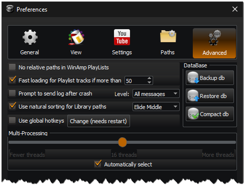  

**Όχι σχετικές διευθύνσεις στις WinAmp λίστες**  
Οι λίστες αναπαραγωγής του WinAmp μπορούν να έχουν τόσο απόλυτες όσο και σχετικές διαδρομές.  
Οι σχετικές διαδρομές λειτουργούν μόνο εάν η θέση της λίστας αναπαραγωγής παραμένει στην ίδια σχέση με τη θέση των αρχείων, όπως είχε αρχικά αποθηκευτεί.  
Έτσι, αν μετακινηθούν και τα δύο και διατηρήσουν τη σχέση θέσης τους, η λίστα αναπαραγωγής θα λειτουργήσει.  
Για να μετακινήσετε μόνο τη λίστα αναπαραγωγής και όχι τα αρχεία, όλες οι διαδρομές πρέπει να είναι απόλυτες.

**Γρήγορη φόρτωση κομματιών στη Λίστα πάνω από**  
Γρήγορη φόρτωση των κομματιών (όταν είναι πάνω από αυτόν τον αριθμό) χρησιμοποιώντας μόνο τις βασικές ιδιότητες και ανάκτηση των υπόλοιπων πληροφοριών όταν αυτό είναι δυνατόν.

**Προτροπή για αποστολή σφαλμάτων μετά από κόλλημα**  
Αν το πρόγραμμα κολλήσει, μας ρωτάει αν θέλουμε να στείλουμε το αρχείο καταγραφής του κολλήματος στον προγραμματιστή για προσπάθεια διορθώσεων. 

**Φυσική στοίχιση διευθύνσεων βιβλιοθήκης**  
Η κανονική (αλφαβητική) ταξινόμηση φέρνει το «Track 11» πριν από το «Track 2», αλλά είναι ~15% ταχύτερη.  
Φυσική ταξινόμηση, ταξινομεί τους αριθμούς στις διευθύνσεις όπως αναμένεται (π.χ. X1, X2, X11).

**Χρήση γενικών συντομεύσεων**  
Ελέγξτε την αναπαραγωγή ακόμη και όταν το παράθυρο του KataLib δεν είναι επιλεγμένο.  
Πατώντας το κουμπί **Αλλαγή** ανοίγει ένα παράθυρο διαλόγου που μας επιτρέπει να επιλέξουμε ποιος συνδυασμός πληκτρολογίου θα κάνει ποια ενέργεια.  
Για τις προεπιλεγμένες ρυθμίσεις ελέγξτε την ενότητα [Συντομεύσεις](#συντομεύσεις) στο τέλος.

**Βάση δεδομένων**

- **Αντιγραφή βάσης**  
  Δημιουργία αντιγράφου ασφαλείας του αρχείου της βάσης δεδομένων για λόγους ασφαλείας (!).
- **Επαναφορά βάσης**  
  Επαναφορά της βάσης δεδομένων από ένα αντίγραφο ασφαλείας.
- **Συμπύκνωση βάσης**  
  Συμπίεση του αρχείου βάσης δεδομένων για εξοικονόμηση χώρου.

**Πολυπύρηνοι επεξεργαστές**

- **Εργασίες**  
  Τα νήματα (ή πυρήνες) που θα χρησιμοποιήσει το πρόγραμμα για την παράλληλη επεξεργασία πολλαπλών εργασιών.
- **Αυτόματη επιλογή**  
  Το πρόγραμμα θα επιλέξει τον αριθμό των νημάτων με βάση τον αριθμό των φυσικών πυρήνων του επεξεργαστή.

### Σχετικά

Πληροφορίες σχετικά με το πρόγραμμα σε πέντε σελίδες:

  

- Πληροφορίες σχετικά με την KataLib.
- Ο οδηγός χρήσης.
- Μια γρήγορη επισκόπηση των συντομεύσεων του KataLib.
- Οι βιβλιοθήκες που χρησιμοποιεί το πρόγραμμα και οι άδειες χρήσης τους.
- Μια προβολή του αρχείου καταγραφής, που εκτυπώνει διάφορες πληροφορίες εντοπισμού σφαλμάτων κατά τη διάρκεια της εκτέλεσης της εφαρμογής.  

___

### Περικοπή/Διαίρεση
Σε αυτό το παράθυρο διαλόγου μπορούμε να επιλέξουμε να περικόψουμε την αρχή ή/και το τέλος του επιλεγμένου κομματιού ή να το χωρίσουμε σε πολλά διαφορετικά κομμάτια.  
Χρησιμοποιούμε αριθμημένα πεδία για να το κάνουμε αυτό και το κουμπί **Προεπισκόπηση** μας επιτρέπει να ακούσουμε τα αποτελέσματα των αλλαγών μας. 

#### Περικοπή

  

Αυτό το παράθυρο περιέχει μόνο δύο αριθμητικά πεδία με ώρες:λεπτά:δευτερόλεπτα, για να ορίσετε την αρχή και το τέλος του κομματιού.  
Οι τιμές τίθενται αυτόματα στην αρχή/τέλος του κομματιού όταν το ανοίγουμε για πρώτη φορά.  
Το κομμάτι που προκύπτει θα έχει τα ίδια μεταδεδομένα με το αρχικό.

#### Διαίρεση

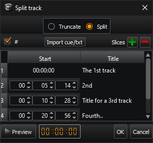  
Όταν ανοίγουμε για πρώτη φορά αυτό το παράθυρο, περιέχει μόνο ένα μέρος με την **Αρχή** του, η οποία _πρέπει_ να είναι 00:00:00 (αναγκαστικά).  
Πατώντας το κουμπί **Συν (+)** μπορούμε να προσθέσουμε ένα νέο μέρος του κομματιού, ενώ πατώντας το κουμπί **Μείον (-)** αφαιρούμε το επιλεγμένο μέρος.  
Κάνοντας κλικ στη στήλη **Τίτλος** οποιουδήποτε μέρους, μπορούμε να αλλάξουμε τον τίτλο του, και κατά συνέπεια να αλλάξουμε τον τίτλο/το όνομα αρχείου του κομματιού που προκύπτει.  
Το πεδίο **Αρχή** όλων των μερών (εκτός του πρώτου) είναι επεξεργάσιμο και μπορούμε να κάνουμε προεπισκόπηση των αλλαγών μας χρησιμοποιώντας το κουμπί **Προεπισκόπηση**.  
Όλα τα κομμάτια που θα προκύψουν θα έχουν ένα αντίγραφο των μεταδεδομένων του αρχικού κομματιού, εκτός από τον τίτλο και τον αριθμό του κομματιού.  
Ο Τίτλος θα είναι ο τίτλος του μέρους, και αν τσεκάρουμε το τσεκ με τη **Δίεση (#)**, ο αριθμός του μέρους θα είναι ο αριθμός του κομματιού στα μεταδεδομένα τους.  

Το κουμπί **Εισαγωγή cue/txt** μας επιτρέπει να εισάγουμε τους χρόνους των κοψιμάτων από ένα αρχείο *.cue ή ένα αρχείο *.txt.  
Η μορφή του αρχείου `*.cue` είναι στάνταρ, αλλά η μορφή του αρχείου `*.txt` θα πρέπει να είναι:

* Ένα μέρος του κομματιού ανά γραμμή
* Χρόνος με τη μορφή `Ώρες:Λεπτά:Δευτερόλεπτα` ή ` Λεπτά:Δευτερόλεπτα`.
* Η μορφή κάθε γραμμής πρέπει να είναι μία από τις παρακάτω:
  * Χρόνος **+** Ένα κενό διάστημα **+** Τίτλος του κομματιού (_π.χ._ «14:53 This is a title»), ή
  * Τίτλος του κομματιού **+** Ένα κενό διάστημα **+** Χρόνος (_π.χ._ «Αυτός είναι ένας τίτλος 01:03:46»)

Η ρίψη ενός αρχείου `*.cue` ή `*.txt` στο παράθυρο εισαγάγει αυτόματα τους χρόνους. 

### Μετονομασία

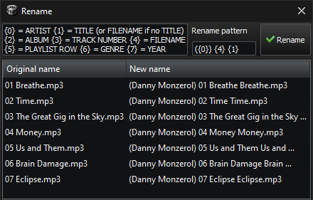  

Αυτό το παράθυρο μας επιτρέπει να μετονομάσουμε το επιλεγμένο(α) αρχείο(α) χρησιμοποιώντας ένα μοτίβο με μεταβλητές.  

Οι μεταβλητές είναι οι εξής:  
{0} = ΚΑΛΙΤΕΧΝΗΣ  
{1} = ΤΙΤΛΟΣ (ή ΟΝΟΜΑ ΑΡΧΕΙΟΥ αν δεν υπάρχει ΤΙΤΛΟΣ)  
{2} = ΔΙΣΚΟΣ  
{3} = ΑΡΙΘΜΟΣ ΚΟΜΜΑΤΙΟΥ  
{4} = ΟΝΟΜΑ ΑΡΧΕΙΟΥ  
{5} = ΣΕΙΡΑ ΛΙΣΤΑΣ ΑΝΑΠΑΡΑΓΩΓΗΣ  
{6} = ΕΙΔΟΣ  
{7} = ΕΤΟΣ  

Μπορεί επίσης να δημιουργήσει καταλόγους χρησιμοποιώντας τον χαρακτήρα \.  

Παράδειγμα: {7} {2}\{0} - {1}  

Παράγει: ..\1998 NYC Live\Portishead - Sour Times.mp3

### Περιοχή Ρίψης

  

Η Περιοχή ρίψης είναι το τετράγωνο εικονίδιο που βρίσκεται πάντα πάνω από όλα τα άλλα παράθυρα.  
Μπορείτε να σύρετε διευθύνσεις του YouTube από το πρόγραμμα περιήγησής σας για να τα ανοίξετε στο KataLib, χωρίς να χρειάζεται να αφήσετε το πρόγραμμα περιήγησής σας και να μεταβείτε στο KataLib.  

Μπορούμε να αλλάξουμε το μέγεθος και το επίπεδο διαφάνειάς της από την καρτέλα **Εμφάνιση** στις **Προτιμήσεις**, για να την κάνουμε όπως ακριβώς μας αρέσει.  
Υπάρχουν επίσης κάποιες χρήσιμες ενέργειες, οι οποίες είναι διαθέσιμες από το [μενού της Περιοχής Ρίψης](#μενού-περιοχής-ρίψης) που εμφανίζεται αν κάνετε δεξί κλικ πάνω του.

___

## Δεξί κλικ Μενού
### Κομμάτι Λίστας

Το μενού του δεξιού κλικ των κομματιών της Λίστας αναπαραγωγής, έχει διαφορετικές επιλογές, ανάλογα με τον τύπο της επιλογής.  
Ορισμένες από αυτές τις επιλογές ενδέχεται να μην είναι διαθέσιμες για ορισμένους τύπους κομματιών.

|                                     | 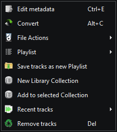 |
|:---------------------------------------------------------------------------------:|:------------------------------------------------:|
|                         _Επιλεγμένο ένα κομμάτι αρχείου_                          |       _Επιλεγμένα πολλά κομμάτια αρχείων_        |
|                                   |                                                  |
| _Ένα κομμάτι αρχείου επιλεγμένο (παίζει ή έχει αποθηκευμένο Σημείο αναπαραγωγής)_ |                                                  |

|  | 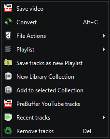 |
|:----------------------------------------------:|:------------------------------------------------:|
|        _Επιλεγμένο ένα κομμάτι YouTube_        |       _Επιλεγμένα πολλά κομμάτια YouTube_        |

- **[Επεξ. μεταδεδομένων](#επεξεργασία-μεταδεδομένων)**
- **Βίντεο** (υπό-μενού)  
  Αν επιλεγεί μόνο ένα κομμάτι του YouTube, εμφανίζεται ένα υπομενού με τα διαθέσιμα αρχεία βίντεο (βίντεο και ήχου) που μπορούμε να κατεβάσουμε ή να παρακολουθήσουμε.
- **[Μετατροπή](#μετατροπή)**
- **[Ενέργειες αρχείων](#files)** (υπό-μενού)
- **[Λιστα](#μενού-λίστα-αναπαραγωγής)** (υπό-μενού)
- **Αποθήκευση σε νέα Λίστα** αναπαραγωγής και δημιουργία μιας **Νέας συλλογής βιβλιοθήκης** εάν έχουν επιλεγεί περισσότερα από ένα κομμάτια.
- Η επιλογή **Προσθήκη στην επιλεγμένη Συλλογή** προσθέτει τα τρέχοντα επιλεγμένα κομμάτια στην τρέχουσα επιλεγμένη Συλλογή.
- **Σημείο αναπαραγωγής**  
  Ανοίγει ένα υπο-μενού που μας επιτρέπει να αποθηκεύσουμε την τρέχουσα θέση του κομματιού ή να ξεκινήσουμε την αναπαραγωγή από την προηγουμένως αποθηκευμένη θέση του.
  - **Αποθήκευση τρέχουσας θέσης** αποθηκεύει την τρέχουσα θέση του κομματιού στο δίσκο δίπλα του, σε ένα αρχείο με το ίδιο όνομα με το όνομα αρχείου του κομματιού. 
  - **Αναπαραγωγή από αποθηκευμένη θέση** αναπαράγει το κομμάτι από την προηγουμένως αποθηκευμένη θέση και είναι ενεργοποιημένο μόνο εάν υπάρχει το σχετικό αρχείο.
  - **Καθαρισμός αποθηκευμένης θέσης** αφαιρεί το αρχείο αποθηκευμένης θέσης εάν υπάρχει. 
- **Άνοιγμα εκτός προγράμματος**  
  Ανοίγει το επιλεγμένο κομμάτι αρχείου με έναν από τους τέσσερις προσαρμοσμένους επεξεργαστές μας (βλ. [Διαδρομές](#διαδρομές)).
- **Προφόρτωση YouTube κομματιών**  
  Κατεβάζει αμέσως το κανάλι ήχου του κομματιού(ών) για να το έχει έτοιμο για αναπαραγωγή/μετατροπή, χωρίς να χρειάζεται ενεργή σύνδεση στο δίκτυο.
- **Ανανέωση συνδέσμου** ξανά κατεβάζει τις πληροφορίες του κομματιού από το YouTube.
- **Πρόσφατα κομμάτια** μας επιτρέπει να ανοίξουμε ξανά τα κομμάτια που αναπαράχθηκαν πρόσφατα.
- **Αφαίρεση κομματιών** απλώς αφαιρεί τα επιλεγμένα κομμάτια από τη Λίστα αναπαραγωγής.

### Κομμάτι βιβλιοθήκης

|  |
|:--------------------------------------------:|
|    _Επιλεγμένα κομμάτια της βιβλιοθήκης_     |

- **[Επεξεργασία μεταδεδομένων](#επεξεργασία-μεταδεδομένων)**
- **[Μετατροπή](#μετατροπή)**
- **[Ενέργειες αρχείων](#files)** (υπό-μενού)
- **Αναπαραγωγή στη Λίστα**  
    Καθαρίζει τη Λίστα αναπαραγωγής, προσθέτει τα επιλεγμένα αρχεία και ξεκινά την αναπαραγωγή του πρώτου από αυτά.
- **Προσθήκη στη Λίστα**  
    Προσθέτει τα επιλεγμένα αρχεία στο τέλος της λίστας αναπαραγωγής.
- **Άνοιγμα εκτός προγράμματος**  
    Ανοίγει τα επιλεγμένα αρχεία με το πρόγραμμα αναπαραγωγής του συστήματος.
- **Διαγραφή αρχείων**  
    Διαγράφει τα επιλεγμένα αρχεία από τη βιβλιοθήκη <ins>_**και από το δίσκο!**_</ins>.

### Συλλογή βιβλιοθήκης

|  |  |
|:-----------------------------------------------:|:-------------------------------------------------:|
|      _Επιλεγμένη μία Συλλογή βιβλιοθήκης_       |     _Επιλεγμένες πολλές Συλλογές βιβλιοθήκης_     |

- **Άνοιγμα Συλλογών** - Επιλέξτε μία από τις δύο επιλογές:
  - **Άνοιγμα Συλλογών από αρχείο** - Ανοίξτε ένα αρχείο συλλογής `.dbc` ή μετατρέψτε ένα αρχείο λίστας αναπαραγωγής `.lst` σε μια νέα συλλογή.
  - **Άνοιγμα Λίστας από το YouTube** - Δημιουργήστε μια Συλλογή από μια διεύθυνση λίστας του YouTube.
- **Προσθήκη της λίστας σαν νέα Συλλογή** - Δημιουργεί μια νέα Συλλογή από τα φορτωμένα κομμάτια της Λίστας αναπαραγωγής.
- **Αναδημιουργία της Συλλογής από την Λίστα** - Αντικαθιστά τα κομμάτια της τρέχουσας επιλεγμένης Συλλογής με τα φορτωμένα κομμάτια της Λίστας αναπαραγωγής. 
- **Επεξεργασία Συλλογής** - Ανοίγει ένα παράθυρο για να αλλάξετε τον τίτλο της συλλογής, τις ετικέτες ή την ηλεκτρονική διεύθυνση. 
- **Αποθήκευση Συλλογής** - Αποθήκευση της συλλογής (ή των συλλογών) σε αρχείο `.dbc`.
- **Αποθήκευση Συλλογής + Κομματιών** - Αποθηκεύει τη Συλλογή(ες) σε ένα αρχείο `.dbc` και δημιουργεί επίσης έναν φάκελο με τα αρχεία τραγουδιών της Συλλογής, με όνομα το όνομα της Συλλογής συν την κατάληξη «_tracks». 
- **Προσθήκη Συλλογής(ών) στη Λίστα** - Προσθέτει τα κομμάτια της συλλογής (ή των Συλλογών) στη λίστα αναπαραγωγής που είναι φορτωμένη. 
- **Διαγραφή Συλλογής(ών)** - Διαγράφει την επιλεγμένη Συλλογή(ές) από τη Βιβλιοθήκη. 

### Μενού Λίστας αναπαραγωγής

|          Μενού Λίστας αναπαραγωγής           |               Μενού ταξινόμησης Λίστας               |                Μενού εμφάνισης Λίστας                |
|:--------------------------------------------:|:----------------------------------------------------:|:----------------------------------------------------:|
|  |  |  |

- **Φόρτωση λίστας**  
    Ανοίγει ένα αρχείο λίστας αναπαραγωγής KataLib `.lst` ή WinAmp (`.m3u`, `.m3u8`).
- **Αποθήκευση λίστας**  
    Αποθηκεύει ένα αρχείο KataLib (`.lst`) ή ένα αρχείο λίστας αναπαραγωγής WinAmp (`.m3u`, `.m3u8`).
- **Αποθήκευση λίστας + Κομματιών**  
    Αποθηκεύει μια λίστα αναπαραγωγής KataLib `.lst` ή WinAmp, αλλά δημιουργεί επίσης ένα φάκελο με τα αρχεία των κομματιών της λίστας, με όνομα το όνομα της λίστας αναπαραγωγής συν την κατάληξη «_tracks».  
    Εάν η λίστα αναπαραγωγής περιέχει συνδέσμους YouTube, αυτοί θα μετατραπούν χρησιμοποιώντας τις τρέχουσες ρυθμίσεις μετατροπής.
- **Προσθήκη κομματιών**  
    Ανοίγει ένα υπομενού για να επιλέξουμε τι είδους Κομμάτια θέλουμε να προσθέσουμε στη λίστα αναπαραγωγής.
  - Κομμάτια από τοπικά αρχεία (αρχεία πολυμέσων ήχου/βίντεο)
  - Κομμάτια από διεύθυνση του YouTube (μπορεί να είναι ένα μεμονωμένο κομμάτι ή μια λίστα αναπαραγωγής YouTube)
- **Προσθήκη στις Συλλογές**  
    Προσθέτει την τρέχουσα λίστα αναπαραγωγής ως νέα Συλλογή στις **[Συλλογές βιβλιοθήκης](#συλλογές-βιβλιοθήκης)**.
- **Στοίχιση λίστας**  
    Ανοίγει το μενού **Στοίχιση Λίστας** που παρέχει βασικές επιλογές ταξινόμησης.
- **Εμφάνιση λίστας**  
    Ανοίγει το μενού **Εμφάνισης Λίστας** που μας επιτρέπει την εμφάνιση/απόκρυψη των αριθμών και των εικονιδίων της Λίστας αναπαραγωγής, καθώς και την αλλαγή της εμφάνισης των κομματιών.
- **Ανανέωση λίστας**  
    Επαναφορτώνει τα τοπικά αρχεία από το δίσκο και τις συνδέσεις YouTube από το δίκτυο. 
- **Καθαρισμός λίστας**  
    Αφαιρεί όλα τα κομμάτια από τη Λίστα αναπαραγωγής.

### Μενού εξώφυλλων

Αυτές οι επιλογές ενεργοποιούνται/απενεργοποιούνται ανάλογα με τον τύπο της επιλογής.
    

- **Προβολή εξωφύλλου**  
  Ανοίγει ένα παράθυρο με την εικόνα του εξωφύλλου σε πλήρη ανάλυση (εφόσον χωράει στην οθόνη, αλλιώς θα είναι η μεγαλύτερη δυνατή).
- **Φόρτωση εξωφύλλου**  
  Φορτώνει μια εικόνα από ένα αρχείο ως εξώφυλλο.
- **Αποθήκευση εξωφύλλου**  
  Αποθηκεύει το εξώφυλλο σε ένα αρχείο εικόνας στο δίσκο.
- **Λήψη εξωφύλλου**  
  Ανοίγει το παράθυρο **Λήψη εξωφύλλου**, το οποίο θα αναζητήσει εικόνες με βάση οποιαδήποτε από τις καταχωρήσεις Καλλιτέχνη ή/και Δίσκου που του παρέχουμε.
- **Καθαρισμός Εξωφύλλου**  
  Διαγράφει την επιλεγμένη εικόνα εξωφύλλου.
- **Αντιγραφή στο πρόχειρο**  
  Αντιγράφει την εικόνα στο πρόχειρο του συστήματος.
- **Επικόλληση από το πρόχειρο**  
  Εάν υπάρχει μια εικόνα στο πρόχειρο του συστήματος, θα επικολληθεί ως εξώφυλλο.
- **Σμίκρυνση εξωφύλλου**  
  Αλλάζει το μέγεθος της εικόνας του εξωφύλλου στο μέγεθος που καθορίζεται στο παράθυρο διαλόγου **Λήψη εξωφύλλου** (μόνο αν η εικόνα του εξωφύλλου είναι μεγαλύτερη).
- **Ορισμός μικρογραφίας φακέλου**  
  Ορίζει το εξώφυλλο ως το εικονίδιο του φακέλου που περιέχει το κομμάτι (χρήσιμο για φακέλους άλμπουμ).
- **Άνοιγμα εκτός προγράμματος**  
  Ανοίγει το εξώφυλλο με το πρόγραμμα προβολής εικόνων του συστήματος.

### Μενού απεικόνισης

|  |  |
|----------------------------------------------------------|----------------------------------------------------------|

Εδώ επιλέγουμε μεταξύ των τεσσάρων τρόπων λειτουργίας του [Οπτικοποιητή](#οπτικοποιητής)

- **Αναλυτής φάσματος**
- **Παλμογράφος**
- **Φασματογράφος**  
- **Μετρητής έντασης**
- **Καμία** (Κρύβει τελείως τον Οπτικοποιητή).  

Υπάρχει επίσης η επιλογή για την **Εμφάνιση της κυματομορφής** (ή όχι), κάτω από τη γραμμή θέσης του [Ελεγχου Αναπαραγωγής](#έλεγχος-αναπαραγωγής).  

Στο υπο-μενού **Βίντεο οπτικοποίησης** μπορούμε να δημιουργήσουμε ένα βίντεο με το τρέχον επιλεγμένο (ή το τελευταίο από τα επιλεγμένα, αν υπάρχουν πολλά) κομμάτι ήχου, συγχρονισμένο με τα στοιχεία οπτικοποίησης.  
Αυτό το υπο-μενού περιέχει τις ακόλουθες επιλογές:

- Το μενού **Στοιχεία οπτικοποίησης**, μας επιτρέπει να επιλέξουμε ποια από τα στοιχεία οπτικοποίησης θέλουμε να εμφανίσουμε στο βίντεο. Έχουμε την επιλογή να επιλέξουμε/αποεπιλέξουμε οποιοδήποτε από τα στοιχεία ή την κυματομορφή.
- Το **Δημιουργία βίντεο οπτικοποίησης** σας ζητά την ανάλυση του βίντεο και τη διαδρομή στην οποία θα αποθηκευτεί το βίντεο.

Το υπομενού **Ρυθμίσεις** περιέχει τις ακόλουθες επιλογές:

- Το μενού **Χρώμα Οπτικοποίησης**, μας επιτρέπει να προσαρμόσουμε το χρώμα της απεικόνισης ή να επιστρέψουμε στο προεπιλεγμένο χρώμα.
- Το μενού **Γραμμές αναλυτή φάσματος**, μας επιτρέπει να επιλέξουμε τον αριθμό των γραμμών που θα χρησιμοποιηθούν από τον αναλυτή φάσματος. Η προεπιλογή είναι 32, αλλά μπορούμε να επιλέξουμε μια τιμή μεταξύ 24, 32, 40, 48 και 56.

### Μενού Συμπαγούς προβολής

Κάνοντας δεξί κλικ στο εξώφυλλο της [Συμπαγούς προβολής](#συμπαγής-προβολή), θα εμφανιστεί αυτό το μενού

|  | 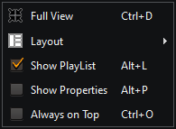 |
|:------------------------------------------:|:--------------------------------------------------:|
|    _Κεντρικό μενού Συμπαγούς προβολής_     |                 _Μενού εμφάνισης_                  |

- **Κομμάτι** - Ανοίγει το μενού της [Λίστας Αναπαραγωγής](#μενού-λίστας-αναπαραγωγής) για το επιλεγμένο κομμάτι
- **Εξώφυλλο** - Ανοίγει το [μενού](#μενού-εξώφυλλων) για το εμφανιζόμενο εξώφυλλο
- **Εμφάνιση** - Εμφανίζει το μενού εμφάνισης που περιέχει τα εξής:
    - **Πλήρης εμφάνιση** - Αλλαγή της λειτουργίας προβολής σε Πλήρης
    - **Διάταξη** - Υπο-μενού με επιλογές για την αποθήκευση και την επαναφορά της τρέχουσας διάταξης όλων των παραθύρων της συμπαγούς προβολής
    - **Εμφάνιση Λίστας** - Εμφανίζει (ή όχι) το παράθυρο της Λίστας αναπαραγωγής
    - **Εμφάνιση Ιδιοτήτων** - Εμφανίζει (ή όχι) το παράθυρο των Ιδιοτήτων του κομματιού
    - **Πάντα στο προσκήνιο** - Επηρεάζει όλα τα παράθυρα συμπαγούς προβολής
- **Εύρεση** - Ανοίγει το παράθυρο διαλόγου [Εύρεση](#εύρεση)
- **Προτιμήσεις** - Ανοίγει τον διάλογο [Προτιμήσεις](#προτιμήσεις)
- **Σχετικά** - Ανοίγει τον διάλογο [Περί του KataLib](#σχετικά)
- **Έξοδος από το KataLib** - Τερματίζει την εφαρμογή

### Μενού Περιοχής Ρίψης

  

Αυτό είναι το μενού που εμφανίζεται αν κάνετε δεξί κλικ στην Περιοχή Ρίψης.

- **Επικόλληση από το πρόχειρο** αναζητά στο πρόχειρο του συστήματος οποιοδήποτε url του YouTube και το προσθέτει στο KataLib. 
- **Εμφάνιση/Απόκρυψη του KataLib** σας επιτρέπει να αποκρύψετε εντελώς όλα τα άλλα παράθυρα της εφαρμογής (και από τη γραμμή εργασιών), χωρίς να την κλείσετε. 
- Η **Περιοχή Ρίψης** είναι ένα υπομενού που μπορεί να αλλάξει το μέγεθος του DropZone ή ακόμα και να το αποκρύψει εντελώς.
- **Συμπαγής Εμφάνιση** αλλάζει μεταξύ της κανονικής και της συμπαγούς προβολής της εφαρμογής.
- **Προτιμήσεις** είναι μια συντόμευση για τις [Προτιμήσεις](#προτιμήσεις) της εφαρμογής. 
- **Έξοδος από το KataLib** τερματίζει την εφαρμογή.

___

# Συντομεύσεις

| **Γενικά**                  |           |
|-----------------------------|-----------|
| Εναλλαγή συμπαγούς προβολής | Ctrl+D    |
| Μετατροπή                   | Alt+C     |
| Αρχεία (Αντιγραφή)          | Alt+V     |
| Επεξεργασία μεταδεδομένων   | Ctrl+E    |
| Κατάργηση/Διαγραφή          | Del       |
| Διαγραφή από το δίσκο       | Shift+Del |
| Φίλτρο Βιβλιοθήκη/Συλλογές  | Alt+F     |
| Φάκελοι βιβλιοθήκης         | Ctrl+M    |
| Προτιμήσεις                 | Ctrl+P    |
| Σχετικά                     | Ctrl+I    |
| Έξοδος από το KataLib       | Ctrl+Q    |

| **Συμπυκνωμένη λειτουργία** ειδικά   |                     |
|--------------------------------------|---------------------|
| Εναλλαγή του παραθύρου της Λίστας    | Alt+L               |
| Εναλλαγή του παραθύρου των Ιδιοτήτων | Alt+P               |
| Εναλλαγή του Πάντα στο προσκήνιο     | Ctrl+O              |

| **Αναπαραγωγή**                        |                 |
|----------------------------------------|-----------------|
| Αναπαραγωγή/Παύση                      | Κενό            |
| Σταμάτημα                              | Ctrl+Κενό       |
| Σταμάτημα με σβήσιμο                   | Ctrl+Alt+Κενό   |
| Σταμάτημα όταν τελειώσει το κομμάτι    | Shift+Κενό      |
| Αναζήτηση (μπάρα θέσης)                | Αριστερό/Δεξι ↔ |
| Αναπαραγωγή επόμενου                   | Ctrl+Δεξι →     |
| Αναπαραγωγή προηγούμενου               | Ctrl+Αριστερό ← |
| Αναπαραγωγή επόμενου με μίξη           | Alt+Δεξι →      |
| Ένταση ήχου                            | Πάνω/Κάτω ↑↓    |
| Σίγαση                                 | Alt+M           |
| Tap Tempo                              | Alt+T           |
| Επιλογή επόμενου                       | Ctrl+Κάτω ↓     |
| Επιλογή προηγούμενου                   | Ctrl+Πάνω ↑     |
| Αποθήκευση του σημείου αναπαραγωγής    | Ctrl+Τελεία     |
| Αναπαραγωγή από το αποθηκευμένο σημείο | Alt+Τελεία      |

| **Λίστα αναπαραγωγής**             |            |
|------------------------------------|------------|
| Φόρτωση λίστας                     | Ctrl+L     |
| Αποθήκευση λίστας                  | Ctrl+S     |
| Καθαρισμός λίστας                  | Ctrl+Del   |
| Ανανέωση λίστας                    | F5         |
| Προσθήκη λίστας στις Συλλογές      | Ctrl+Alt+S |
| Εύρεση κομματιών                   | Ctrl+F     |
| Προσθήκη κομματιών (τοπικά αρχεία) | Alt+A      |
| Διαγραφή κομματιών                 | Del        |
| Διαγραφή αρχείων (κομματιών)       | Shift+Del  |
| Επανάληψη όλων                     | Alt+R      |
| Ανακάτεμα                          | Alt+S      |
| Κατάσταση DJ                       | Alt+D      |

   
**Γενικές συντομεύσεις**

Αυτές είναι απενεργοποιημένες από προεπιλογή.  
Για να τις ενεργοποιήσετε πηγαίνετε στις `Προτιμήσεις > Για προχωρημένους > Χρήση γενικών συντομεύσεων`  
Αυτές οι προεπιλεγμένες αντιστοιχίσεις μπορούν να αλλάξουν από τον χρήστη.  
 

| Global Shortcuts   | Hotkeys    |
|--------------------|------------|
| Αναπαραγωγή/Παύση  | Win+Ctrl+Z |
| Σταμάτημα          | Win+Ctrl+C |
| Προηγούμενο        | Win+Ctrl+A |
| Επόμενο            | Win+Ctrl+X |
| Αναζήτηση δεξιά    | Win+Ctrl+] |
| Αναζήτηση αριστερά | Win+Ctrl+[ |
| Εκίνηση μίξης      | Win+Ctrl+W |
| Εμφάνιση/Απόκρυψη  | Win+Ctrl+S |
| Αύξηση έντασης     | Win+.      |
| Μείωση έντασης     | Win+,      |
